# Cartman PH — System Architecture

> **Version:** 1.0 (Phase 1)  
> **Region:** Antique Province, Philippines  
> **Status:** Greenfield  
> **Sources:** Customer-Side Mobile Application backlog, Rider-Side Mobile Application backlog

---

## Table of Contents

1. [Executive Summary](#1-executive-summary)
2. [Platform Context](#2-platform-context)
3. [Container Architecture](#3-container-architecture)
4. [Repository Layout](#4-repository-layout)
5. [Technology Stack](#5-technology-stack)
6. [Authentication & Authorization](#6-authentication--authorization)
7. [Core Domain Model](#7-core-domain-model)
8. [Order Lifecycle](#8-order-lifecycle)
9. [Realtime & Event Architecture](#9-realtime--event-architecture)
10. [Application Architecture](#10-application-architecture)
11. [Financial Ledger & Wallet Model](#11-financial-ledger--wallet-model)
12. [Deployment & Environments](#12-deployment--environments)
13. [Security & Row-Level Security](#13-security--row-level-security)
14. [Non-Functional Requirements](#14-non-functional-requirements)
15. [Phase Roadmap](#15-phase-roadmap)
16. [Open Decisions](#16-open-decisions)

---

## 1. Executive Summary

Cartman PH is a provincial delivery platform serving **Antique Province**. It connects customers, merchants, riders, and operations staff through a shared Supabase backend.

### Phase 1 Scope

| In Scope | Out of Scope (Phase 1) |
|----------|------------------------|
| Food ordering with menu variations | Digital payments (GCash, cards) |
| Errand / Pabili requests (free-text) | In-app turn-by-turn navigation |
| On-demand courier (pickup → drop-off) | Mapbox / Google Maps in-app tiles |
| Cash on Delivery (COD) only | iOS native release |
| OpenStreetMap tile rendering | Multi-province expansion |
| Android mobile apps (Customer + Rider) | |
| Merchant Panel, Admin Dashboard, Financial Ledger (web) | |

### Architectural Principles

1. **Single source of truth** — Supabase PostgreSQL holds all transactional state.
2. **Realtime over polling** — Order status propagates via Supabase Realtime (Postgres WAL).
3. **Zero-cost maps baseline** — OSM tiles for in-app maps; riders deep-link to native map apps for navigation.
4. **Append-only financial ledger** — Rider wallet balances are derived, never mutated by mobile clients.
5. **Offline resilience** — Customer cart persists locally; provincial connectivity is unreliable.

---

## 2. Platform Context

C4 Level 1 — system context diagram showing actors and external systems.

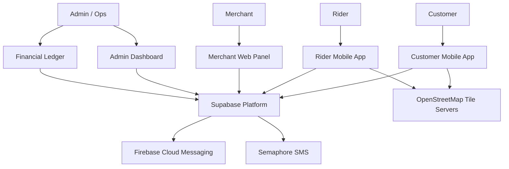

### Actors

| Actor | Primary Surface | Responsibility |
|-------|-----------------|----------------|
| Customer | Android mobile app | Browse menus, place orders, track delivery |
| Rider | Android mobile app | Claim orders, navigate, update status, manage earnings |
| Merchant | Web panel | Manage menu, accept/prepare orders |
| Admin / Ops | Web dashboard + ledger | Approvals, dispatch oversight, financial operations |

---

## 3. Container Architecture

C4 Level 2 — major deployable units and Supabase services.

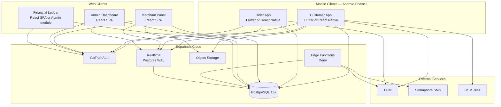

### Local Client Storage

| App | Library | Purpose |
|-----|---------|---------|
| Customer (Flutter) | Hive | Offline cart, session cache |
| Customer (RN) | AsyncStorage | Offline cart, session cache |
| Rider (Flutter) | Hive | Declined-order local filter |
| Rider (RN) | AsyncStorage | Declined-order local filter |

---

## 4. Repository Layout

**Recommendation: monorepo** — all five client surfaces share order enums, wallet invariants, and RLS policies. Separate repos increase schema drift risk.

```
cartman-ph/
├── apps/
│   ├── customer-mobile/       # Flutter or React Native
│   ├── rider-mobile/
│   ├── merchant-web/          # React + Vite or Next.js
│   ├── admin-web/
│   └── ledger-web/            # Optional: module inside admin-web
├── packages/
│   ├── shared-types/          # OrderStatus, WalletTxnType, DTOs
│   ├── supabase-client/       # Typed Supabase wrappers
│   └── geo-utils/             # OSM pin helpers, distance/fee calc
├── supabase/
│   ├── migrations/            # Schema + RLS
│   ├── functions/             # OTP, fee calc, FCM triggers
│   └── seed/                  # Antique Province test data
└── docs/
    └── ARCHITECTURE.md
```

### Why Monorepo

- Order status enum changes must propagate to all 5 surfaces simultaneously.
- Wallet transaction types are enforced server-side but displayed consistently in rider app and ledger.
- Shared TypeScript/Dart types prevent client-server contract mismatches.
- Single CI pipeline can run migration checks before any app deploys.

---

## 5. Technology Stack

### Decision Matrix

| Layer | Phase 1 Choice | Alternatives Considered | Notes |
|-------|----------------|-------------------------|-------|
| Mobile framework | **TBD** — Flutter or React Native | Native Kotlin/Swift | Both PDFs specify either; see [Open Decisions](#16-open-decisions) |
| In-app maps | OSM via `flutter_map` or `react-native-maps` | Mapbox, Google Maps | ₱0 API cost baseline |
| Rider navigation | Deep links to Google Maps / Apple Maps / Waze | In-app routing | External apps only in Phase 1 |
| Backend | Supabase (PostgreSQL 15+, Auth, Realtime, Storage, Edge Functions) | Custom Node API | Managed, fits provincial budget |
| Push notifications | Firebase Cloud Messaging (FCM) | OneSignal | Background alerts when app is killed |
| SMS OTP | Semaphore via Supabase Edge Function | Twilio | PH-local SMS gateway |
| Local persistence | Hive (Flutter) / AsyncStorage (RN) | SQLite | Cart + UI state |
| Web panels | React + Vite (recommended) | Next.js | Lightweight SPAs for merchant/admin |

### Mobile Framework Comparison (for final decision)

| Criterion | Flutter | React Native |
|-----------|---------|--------------|
| Map libraries | `flutter_map` (mature OSM) | `react-native-maps` (OSM support) |
| Background GPS | `geolocator` + foreground service | `react-native-geolocation-service` + foreground service |
| Offline storage | Hive | AsyncStorage |
| Team JS/TS skill | Lower leverage | Higher leverage |
| Single codebase quality | Strong UI consistency | Strong if team knows RN |
| Supabase SDK | `supabase_flutter` | `@supabase/supabase-js` |

### Android-First Platform Strategy

Phase 1 targets **Android only**. Rationale:

1. **Device economics** — Android dominates handset share in provincial Philippines; lower cost barrier for riders and customers in Antique.
2. **Distribution flexibility** — APK sideloading is viable for controlled provincial rollout before Play Store listing.
3. **iOS hardware availability** — iPhones are less common among target rider workforce; requiring iOS would shrink the rider pool.
4. **Operational overhead** — Apple Developer Program, TestFlight, and App Store review add timeline and cost without proportional user reach in Phase 1.
5. **Background location complexity** — iOS background GPS has stricter APIs and review scrutiny; Android foreground-service pattern is well-documented for delivery apps.

The mobile codebase should remain **cross-platform-ready** (Flutter or React Native) so iOS can ship in Phase 2 without architectural rework.

---

## 6. Authentication & Authorization

### Recommended Model: Single Auth Pool + Role-Based RLS

All actors authenticate through **one Supabase Auth (GoTrue) pool**. Authorization is enforced via a `profiles` extension table and PostgreSQL Row-Level Security — not separate auth tenants.

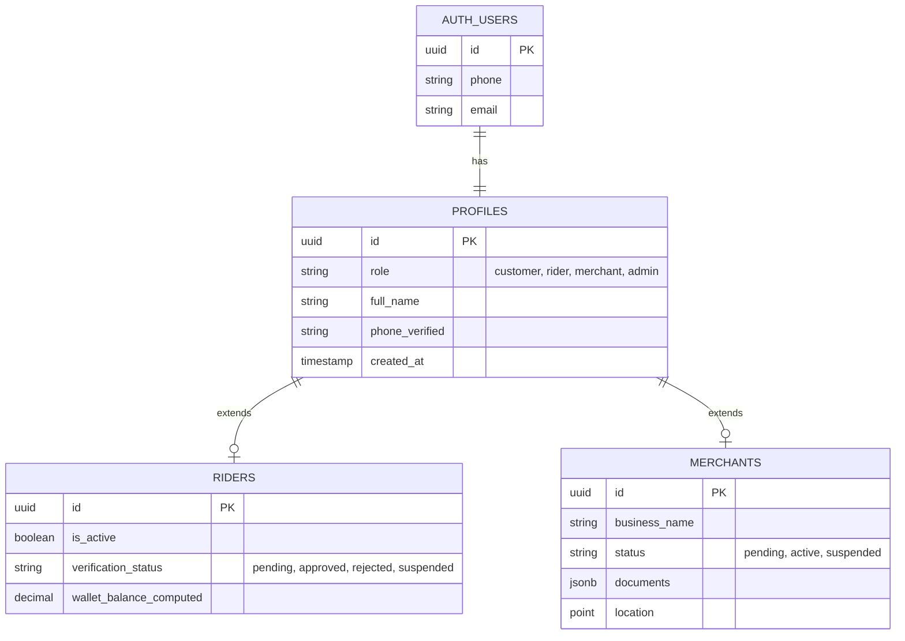

### Role Definitions

| Role | Registration Path | Access |
|------|-------------------|--------|
| `customer` | Self-serve: phone/email + OTP | Customer app only |
| `rider` | Application → admin approval | Rider app only |
| `merchant` | Application + document upload → admin approval | Merchant panel only |
| `admin` | Provisioned by existing admin | Admin dashboard + ledger |

### Customer Onboarding Flow

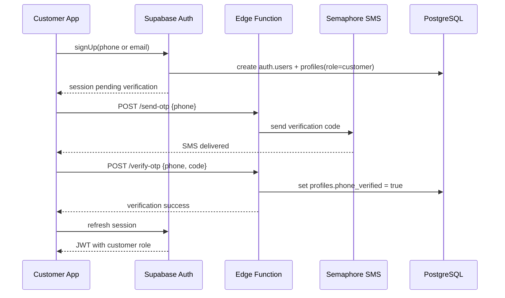

**Acceptance criteria (C-1.1, C-1.2):**
- OTP blocks checkout until phone is verified (required for COD contact).
- Session tokens stored securely on device (encrypted storage / secure keychain).

### Rider Onboarding Flow

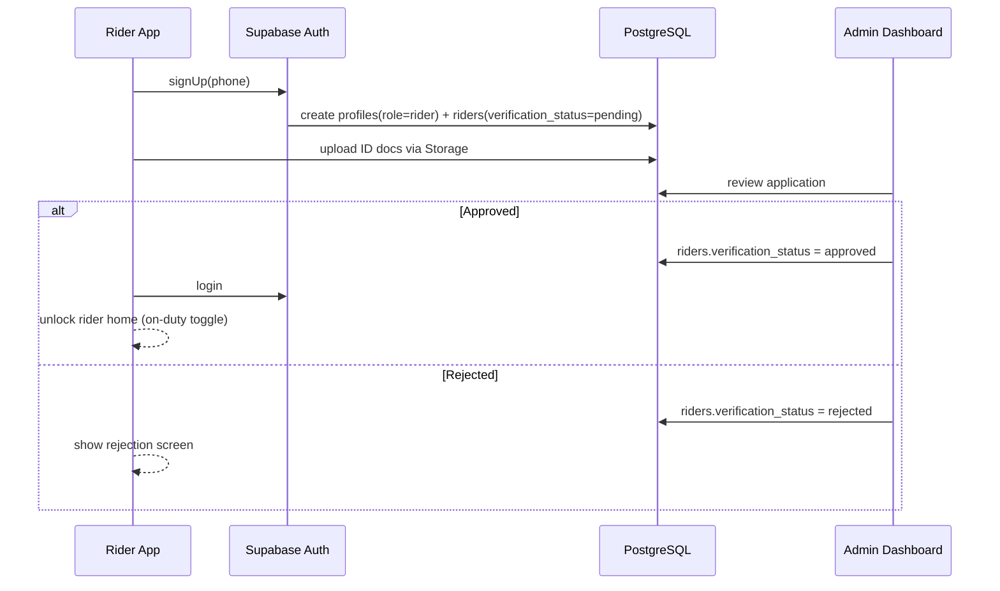

Riders with `verification_status != approved` or `is_active = false` cannot subscribe to the order broadcast feed.

### Merchant Onboarding Flow

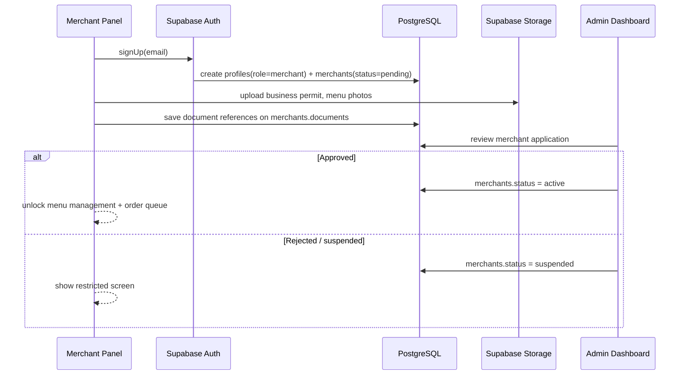

Merchants in `pending` status cannot receive live orders. Menu items remain hidden from customer browse queries until `status = active`.

### App Access Control

Each client app validates role after login:

- Customer app: reject if `role != customer`
- Rider app: reject if `role != rider` or `verification_status != approved`
- Merchant panel: reject if `role != merchant` or `status != active`
- Admin / Ledger: reject if `role != admin`

This can be enforced client-side (route guards) and server-side (RLS).

---

## 7. Core Domain Model


### Order Types

| Type | `merchant_id` | Line Items | Special Fields |
|------|---------------|------------|----------------|
| `food` | Required | Structured `order_items` linked to `menu_items` | Variations/add-ons in `modifiers` JSONB |
| `errand` | Null | None | `custom_description`: store name, item list, estimated budget |
| `courier` | Null | None | `pickup_coords` + `dropoff_coords`; fee from distance calc |

---

## 8. Order Lifecycle

### Status State Machine

Shared across Customer app, Rider app, Merchant panel, and Admin dashboard.

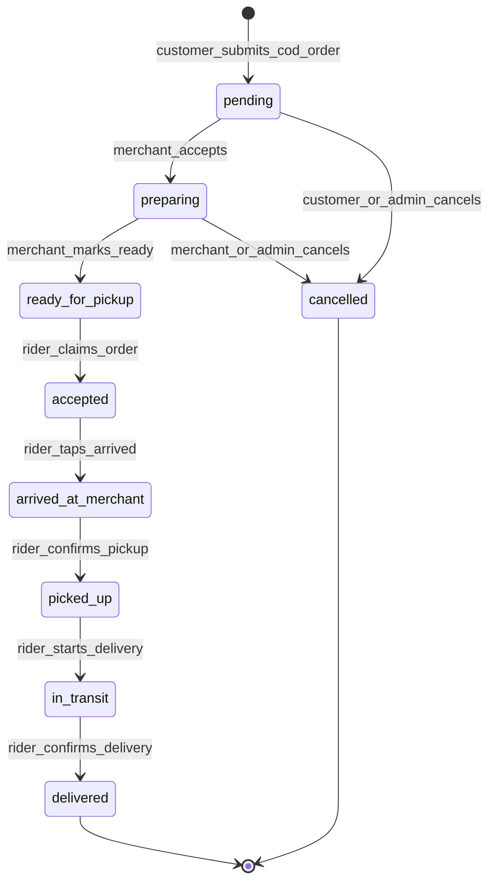

### Rider Status Progression (R-5.1)

The rider app exposes a single contextual action button that advances status sequentially:

`accepted` → `arrived_at_merchant` → `picked_up` → `in_transit` → `delivered`

Each tap writes to `orders.status`, which broadcasts via Realtime to all subscribers.

### Race-Safe Order Claim (R-1.2)

When multiple riders tap "Accept" on the same order, the database enforces first-writer-wins:

```sql
UPDATE orders
SET
  assigned_rider_id = :rider_id,
  status = 'accepted',
  accepted_at = now()
WHERE
  id = :order_id
  AND assigned_rider_id IS NULL
  AND status = 'ready_for_pickup'
RETURNING *;
```

- **Success (1 row):** Rider secures the order; UI transitions to active delivery.
- **Failure (0 rows):** Another rider claimed it; app removes card and shows graceful message.

Target: query execution under **50ms** (per rider backlog).

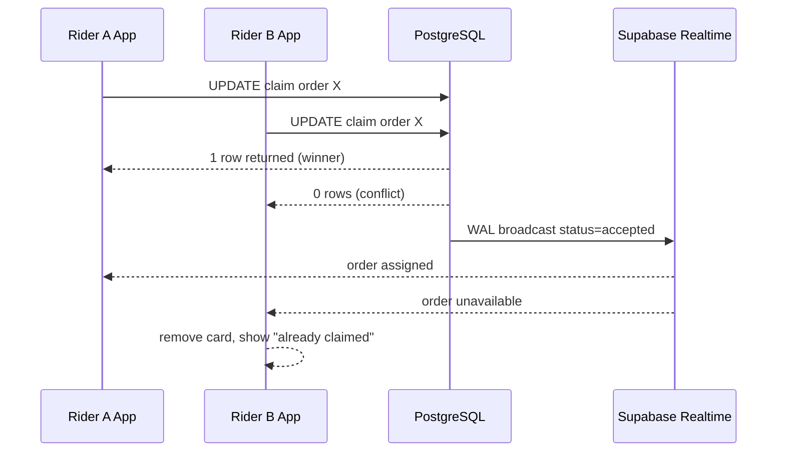

---

## 9. Realtime & Event Architecture

### Event Catalog

| Event | Producer | Transport | Consumers |
|-------|----------|-----------|-----------|
| Order status change | Merchant, Rider, Admin | Supabase Realtime (WAL) | Customer app, Rider app, Merchant panel, Admin |
| New `ready_for_pickup` order | Merchant panel | Realtime filtered subscription | On-duty riders in service zone |
| Rider GPS telemetry | Rider app (background) | DB insert → `rider_location_logs` | Customer tracking view, Admin dispatch map |
| Push notification | DB trigger / Edge Function | FCM | Customer, Rider (app backgrounded or killed) |
| Wallet transaction | Admin ledger (server) | Realtime on `rider_wallet_transactions` | Rider app earnings view |

### End-to-End Order Sequence

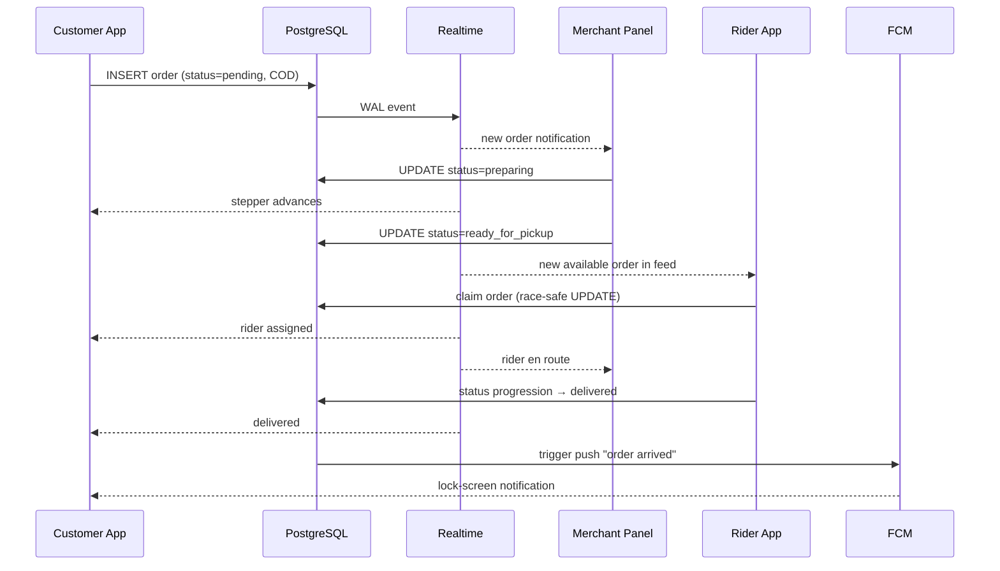

### Realtime Subscription Patterns

**Customer app (C-4.1, C-7.1):**
```javascript
supabase
  .channel('order:' + orderId)
  .on('postgres_changes', {
    event: 'UPDATE',
    schema: 'public',
    table: 'orders',
    filter: 'id=eq.' + orderId
  }, handleStatusChange)
  .subscribe()
```

**Rider app (R-1.1):**
```javascript
supabase
  .channel('available-orders')
  .on('postgres_changes', {
    event: 'UPDATE',
    schema: 'public',
    table: 'orders',
    filter: 'status=eq.ready_for_pickup'
  }, appendToFeed)
  .subscribe()
```

Only riders with `is_active = true` and `verification_status = approved` should maintain this subscription.

---

## 10. Application Architecture

### 10.1 Customer Mobile App

**Epics:** Authentication, Geolocation, Cart & Checkout, Order Lifecycle, Core Ordering, Checkout Details, Order History.

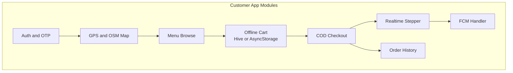

| Module | Key Tasks | Data Flow |
|--------|-----------|-----------|
| Auth & OTP | C-1.1, C-1.2 | Supabase Auth + Edge Function → Semaphore |
| GPS & Map | C-2.1, C-2.2 | Device GPS → OSM tiles → pin drag → coords |
| Offline Cart | C-3.1 | Local Hive/AsyncStorage; sync on checkout |
| COD Checkout | C-3.2 | INSERT `orders` + `order_items` with FK constraints |
| Food Ordering | C-5.1 | Fetch `menu_items` from Storage + DB |
| Errand / Pabili | C-5.2 | INSERT with `order_type=errand`, JSONB description |
| Courier Booking | C-5.3 | Origin + destination coords; fee via Edge Function |
| Order Notes | C-6.1 | `merchant_notes`, `rider_notes` columns |
| Saved Addresses | C-6.2 | `saved_addresses` table linked to profile |
| Contact Binding | C-6.3 | Auto-inject verified phone from Auth metadata |
| Realtime Tracking | C-4.1, C-7.1 | Supabase Realtime → stepper UI |
| Push Alerts | C-4.2 | FCM background handler |
| Order History | C-7.2 | Query last 20 orders by customer JWT ID |

### 10.2 Rider Mobile App

**Epics:** Order Acquisition, Telemetry, Financial Integrity, Dispatch, Order Execution, Earnings.

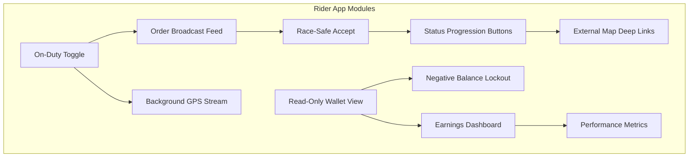

| Module | Key Tasks | Data Flow |
|--------|-----------|-----------|
| Order Feed | R-1.1 | Realtime subscription on `ready_for_pickup` |
| Order Claim | R-1.2, R-4.1 | Race-safe UPDATE; decline stored locally |
| Background GPS | R-2.1 | Foreground service → `rider_location_logs` inserts |
| On-Duty Toggle | R-4.2 | `riders.is_active`; disconnects telemetry when off-duty |
| Navigation | R-4.3 | Deep link coords to Google/Apple/Waze |
| Status Updates | R-5.1 | Sequential status button → UPDATE `orders.status` |
| Wallet Display | R-3.1 | Read `rider_wallet_transactions`; compute balance |
| Balance Lockout | R-3.2 | If `W_r <= -2000`, hide feed, show restriction screen |
| Earnings | R-6.1 | Aggregate `credit_delivery_reward` for today |
| Order History | R-6.2 | Query delivered orders by `assigned_rider_id` |
| Performance | R-6.3 | Acceptance rate, avg delivery duration |

### 10.3 Merchant Web Panel

The merchant panel is the operational bridge between customer orders and rider dispatch. It is not covered in the mobile PDFs but is required for the food order flow.

**Responsibilities:**

| Feature | Description |
|---------|-------------|
| Menu management | CRUD for `menu_categories` and `menu_items`; images in Supabase Storage |
| Stock toggling | `in_stock` flag hides unavailable items from customer browse |
| Order queue | Realtime list of incoming orders for this merchant |
| Order acceptance | `pending` → `preparing` |
| Ready for pickup | `preparing` → `ready_for_pickup` (triggers rider broadcast) |
| Order notes | Display `merchant_notes` and `rider_notes` from customer |
| Order history | Past orders with status and totals |

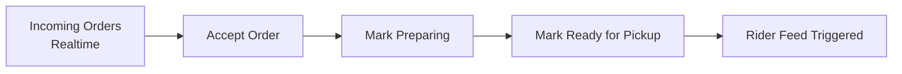

### 10.4 Admin Dashboard

Central operations console for Antique Province launch.

**Responsibilities:**

| Feature | Description |
|---------|-------------|
| Rider approval | Review applications; set `verification_status` |
| Merchant approval | Review documents; activate merchants |
| Dispatch oversight | View all active orders, rider locations on map |
| Manual intervention | Reassign riders, cancel orders, override status |
| Zone management | Configure service areas (barangays/municipalities in Antique) |
| Rider suspension | Set `is_active = false` or `verification_status = suspended` |
| System config | Delivery fee tables, commission rates, lockout threshold |

### 10.5 Financial Ledger

Authoritative financial surface. **Only admins write to `rider_wallet_transactions`.**

**Responsibilities:**

| Feature | Description |
|---------|-------------|
| COD debit posting | `debit_cod_order` when rider collects cash |
| Delivery reward credit | `credit_delivery_reward` on order delivery |
| Remittance credit | `credit_remittance` when rider remits cash to management |
| Commission calculation | Apply `C_m` commission splits on order values |
| Audit trail | Immutable append-only transaction log |
| Balance oversight | Monitor riders approaching lockout threshold |
| Reporting | Daily/weekly revenue, rider liabilities, merchant settlements |

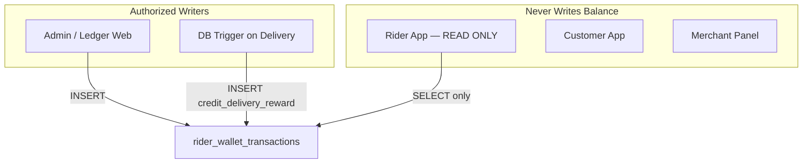

---

## 11. Financial Ledger & Wallet Model

### Balance Formula

Rider net disposable cash is a **computed aggregate**, never stored as a directly mutable field:

```
W_r = Σ(R_a) - Σ(V_o(COD) + (V_o × C_m) - F_d)
```

| Symbol | Meaning |
|--------|---------|
| `W_r` | Net disposable cash (rider wallet position) |
| `R_a` | Cash remittances to platform (`credit_remittance`) |
| `V_o` | Historical order value |
| `V_o(COD)` | COD amounts collected by rider (`debit_cod_order`) |
| `C_m` | Commission split rate |
| `F_d` | Delivery payout to rider (`credit_delivery_reward`) |

### Transaction Types

| Type | Direction | Trigger |
|------|-----------|---------|
| `debit_cod_order` | Debit (rider owes more) | Rider delivers COD order |
| `credit_delivery_reward` | Credit (rider earns) | Order marked `delivered` |
| `credit_remittance` | Credit (rider pays platform) | Admin logs cash remittance |

### Negative Balance Lockout (R-3.2)

When `W_r <= -₱2,000`:

1. Rider app queries computed balance on app open and periodically.
2. If threshold breached: hide order feed, block accept button.
3. Display restriction screen: "Remit funds to continue."
4. Admin logs `credit_remittance` in ledger → balance recovers → lockout lifts.

---

## 12. Deployment & Environments

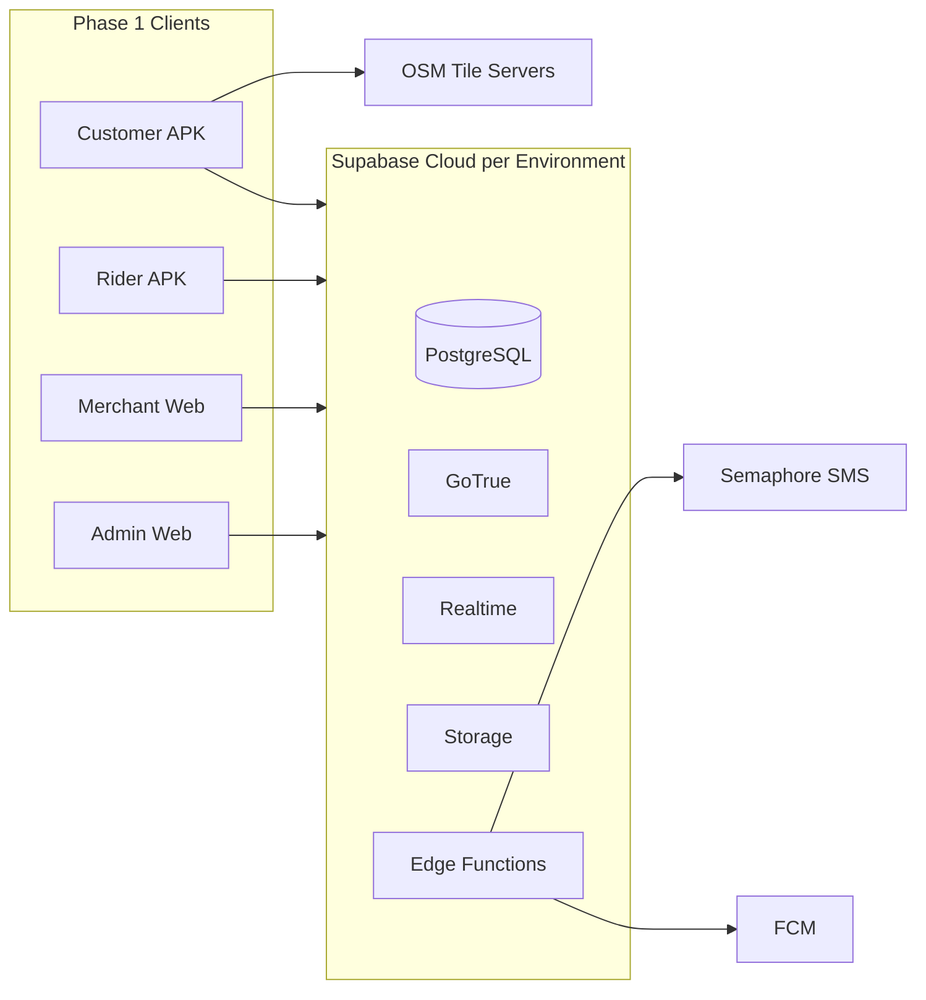

### Environment Strategy

| Environment | Purpose | Supabase Project |
|-------------|---------|------------------|
| `dev` | Local development, seed data | Separate project |
| `staging` | QA, Antique Province test riders/merchants | Separate project |
| `prod` | Live Antique Province operations | Separate project |

### Android Distribution

| Channel | Use Case |
|---------|----------|
| Direct APK | Initial provincial pilot with known rider/customer cohort |
| Google Play Store | Broader public rollout after stability validation |

### Edge Functions

| Function | Trigger | Purpose |
|----------|---------|---------|
| `send-otp` | Customer/Rider registration | Semaphore SMS dispatch |
| `verify-otp` | OTP submission | Validate code, mark phone verified |
| `calculate-delivery-fee` | Courier checkout | Distance-based fee for Antique zones |
| `send-push-notification` | DB webhook on status change | FCM dispatch |

---

## 13. Security & Row-Level Security

### RLS Policy Summary

| Table | Customer | Rider | Merchant | Admin |
|-------|----------|-------|----------|-------|
| `orders` | Own orders (SELECT) | Assigned + `ready_for_pickup` pool (SELECT); assigned (UPDATE status) | Own merchant orders (SELECT, UPDATE status) | Full access |
| `order_items` | Via order ownership | Via assigned order | Via merchant order | Full access |
| `menu_items` | Active items (SELECT) | — | Own menu (CRUD) | Full access |
| `rider_wallet_transactions` | — | Own rows (SELECT only) | — | Full access |
| `rider_location_logs` | Assigned rider on own order (SELECT) | Own rows (INSERT) | — | Full access |
| `saved_addresses` | Own (CRUD) | — | — | Full access |
| `merchants` | Active merchants (SELECT) | — | Own record (SELECT) | Full access |
| `riders` | — | Own record (SELECT, UPDATE `is_active`) | — | Full access |

### Security Rules

1. **No client-side wallet mutations** — Rider app never INSERTs/UPDATEs `rider_wallet_transactions`.
2. **OTP rate limiting** — Edge Function throttles per phone number (e.g., 3 requests / 15 min).
3. **PII scoping** — Customer phone visible to assigned rider only during active order.
4. **Merchant document access** — Business permits in Storage restricted to merchant owner + admin.
5. **Service role key** — Used only in Edge Functions and server-side jobs; never shipped in mobile APKs.

---

## 14. Non-Functional Requirements

| Requirement | Target | Source |
|-------------|--------|--------|
| Rider order claim latency | < 50ms DB query | R-1.2 |
| Order status propagation | Near-instant via Realtime WAL | C-4.1 |
| Offline cart durability | Survives app kill / background | C-3.1 |
| GPS telemetry interval | Adaptive (e.g., 10–30s in transit, stop when off-duty) | R-2.1, R-4.2 |
| Push delivery | Works when app is killed | C-4.2 |
| Order history pagination | Initial limit: 20 records | C-7.2 |
| Map tile load | No enterprise API key dependency | C-2.2 |
| Wallet lockout check | On app open + after each delivery | R-3.2 |

### Background GPS — Android Pattern

The rider app uses an Android **foreground service** with a persistent notification while on-duty and actively delivering. This satisfies Android 8+ background execution limits and keeps telemetry streaming reliable on budget devices common in Antique Province.

---

## 15. Phase Roadmap

### Phase 1 (Current Architecture)

- Antique Province service area
- Android Customer + Rider apps
- Merchant Panel, Admin Dashboard, Financial Ledger
- COD payments only
- OSM in-app maps
- Food, errand, and courier order types
- Supabase Realtime + FCM

### Phase 2 (Future)

- iOS apps (Customer + Rider)
- Digital payments (GCash, Maya)
- In-app turn-by-turn navigation
- Multi-province expansion
- Advanced dispatch (auto-assign, surge pricing)
- Customer loyalty / promotions

---

## 16. Open Decisions

| Decision | Options | Recommendation | Blocker For |
|----------|---------|----------------|-------------|
| Mobile framework | Flutter vs React Native | Decide based on team skills; Flutter if no strong JS preference | App scaffolding |
| Web framework | Vite SPA vs Next.js | Vite + React for simpler SPAs; Next.js if SSR/SEO needed | Web panel scaffolding |
| Ledger placement | Separate app vs Admin module | Admin module in Phase 1; split if team grows | Web repo structure |
| Courier fee calculation | Client-side vs Edge Function | **Edge Function** — consistent fees, tamper-proof | Courier booking feature |
| Antique geofencing | Municipality polygons vs radius from hub | Define during admin zone config epic | Rider feed filtering |
| Play Store vs sideload | Both viable | Sideload for pilot, Play Store for scale | Distribution plan |

### Flutter vs React Native — Decision Criteria

Choose **Flutter** if:
- Team prioritizes UI consistency and performance on low-end Android devices.
- No existing React/TypeScript codebase to leverage.

Choose **React Native** if:
- Team is already proficient in TypeScript/React.
- Web panels and mobile can share more utility code via `packages/`.

---

## Appendix A: Antique Province Service Context

Antique Province (Western Visayas) is the Phase 1 geographic boundary. Architecture assumptions:

- Delivery zones configured per municipality/barangay in Admin Dashboard.
- OSM tiles provide adequate coverage for San Jose de Buenavista and surrounding municipalities.
- SMS OTP via Semaphore supports Philippine mobile numbers (+63).
- COD is the dominant payment method in provincial markets.

## Appendix B: Document References

| Document | Scope |
|----------|-------|
| Customer-Side Mobile Application PDF | Tasks C-1.1 through C-7.2 |
| Rider-Side Mobile Application PDF | Tasks R-1.1 through R-6.3 |
| This document | Full-platform architecture including web panels |

---

*End of architecture document.*
