# Cartman PH — System Architecture

> **Version:** 1.0 (Phase 1)  
> **Region:** Antique Province, Philippines  
> **Status:** Greenfield  
> **Sources:** Customer-Side Mobile Application backlog, Rider-Side Mobile Application backlog

---

## Table of Contents

1. [Executive Summary](#1-executive-summary)
2. [Platform Context](#2-platform-context)
3. [Container Architecture](#3-container-architecture)
4. [Repository Layout](#4-repository-layout)
5. [Technology Stack](#5-technology-stack)
6. [Authentication & Authorization](#6-authentication--authorization)
7. [Core Domain Model](#7-core-domain-model)
8. [Order Lifecycle](#8-order-lifecycle)
9. [Realtime & Event Architecture](#9-realtime--event-architecture)
10. [Application Architecture](#10-application-architecture)
11. [Financial Ledger & Wallet Model](#11-financial-ledger--wallet-model)
12. [Deployment & Environments](#12-deployment--environments)
13. [Security & Row-Level Security](#13-security--row-level-security)
14. [Non-Functional Requirements](#14-non-functional-requirements)
15. [Phase Roadmap](#15-phase-roadmap)
16. [Open Decisions](#16-open-decisions)

---

## 1. Executive Summary

Cartman PH is a provincial delivery platform serving **Antique Province**. It connects customers, merchants, riders, and operations staff through a shared Supabase backend.

### Phase 1 Scope

| In Scope | Out of Scope (Phase 1) |
|----------|------------------------|
| Food ordering with menu variations | Digital payments (GCash, cards) |
| Errand / Pabili requests (free-text) | In-app turn-by-turn navigation |
| On-demand courier (pickup → drop-off) | Mapbox / Google Maps in-app tiles |
| Cash on Delivery (COD) only | iOS native release |
| OpenStreetMap tile rendering | Multi-province expansion |
| Android mobile apps (Customer + Rider) | |
| Merchant Panel, Admin Dashboard, Financial Ledger (web) | |

### Architectural Principles

1. **Single source of truth** — Supabase PostgreSQL holds all transactional state.
2. **Realtime over polling** — Order status propagates via Supabase Realtime (Postgres WAL).
3. **Zero-cost maps baseline** — OSM tiles for in-app maps; riders deep-link to native map apps for navigation.
4. **Append-only financial ledger** — Rider wallet balances are derived, never mutated by mobile clients.
5. **Offline resilience** — Customer cart persists locally; provincial connectivity is unreliable.

---

## 2. Platform Context

C4 Level 1 — system context diagram showing actors and external systems.

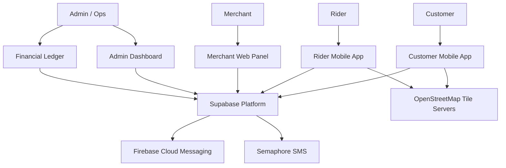

### Actors

| Actor | Primary Surface | Responsibility |
|-------|-----------------|----------------|
| Customer | Android mobile app | Browse menus, place orders, track delivery |
| Rider | Android mobile app | Claim orders, navigate, update status, manage earnings |
| Merchant | Web panel | Manage menu, accept/prepare orders |
| Admin / Ops | Web dashboard + ledger | Approvals, dispatch oversight, financial operations |

---

## 3. Container Architecture

C4 Level 2 — major deployable units. **Writes route through `cartman-server`; reads and Realtime stay direct-to-Supabase.**

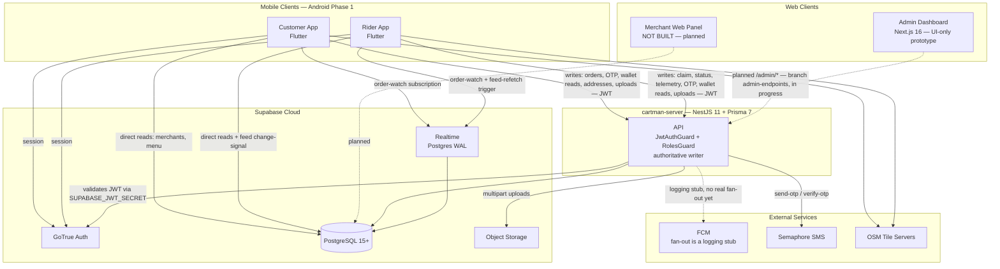

No Edge Functions node: the `otp-send`/`otp-verify` Supabase Edge Functions are deprecated (§12) — OTP now goes through `cartman-server`. Storage uploads (avatar, docs) route through the server's multipart endpoint rather than clients writing to Supabase Storage directly.

### Local Client Storage

| App | Library | Purpose |
|-----|---------|---------|
| Customer (Flutter) | Hive | Offline cart, session cache |
| Customer (RN) | AsyncStorage | Offline cart, session cache |
| Rider (Flutter) | Hive | Declined-order local filter |
| Rider (RN) | AsyncStorage | Declined-order local filter |

---

## 4. Repository Layout

**Implemented: polyrepo.** The monorepo recommended below was never built — the platform ships as independent git repos under one workspace directory (`cartmanph-master-dir/`, itself not a repo):

```
cartmanph-master-dir/                # workspace root — NOT a git repo
├── cartman-server/                  # NestJS 11 + Prisma 7 — authoritative writer (this doc's "server")
├── cartman-mobile/                  # Flutter melos workspace
│   ├── apps/customer/                 # Customer app
│   ├── apps/rider/                    # Rider app
│   ├── packages/core/                 # CartmanApiClient, repositories, models, theme
│   └── supabase/
│       ├── migrations/                # Schema, RLS, functions, realtime publication
│       └── functions/                 # otp-send / otp-verify — deprecated, server owns OTP now
├── Cartman-PH-Dashboard/            # Next.js 16 admin dashboard — UI-only prototype
├── cartmanph-docs/                  # this repo — architecture + backlogs, docs only
└── docs/plans/                      # loose planning docs — not a git repo
```

### Decision superseded — how drift is mitigated

Monorepo was the Phase 1 recommendation; the team shipped 4 independent repos instead. No shared `packages/shared-types` exists — each repo defines its own DTOs/models. Drift is mitigated by convention, not tooling:

- **Schema changes land in both repos in the same change** — `cartman-mobile/supabase/migrations/*.sql` (tables, RLS, functions, realtime) and `cartman-server/prisma/schema.prisma` (Prisma model) must be kept in sync manually; there is no shared migration source.
- **`ARCHITECTURE.md` (this repo) is the single canonical spec** — `docs/breakdown/*` mirror it; when code and docs disagree, code wins until this doc is updated, but no repo's local `docs/` is allowed to contradict this file (see [README.md](./README.md) for authority rules).
- **No cross-repo CI** — each repo gates independently: `cartman-server` runs `npm test` + `npm run build` + lint; `cartman-mobile` runs `melos run analyze` + per-package `flutter test`; `Cartman-PH-Dashboard` has no CI configured yet (UI-only prototype).

---

## 5. Technology Stack

### Decision Matrix

| Layer | Phase 1 Choice | Alternatives Considered | Notes |
|-------|----------------|-------------------------|-------|
| Mobile framework | **Flutter** (confirmed) | React Native, native Kotlin/Swift | See [Mobile Framework Comparison](#mobile-framework-comparison-for-final-decision) below, retained for reference |
| In-app maps | OSM via `flutter_map` | Mapbox, Google Maps | ₱0 API cost baseline |
| Rider navigation | Deep links to Google Maps / Apple Maps / Waze | In-app routing | External apps only in Phase 1 |
| Backend | **Implemented:** NestJS 11 + Prisma 7, deployed on **Render** (Singapore region); Supabase provides PostgreSQL 15+, Auth (GoTrue), Realtime, Storage | Pure Supabase Edge Functions | `cartman-server` is the authoritative writer for orders/dispatch/ledger/OTP; see §3 |
| Push notifications | Firebase Cloud Messaging (FCM) — **fan-out is a logging stub**, not wired to a real Firebase project | OneSignal | `firebase_messaging` not yet in the mobile apps; needs Firebase project + `firebase-admin` fan-out work |
| SMS OTP | Semaphore, called server-side by `cartman-server` (`POST /auth/send-otp\|verify-otp`) | Twilio | PH-local SMS gateway; `OTP_DEV_MODE` returns the code inline instead of sending SMS |
| Local persistence | Hive (Flutter) | AsyncStorage (RN), SQLite | Cart + UI state |
| Web panels | **Implemented:** Next.js 16 + Tailwind v4 + react-icons — admin dashboard shipped as a UI-only prototype (no fetch layer, no auth); merchant panel not started | React + Vite | See §10.3, §10.4 |

### Mobile Framework Comparison (for final decision)

**Resolved: Flutter.** Comparison kept for historical reference.

| Criterion | Flutter | React Native |
|-----------|---------|--------------|
| Map libraries | `flutter_map` (mature OSM) | `react-native-maps` (OSM support) |
| Background GPS | `geolocator` + foreground service | `react-native-geolocation-service` + foreground service |
| Offline storage | Hive | AsyncStorage |
| Team JS/TS skill | Lower leverage | Higher leverage |
| Single codebase quality | Strong UI consistency | Strong if team knows RN |
| Supabase SDK | `supabase_flutter` | `@supabase/supabase-js` |

### Android-First Platform Strategy

Phase 1 targets **Android only**. Rationale:

1. **Device economics** — Android dominates handset share in provincial Philippines; lower cost barrier for riders and customers in Antique.
2. **Distribution flexibility** — APK sideloading is viable for controlled provincial rollout before Play Store listing.
3. **iOS hardware availability** — iPhones are less common among target rider workforce; requiring iOS would shrink the rider pool.
4. **Operational overhead** — Apple Developer Program, TestFlight, and App Store review add timeline and cost without proportional user reach in Phase 1.
5. **Background location complexity** — iOS background GPS has stricter APIs and review scrutiny; Android foreground-service pattern is well-documented for delivery apps.

The mobile codebase should remain **cross-platform-ready** (Flutter or React Native) so iOS can ship in Phase 2 without architectural rework.

---

## 6. Authentication & Authorization

### Implemented Model: Single Auth Pool, Server-Enforced Roles

All actors authenticate through **one Supabase Auth (GoTrue) pool** — email + password, **no email verification** (dashboard "Confirm email" toggle is OFF for Phase 1). Phone OTP is **not** the identity method; it is a separate server-side verification step that gates COD checkout (see Customer Onboarding below).

Authorization for **writes** is enforced by `cartman-server`: `JwtAuthGuard` validates the Supabase-issued JWT (`SUPABASE_JWT_SECRET`), then looks up `profiles.role` in Postgres and checks it against `@Roles(...)` via `RolesGuard`. Authorization for **direct reads** (menu/merchant browse, realtime) is enforced by RLS — defense-in-depth, not the primary boundary (§13).

**Only `customer` and `rider` are real, self-serve roles today.** `profiles.role` is `'customer' | 'rider'` by default (see schema below); `merchant` and `admin` are not signup paths — merchants are catalog rows with no `auth.users` linkage (provisioned by ops via seed/SQL), and `admin` is a `profiles.role` value set directly by ops, not obtainable through any app screen. The approval workflows and `merchants`/`riders.verification_status` states described in the original design below were **not implemented** — call this out explicitly where noted.

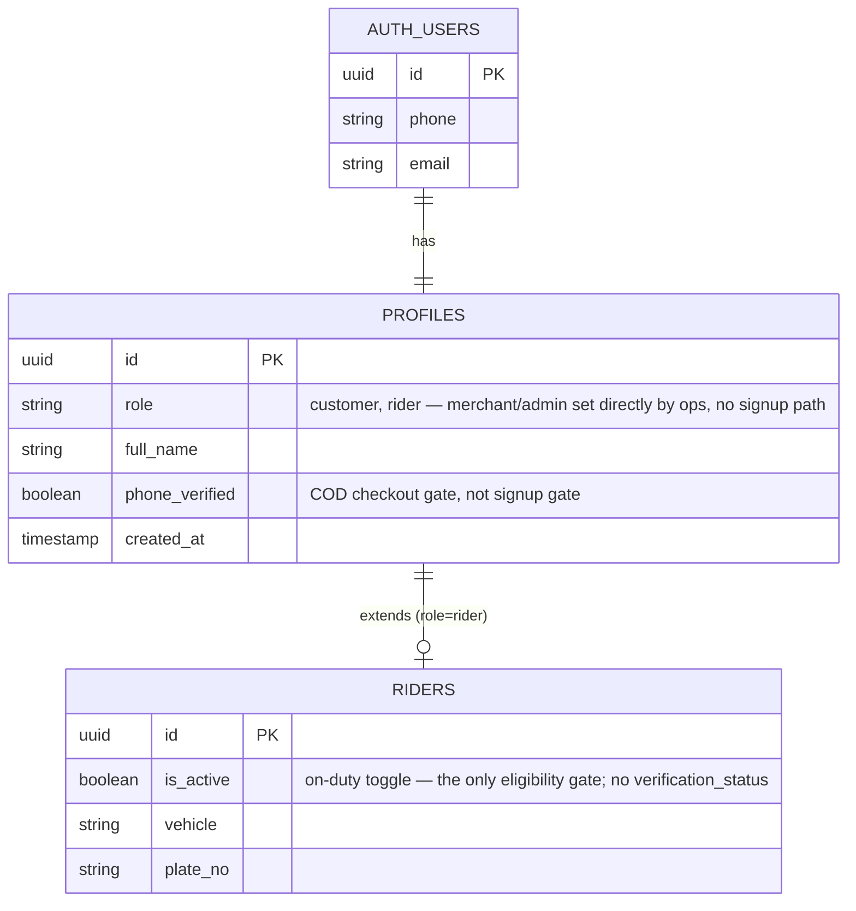

`MERCHANTS` has no FK to `auth.users`/`profiles` in the implemented schema — it is catalog data (name, menu, delivery fee), not an authenticated actor. There is no merchant login.

### Role Definitions

| Role | Registration Path | Access |
|------|-------------------|--------|
| `customer` | Self-serve: email + password (`handle_new_user()` trigger provisions `profiles`) | Customer app |
| `rider` | Self-serve: email + password; trigger also provisions a `riders` row. **No approval gate** — eligible to go on-duty immediately | Rider app |
| `merchant` | **Not a signup path.** Merchant rows are seeded/inserted by ops; no auth linkage, no merchant app | N/A |
| `admin` | `profiles.role = 'admin'` set directly by ops (SQL/Swagger); no admin signup screen | Admin dashboard (planned auth), Swagger ops |

### Customer Onboarding Flow

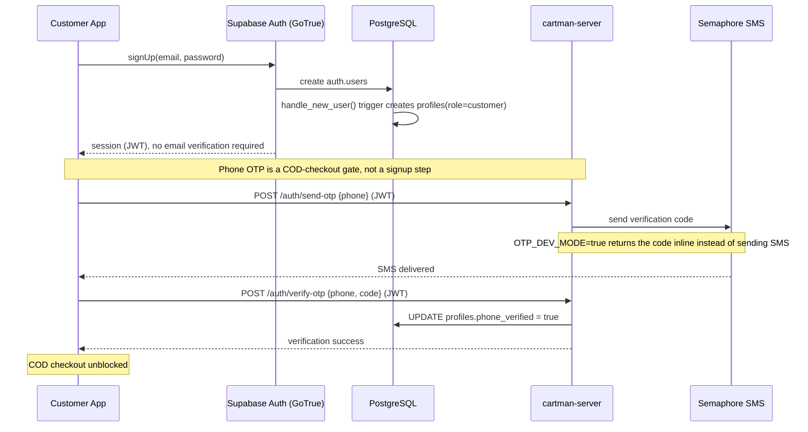

**Acceptance criteria (C-1.1, C-1.2):**
- OTP blocks COD checkout until phone is verified — not blocking signup, login, or browsing.
- Session tokens stored via the Supabase client SDK's secure storage.

### Rider Onboarding Flow

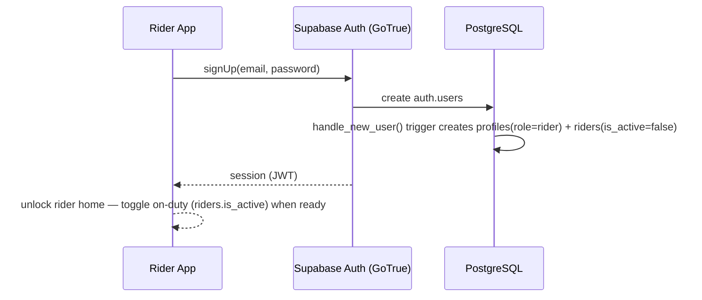

**Not implemented:** the approval workflow (document upload, admin review, `verification_status: pending/approved/rejected/suspended`) originally designed here. The current schema has no `verification_status` column — `is_active` (on-duty toggle) is the only feed-eligibility gate. Treat approval as a deferred gap, not a shipped feature (§10.4 open items).

### Merchant Onboarding Flow

**Not implemented — no merchant app, no signup path.** `merchants` has no FK to `auth.users`/`profiles`; rows (name, menu, delivery fee) are inserted directly by ops (seed data today: *Kusina ni Aling Nena* + 3 menu items). The self-serve application/document-upload/approval flow originally designed here does not exist in code. See §10.3.

### App Access Control

- Customer app: reject if `role != customer`.
- Rider app: reject if `role != rider`. (No `verification_status` check — doesn't exist.)
- Merchant panel / Admin dashboard: no login exists yet for either (§10.3, §10.4). Server-side `@Roles('admin')` endpoints will require an authenticated `profiles.role = 'admin'` session once dashboard auth ships.

Write-path enforcement is server-side (`JwtAuthGuard` + `RolesGuard`, §13); read-path role checks are client route guards backed by RLS.

---

## 7. Core Domain Model

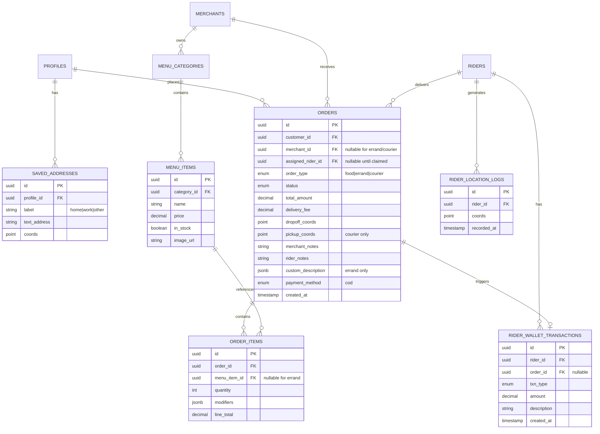

### Order Types

Implemented `orders.order_type` enum has 6 values (§8 covers lifecycle detail):

| Type | `merchant_id` | Line Items | Special Fields |
|------|---------------|------------|----------------|
| `food` | Required | Structured `order_items` linked to `menu_items` | Variations/add-ons in `modifiers` JSONB; born `pending` |
| `grocery` | Required | Structured `order_items` | Same shape as `food`; born `pending` |
| `errand` | Null | None | `custom_description`: store name, item list, estimated budget; born `ready_for_pickup` |
| `pickup_delivery` | Null | None | `pickup_coords` + `dropoff_coords` (this doc's earlier "courier" type); born `ready_for_pickup` |
| `ride` | Null | None | Passenger pickup/dropoff (Pasakay); born `ready_for_pickup` |
| `multi_stop` | — | — | **Not implemented** — no server endpoint; UI entry hidden in the mobile apps |

---

## 8. Order Lifecycle

### Status State Machine

Implemented `order_status` enum (note: `canceled`, one L — matches the Prisma enum, not the earlier "cancelled" spelling used elsewhere in this document's history).

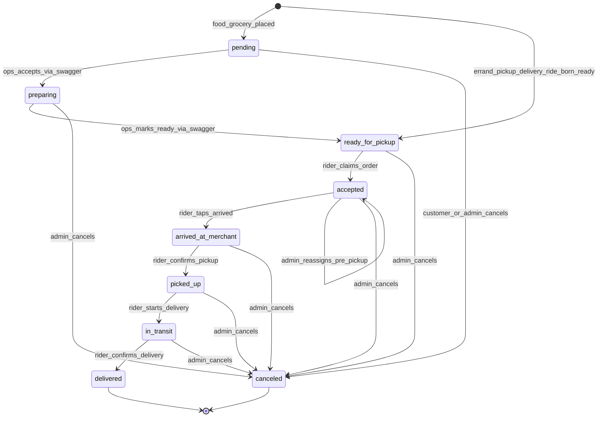

Admin cancel (`PATCH /admin/orders/:id/cancel`) accepts any pre-`delivered` status. Admin reassign (`PATCH /admin/orders/:id/reassign`) is pre-pickup only (`accepted`, before `arrived_at_merchant`).

`food` and `grocery` orders are born `pending` and require an ops accept/ready pass; `errand`, `pickup_delivery`, and `ride` are born `ready_for_pickup` directly (no merchant prep step). `multi_stop` is in the enum but has no server endpoint — not usable.

### Rider Status Progression (R-5.1)

The rider app's single contextual action button advances status through the server's legal-transition guard (strict chain, no skipping):

`accepted` → `arrived_at_merchant` → `picked_up` → `in_transit` → `delivered`

Each tap calls `PATCH /orders/:id/status` on `cartman-server`, which validates the transition server-side before writing `orders.status`; the write then broadcasts via Supabase Realtime to subscribers (order-watch channels, §9).

### Race-Safe Order Claim (R-1.2)

Claim is a conditional `updateMany` **inside `cartman-server`** (`PATCH /orders/:id/claim`), not a raw-SQL RPC run by the client:

```typescript
// cartman-server/src/orders/orders.service.ts — claimOrder()
await prisma.orders.updateMany({
  where: { id: orderId, assigned_rider_id: null, status: 'ready_for_pickup' },
  data: { assigned_rider_id: riderId, status: 'accepted', accepted_at: new Date() },
});
```

- **Success (1 row):** Rider secures the order; server returns it, UI transitions to active delivery.
- **Failure (0 rows):** Another rider claimed it first, or the order no longer qualifies; server returns 409/400.
- **Gates before the update runs:** rider must be on-duty (`riders.is_active`); rider must not be at the **queue-depth cap of 2** (max concurrent non-terminal assigned orders); rider must not be wallet-locked (`rider_net_cash <= -₱2,000`, checked via `LedgerService.getNetCash`).

The ranked feed (`GET /orders/feed`, §9) is advisory ordering only — it does not reserve anything. Claim stays first-writer-wins regardless of feed position.

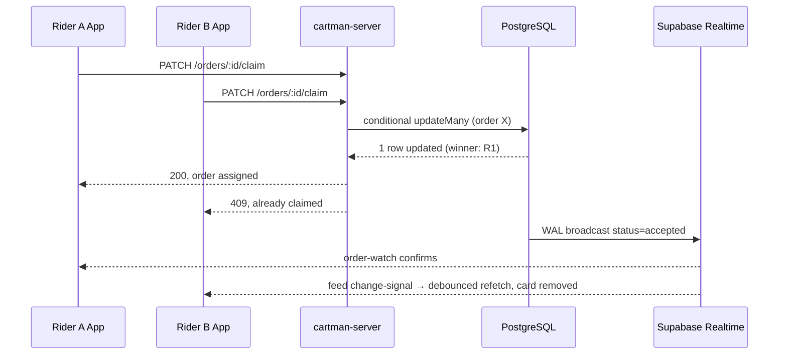

### Admin Cancel / Reassign (branch `admin-endpoints`, in progress)

Two admin-only transitions land alongside the AdminModule (§10.4):

| Endpoint | Effect | Guard |
|----------|--------|-------|
| `PATCH /admin/orders/:id/cancel` | Any status **before** `delivered` → `canceled` | `@Roles('admin')` |
| `PATCH /admin/orders/:id/reassign` | **Pre-pickup only** — clears `assigned_rider_id`, resets to `accepted` with a new rider; mirrors the claim guards (on-duty, queue depth, wallet lock) | `@Roles('admin')` |

Customer cancel (self-service, pre-`preparing`/`accepted` per the state machine above) is a separate existing endpoint, distinct from admin cancel.

---

## 9. Realtime & Event Architecture

### Event Catalog

| Event | Producer | Transport | Consumers |
|-------|----------|-----------|-----------|
| Order status change | `cartman-server` (write) | Supabase Realtime (WAL) | Customer app, Rider app order-watch channels |
| Ranked feed change-signal | `cartman-server` (write) | Realtime filtered subscription on `orders` | On-duty riders — triggers a **debounced refetch** of `GET /orders/feed`, not a raw row push |
| Rider GPS telemetry | Rider app (background) | Batched `POST /riders/me/telemetry` | Server-side only today — no customer/admin live-map consumer yet |
| Push notification | `cartman-server` webhook receiver | FCM | **Stub** — fan-out is a logging stub, no real device delivery |
| Wallet transaction | `cartman-server` (delivered-transition writer, transactional + idempotent) | Read via `GET /ledger/me/*` | Rider app earnings/wallet view |

### Weighted Priority Feed (`GET /orders/feed`)

Live in Phase 1, implemented in `cartman-server/src/orders/feed.service.ts`. Replaces the naive "broadcast to everyone" feed originally designed here — **ranking is advisory only**; the underlying claim (§8) stays first-writer-wins regardless of a rider's position in the ranked list.

```
score = 0.40 · age_norm(cap 30 min) + 0.30 · proximity_norm(10 km range)
      + 0.20 · payout_norm(cap ₱200) + 0.10 · type_weight
```

| Weight | Env var | Default |
|--------|---------|---------|
| Age | `FEED_W_AGE` | `0.40` |
| Proximity | `FEED_W_PROX` | `0.30` |
| Payout | `FEED_W_PAYOUT` | `0.20` |
| Type | `FEED_W_TYPE` | `0.10` |

Candidates are `ready_for_pickup` orders with no assigned rider, capped at 50, top 20 returned. Rider position is resolved from the most recent telemetry ping (10-minute freshness window) or explicit lat/lng query params.

### End-to-End Order Sequence

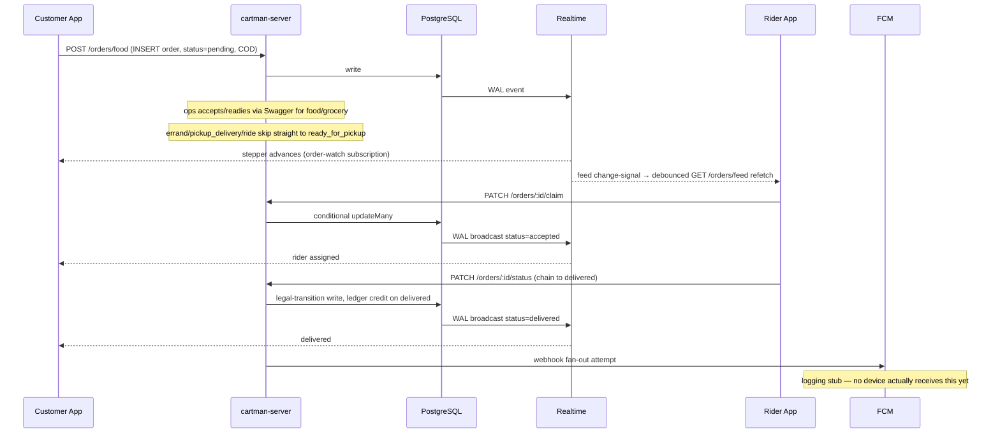

### Realtime Subscription Patterns

**Customer app — order-watch (unchanged from original design):**
```javascript
supabase
  .channel('order:' + orderId)
  .on('postgres_changes', {
    event: 'UPDATE',
    schema: 'public',
    table: 'orders',
    filter: 'id=eq.' + orderId
  }, handleStatusChange)
  .subscribe()
```

**Rider app — feed change-signal (debounced refetch, not a direct feed push):**
```javascript
supabase
  .channel('available-orders')
  .on('postgres_changes', {
    event: '*',
    schema: 'public',
    table: 'orders',
    filter: 'status=eq.ready_for_pickup'
  }, () => debouncedRefetchRankedFeed()) // GET /orders/feed on cartman-server
  .subscribe()
```

Only riders with `is_active = true` maintain this subscription (no `verification_status` gate — see §6).

---

## 10. Application Architecture

### 10.1 Customer Mobile App

**Epics:** Authentication, Geolocation, Cart & Checkout, Order Lifecycle, Core Ordering, Checkout Details, Order History.

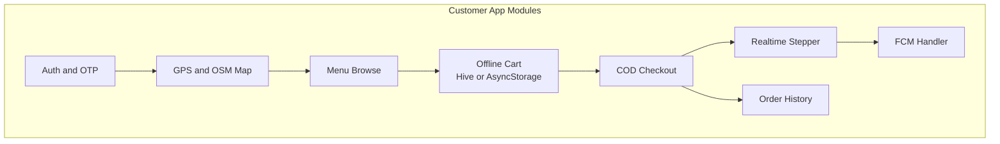

| Module | Key Tasks | Data Flow |
|--------|-----------|-----------|
| Auth & OTP | C-1.1, C-1.2 | Supabase Auth (email+password signup) + `cartman-server` (`POST /auth/send-otp\|verify-otp`) → Semaphore |
| GPS & Map | C-2.1, C-2.2 | Device GPS → OSM tiles → pin drag → coords |
| Offline Cart | C-3.1 | Local Hive; sync on checkout |
| COD Checkout | C-3.2 | `POST /orders/{food,grocery}` on `cartman-server` (server writes `orders` + `order_items`) |
| Food Ordering | C-5.1 | Fetch `menu_items` via direct Supabase read; place order via server |
| Errand / Pabili | C-5.2 | `POST /orders/errand` on `cartman-server`, `custom_description` JSONB |
| Courier Booking (`pickup_delivery`) | C-5.3 | `POST /orders/courier`; fee computed server-side at placement (client has a local `fare.dart` preview mirror, not authoritative) |
| Order Notes | C-6.1 | `merchant_notes`, `rider_notes` columns |
| Saved Addresses | C-6.2 | `saved_addresses` via `cartman-server` (buttons not yet wired to the address API on the UI side) |
| Contact Binding | C-6.3 | Auto-inject verified phone from `profiles.phone` |
| Realtime Tracking | C-4.1, C-7.1 | Supabase Realtime → stepper UI (order-watch channel) |
| Push Alerts | C-4.2 | **Not functional** — FCM fan-out is a logging stub; `firebase_messaging` not in the app |
| Order History | C-7.2 | `GET /orders/history` on `cartman-server` |

### 10.2 Rider Mobile App

**Epics:** Order Acquisition, Telemetry, Financial Integrity, Dispatch, Order Execution, Earnings.

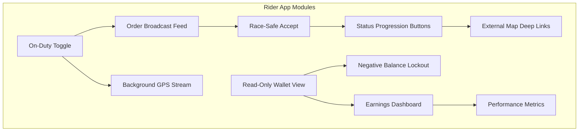

| Module | Key Tasks | Data Flow |
|--------|-----------|-----------|
| Order Feed | R-1.1 | `GET /orders/feed` on `cartman-server` (weighted rank, §9); Realtime change-signal triggers debounced refetch |
| Order Claim | R-1.2, R-4.1 | `PATCH /orders/:id/claim` — conditional `updateMany` in the server (§8); decline stored locally |
| Background GPS | R-2.1 | Batched `POST /riders/me/telemetry` |
| On-Duty Toggle | R-4.2 | `PATCH /riders/me/duty` → `riders.is_active`; disconnects telemetry when off-duty |
| Navigation | R-4.3 | Deep link coords to Google/Apple/Waze |
| Status Updates | R-5.1 | Sequential status button → `PATCH /orders/:id/status` (server legal-transition guard) |
| Wallet Display | R-3.1 | `GET /ledger/me/wallet\|transactions` — derived balance, Manila-day boundary |
| Balance Lockout | R-3.2 | If `rider_net_cash <= -₱2,000`, feed request 403s and claim is blocked server-side (`kWalletLockFloorCentavos` client-side is display-only) |
| Earnings | R-6.1 | `GET /ledger/me/earnings-today` |
| Order History | R-6.2 | `GET /riders/me/history` |
| Performance | R-6.3 | Acceptance rate, avg delivery duration — client-computed from history, no dedicated endpoint |

### 10.3 Merchant Web Panel

**Not built.** No repo, no code — merchants have no login and no self-service surface. The responsibilities below remain the target design; the interim substitute is **ops driving `cartman-server`'s Swagger UI** (`/api/docs`, gated by `SWAGGER_ENABLED` in prod, §12) to call `PATCH /orders/:id/accept` and `PATCH /orders/:id/ready` by hand for every `food`/`grocery` order.

**Target responsibilities (design, not implemented):**

| Feature | Description |
|---------|-------------|
| Menu management | CRUD for `menu_categories` and `menu_items`; images in Supabase Storage |
| Stock toggling | `in_stock` flag hides unavailable items from customer browse |
| Order queue | Realtime list of incoming orders for this merchant |
| Order acceptance | `pending` → `preparing` |
| Ready for pickup | `preparing` → `ready_for_pickup` (triggers rider feed change-signal) |
| Order notes | Display `merchant_notes` and `rider_notes` from customer |
| Order history | Past orders with status and totals |

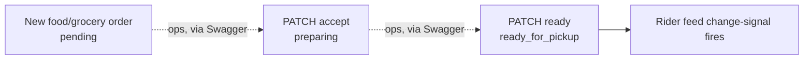

Menu/merchant data itself (browse, stock) is real and already read directly from Supabase by the mobile apps — only the fulfillment-side panel (accept/ready/order queue UI) is missing.

### 10.4 Admin Dashboard

Central operations console for Antique Province launch.

**Implemented, UI-only:** `Cartman-PH-Dashboard` (Next.js 16 + Tailwind v4 + react-icons) is a real, built artifact — 7 pages — but has **no fetch layer and no auth**. Every page renders hardcoded mock data; nothing on the page reads or writes `cartman-server` yet.

| Page | Route | Status |
|------|-------|--------|
| Overview / KPIs | `/` | UI-only, mock data |
| Dispatch console | `/dispatch` | UI-only, mock data |
| Fleet + COD reconcile | `/fleet` | UI-only, mock data |
| Merchants + commission edit | `/merchants` | UI-only, mock data — commission edit has no backing field (§11) |
| Finance / ledger + fee calculator | `/finance` | UI-only, mock data |
| Incidents | `/incidents` | UI-only, mock data — no incidents schema anywhere (§16) |
| Settings | `/settings` | UI-only, mock data |

**AdminModule (`cartman-server`, branch `admin-endpoints`, in progress)** — the backend half of wiring this dashboard up. All endpoints `@Roles('admin')`, list endpoints paginated `{items, total, limit, offset}`:

| Endpoint | Purpose | Feeds which page |
|----------|---------|-------------------|
| `GET /admin/stats` | Platform KPIs | Overview |
| `GET /admin/orders` | Order list, filterable | Dispatch |
| `GET /admin/orders/:id` | Order detail | Dispatch |
| `PATCH /admin/orders/:id/cancel` | Cancel any pre-`delivered` order | Dispatch |
| `PATCH /admin/orders/:id/reassign` | Reassign pre-pickup, mirrors claim guards | Dispatch |
| `GET /admin/riders` | Fleet + `net_cash` + last telemetry | Fleet |
| `GET /admin/merchants` | Merchant list | Merchants |
| `GET /admin/ledger/transactions` | Ledger read | Finance |

**Page → dependency table (what's still missing beyond the endpoint existing):**

| Page | Backend dependency | Status |
|------|--------------------|--------|
| Overview | `GET /admin/stats` | Endpoint in progress; page not wired |
| Dispatch | `GET /admin/orders[/:id]`, `PATCH .../cancel`, `PATCH .../reassign` | Endpoints in progress; page not wired |
| Fleet + COD reconcile | `GET /admin/riders` | Endpoint in progress; page not wired |
| Merchants | `GET /admin/merchants` | Endpoint covers listing only — **commission-rate editing has no backend field** (§11); marked deferred |
| Finance / ledger | `GET /admin/ledger/transactions`, existing `POST /ledger/transactions` | List endpoint in progress; posting endpoint already exists; page not wired |
| Incidents | — | **No backend — deferred.** No `incidents` table, no endpoints, no plan |
| Settings | — | No backend — deferred |

**Deferred gaps (platform-wide, surfaced here because the dashboard is where ops would configure them):** incidents domain (no schema), per-merchant commission rate (no schema; rider currently receives 100% of the delivery fee), zone management, dashboard auth strategy (no login screen, no session, no role check on the Next.js side yet).

### 10.5 Financial Ledger

Authoritative financial surface. **Writers are `cartman-server` only** — no DB trigger, no separate ledger web app.

**Responsibilities:**

| Feature | Description |
|---------|-------------|
| Delivery reward credit | `credit_delivery_reward` written **transactionally and idempotently by `cartman-server` at the `delivered` transition** (§8) — in application code, not a DB trigger |
| COD debit posting | `debit_cod_order` — same delivered-transition writer |
| Remittance credit | `credit_remittance` via `POST /ledger/transactions` (`@Roles('admin')`) — an admin action through the API, not a raw DB insert from a ledger UI |
| Commission calculation | **Not implemented.** `debit_commission` exists in the `wallet_txn_type` enum but nothing writes it — riders currently keep the full delivery fee; no per-merchant commission field exists anywhere |
| Audit trail | Immutable append-only transaction log |
| Balance oversight | Rider net cash surfaced via `GET /admin/riders` (branch `admin-endpoints`, in progress) |
| Reporting | Finance dashboard page exists (UI-only, mock data, §10.4) — not wired |

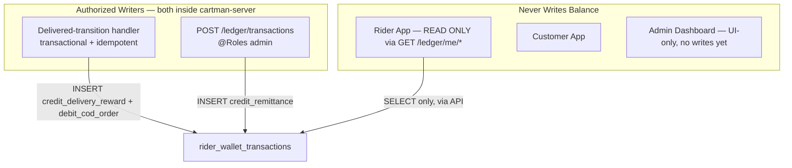

There is no DB trigger on `orders` and no standalone ledger web app — both were part of the original design and neither shipped that way.

---

## 11. Financial Ledger & Wallet Model

### Balance Formula

Rider net disposable cash is a **computed aggregate** (`rider_net_cash` SQL function / `LedgerService.getNetCash`), never stored as a directly mutable field. BigInt centavos throughout, not decimal.

```
W_r = Σ(R_a) - Σ(V_o(COD) + (V_o × C_m) - F_d)
```

| Symbol | Meaning | Implementation status |
|--------|---------|------------------------|
| `W_r` | Net disposable cash (rider wallet position) | Implemented — derived, never stored |
| `R_a` | Cash remittances to platform (`credit_remittance`) | Implemented |
| `V_o` | Historical order value | Implemented |
| `V_o(COD)` | COD amounts collected by rider (`debit_cod_order`) | Implemented |
| `C_m` | Commission split rate | **Not implemented** — no config surface, term is effectively 0 today |
| `F_d` | Delivery payout to rider (`credit_delivery_reward`) | Implemented |

### Transaction Types

`wallet_txn_type` enum (Prisma), 4 values — one unused:

| Type | Direction | Trigger | Status |
|------|-----------|---------|--------|
| `credit_delivery_reward` | Credit (rider earns) | Order marked `delivered` | Implemented — server delivered-transition writer |
| `debit_cod_order` | Debit (rider owes more) | Rider delivers COD order | Implemented — same writer |
| `credit_remittance` | Credit (rider pays platform) | Admin `POST /ledger/transactions` | Implemented |
| `debit_commission` | Debit (platform takes a cut) | Would apply `C_m` | **Defined in the enum, never written** — commission is not implemented |

### Negative Balance Lockout (R-3.2)

When `W_r <= -₱2,000`, enforced **server-side**, not just client display:

1. `GET /orders/feed` returns `403` once a rider's `rider_net_cash` breaches the floor; `PATCH /orders/:id/claim` is guarded the same way (§8).
2. The rider app also checks the threshold client-side (`kWalletLockFloorCentavos`) for immediate UI feedback (hide feed, block accept), but that check is display-only — the server is the actual gate.
3. Display restriction screen: "Remit funds to continue."
4. Admin logs `credit_remittance` via `POST /ledger/transactions` → balance recovers → lockout lifts.

---

## 12. Deployment & Environments

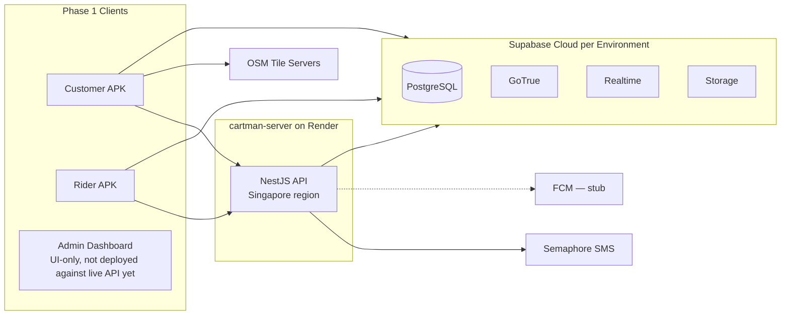

### Environment Strategy

| Environment | Purpose | Supabase Project |
|-------------|---------|------------------|
| `dev` | Local development, seed data | Separate project |
| `staging` | QA, Antique Province test riders/merchants | Separate project |
| `prod` | Live Antique Province operations | Separate project |

`cartman-server`'s `render.yaml`: single `web` service, Node runtime, Singapore region, `preDeployCommand: npx prisma db push` (schema-only — see §4's provisioning-order note; migrations/RLS/functions/publication still apply from `cartman-mobile/supabase/migrations` first). `/api/docs` (Swagger) is gated by `NODE_ENV !== 'production' || SWAGGER_ENABLED === 'true'` — on in prod today to support the interim merchant-ops flow (§10.3).

### Android Distribution

| Channel | Use Case |
|---------|----------|
| Direct APK | Initial provincial pilot with known rider/customer cohort |
| Google Play Store | Broader public rollout after stability validation |

### Server-Hosted Equivalents (formerly Edge Functions)

The original design routed OTP, fee calc, and push through Supabase Edge Functions. Only OTP shipped that way initially — and it has since moved server-side too:

| Function | Original design | Implemented reality |
|----------|------------------|----------------------|
| `send-otp` / `verify-otp` | Supabase Edge Function → Semaphore | **Deprecated.** `cartman-mobile/supabase/functions/otp-send`, `otp-verify` still exist as files but are dormant — OTP is `POST /auth/send-otp\|verify-otp` on `cartman-server` now |
| `calculate-delivery-fee` | Edge Function, distance-based | Computed **in `cartman-server`** at order placement (`orders.service.ts`). A `fare-calc` Edge Function file exists in `cartman-mobile/supabase/functions` but is not invoked by the app — the mobile client has a local `fare.dart` preview mirror for UI display only, not authoritative |
| `send-push-notification` | DB webhook → Edge Function → FCM | `cartman-server`'s webhook receiver → FCM fan-out, but fan-out is a **logging stub** (no real device delivery). A `push-send` Edge Function file also exists in `cartman-mobile/supabase/functions`, unused |

---

## 13. Security & Row-Level Security

**Writes are enforced by the server middleware pipeline, not RLS.** `cartman-server` fronts every write with: `JwtAuthGuard` (validates the Supabase JWT via `SUPABASE_JWT_SECRET`) → `RolesGuard` (`profiles.role` against `@Roles(...)`) → `helmet` → env-driven CORS → `ThrottlerGuard` (100/min global, 10/min on OTP) → global `ValidationPipe({whitelist: true})` → a global exception filter → env validation at boot.

**RLS is defense-in-depth for the surfaces that still read directly from Supabase** (merchant/menu browse, per-order realtime watch, the feed's Realtime change-signal) — 18 policies live in `cartman-mobile/supabase/migrations`. It is not the primary authorization boundary for anything the mobile apps write; those calls go through the server, where role checks happen in application code, not Postgres policy.

### RLS Policy Summary (direct-read surfaces only)

| Table | Customer | Rider | Merchant | Admin |
|-------|----------|-------|----------|-------|
| `orders` | Own orders (SELECT) | Assigned + `ready_for_pickup` pool (SELECT) | — (no merchant auth linkage, §6) | Full access |
| `order_items` | Via order ownership | Via assigned order | — | Full access |
| `menu_items` | Active items (SELECT) | — | — | Full access |
| `rider_wallet_transactions` | — | Own rows (SELECT only) | — | Full access |
| `rider_location_logs` | Assigned rider on own order (SELECT) | Own rows (INSERT) | — | Full access |
| `saved_addresses` | Own (CRUD) | — | — | Full access |
| `merchants` | Active merchants (SELECT) | — | — | Full access |
| `riders` | — | Own record (SELECT, UPDATE `is_active`) | — | Full access |

Row **writes** (order status, claim, wallet, OTP verification) shown here as RLS-permitted are, in practice, executed by the server using its own DB credentials after the `JwtAuthGuard`/`RolesGuard` checks — RLS on those tables is a second line of defense against a compromised client bypassing the server, not the primary gate.

### Security Rules

1. **No client-side wallet mutations** — Rider app never INSERTs/UPDATEs `rider_wallet_transactions`; only reads via `GET /ledger/me/*`.
2. **OTP rate limiting** — `cartman-server`'s `ThrottlerGuard` at 10 requests/min on the OTP routes (replaces the original per-phone Edge Function throttle).
3. **PII scoping** — Customer phone visible to assigned rider only during active order.
4. **Uploads** — Storage writes (avatar, docs) route through the server's multipart endpoint, not direct client-to-Storage writes.
5. **Service role key** — Used only in server-side jobs; never shipped in mobile APKs. `cartman-server` itself authenticates to Postgres via `DATABASE_URL`/`DIRECT_URL`, not the Supabase service role key.

---

## 14. Non-Functional Requirements

| Requirement | Target | Source |
|-------------|--------|--------|
| Rider order claim latency | < 50ms DB query | R-1.2 |
| Order status propagation | Near-instant via Realtime WAL | C-4.1 |
| Offline cart durability | Survives app kill / background | C-3.1 |
| GPS telemetry interval | Adaptive (e.g., 10–30s in transit, stop when off-duty) | R-2.1, R-4.2 |
| Push delivery | Works when app is killed | C-4.2 |
| Order history pagination | Initial limit: 20 records | C-7.2 |
| Map tile load | No enterprise API key dependency | C-2.2 |
| Wallet lockout check | On app open + after each delivery | R-3.2 |

### Background GPS — Android Pattern

The rider app uses an Android **foreground service** with a persistent notification while on-duty and actively delivering. This satisfies Android 8+ background execution limits and keeps telemetry streaming reliable on budget devices common in Antique Province.

---

## 15. Phase Roadmap

### Phase 1 (Shipped / in progress)

- Antique Province service area
- Android Customer + Rider apps (Flutter) — **implemented**
- `cartman-server` as authoritative writer — **implemented**
- Weighted priority dispatch feed (`GET /orders/feed`) — **implemented**, shipped Phase 1 instead of the originally-planned Phase 2 "advanced dispatch." See [rider-dispatch-weighting.md](docs/proposals/rider-dispatch-weighting.md) for what's shipped vs. still future (staggered waves, reliability scoring).
- Admin Dashboard (Next.js 16) — **UI-only prototype**, wiring in progress (`admin-endpoints` branch)
- Merchant Panel — **not built**; interim Swagger ops (§10.3)
- Financial Ledger — **implemented** as server-side writers + admin endpoint, not a standalone web app (§10.5)
- COD payments only
- OSM in-app maps
- Food, grocery, errand, pickup_delivery (courier), and ride order types; `multi_stop` in the enum but no endpoint
- Supabase Realtime — **implemented**; FCM push — **stub, not implemented**

### Phase 2 (Future)

- iOS apps (Customer + Rider)
- Digital payments (GCash, Maya)
- In-app turn-by-turn navigation
- Multi-province expansion
- Staggered-wave dispatch, per-rider reliability scoring (delta beyond the shipped ranked feed — see the proposal doc above)
- Customer loyalty / promotions

---

## 16. Open Decisions

| Decision | Options | Status | Blocker For |
|----------|---------|--------|-------------|
| Web framework | Vite SPA vs Next.js | **Resolved: Next.js 16** — Admin Dashboard built on it | — |
| Dashboard auth strategy | Session cookie, Supabase Auth client, or service-role proxy | Open — no login screen exists yet | Wiring the dashboard to `/admin/*` |
| `delivered_at` column | Add a real column vs keep approximating from `updated_at` | Open — avg-delivery-time is currently an `updated_at` approximation | Accurate delivery-time reporting, `daily_throughput`-style metrics |
| Incidents domain | Design schema vs defer | Open — no schema, dashboard page is mock-only | Incidents page wiring |
| Commissions model | Flat rate, per-merchant, or defer | Open — riders currently keep 100% of the delivery fee; `debit_commission` enum value unused | Merchants page "commission edit" wiring |
| FCM completion | Firebase project + `firebase-admin` fan-out vs stay stubbed | Open | Real push notifications |
| Merchant panel | Build vs stay on Swagger-ops interim | Open | Self-service merchant order fulfillment |
| Antique geofencing | Municipality polygons vs radius from hub | Open — no zone config surface built | Rider feed filtering |
| Play Store vs sideload | Both viable | Open | Distribution plan |

### Flutter vs React Native — Decision Criteria

Choose **Flutter** if:
- Team prioritizes UI consistency and performance on low-end Android devices.
- No existing React/TypeScript codebase to leverage.

Choose **React Native** if:
- Team is already proficient in TypeScript/React.
- Web panels and mobile can share more utility code via `packages/`.

---

## Appendix A: Antique Province Service Context

Antique Province (Western Visayas) is the Phase 1 geographic boundary. Architecture assumptions:

- Delivery zones configured per municipality/barangay in Admin Dashboard.
- OSM tiles provide adequate coverage for San Jose de Buenavista and surrounding municipalities.
- SMS OTP via Semaphore supports Philippine mobile numbers (+63).
- COD is the dominant payment method in provincial markets.

## Appendix B: Document References

| Document | Scope |
|----------|-------|
| Customer-Side Mobile Application PDF | Tasks C-1.1 through C-7.2 |
| Rider-Side Mobile Application PDF | Tasks R-1.1 through R-6.3 |
| This document | Full-platform architecture including web panels |

---

*End of architecture document.*
