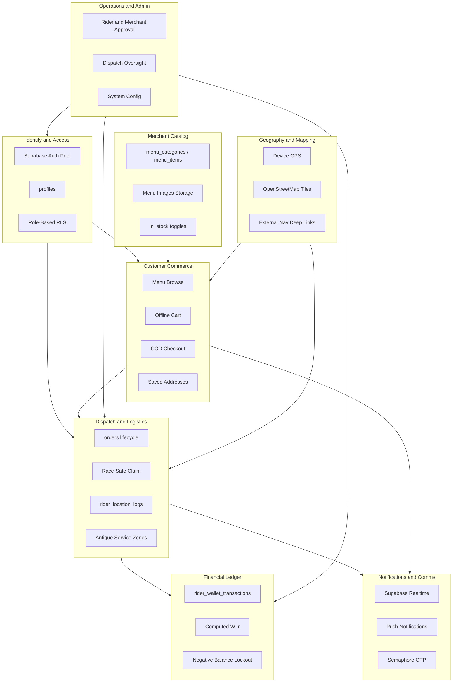

# Information Domains

Grouped bounded contexts extracted from [ARCHITECTURE.md](../../ARCHITECTURE.md).

---

## Domain Map

---

## 1. Identity and Access

**Owner:** Platform (Supabase Auth + `profiles` + RLS)

| Concept | Storage | Consumers |
|---------|---------|-----------|
| User identity | `auth.users` | All apps |
| Role assignment | `profiles.role` | Route guards, RLS |
| Phone verification | `profiles.phone_verified` | Customer checkout gate |
| Rider eligibility | `riders.verification_status`, `riders.is_active` | Rider app, order feed |
| Merchant eligibility | `merchants.status` | Merchant panel, menu visibility |

**Roles:** `customer`, `rider`, `merchant`, `admin`

**Rule:** Single auth pool; authorization via profile role and RLS — not separate auth tenants.

---

## 2. Customer Commerce

**Owner:** Customer mobile app  
**Backlog refs:** C-1.x through C-7.x

| Capability | Domain Data | Local Cache |
|------------|-------------|-------------|
| Food ordering | `orders`, `order_items`, `menu_items` | Cart in Hive/AsyncStorage |
| Errand / Pabili | `orders.custom_description` (JSONB) | — |
| Courier booking | `orders.pickup_coords`, `dropoff_coords` | — |
| Saved addresses | `saved_addresses` | — |
| Order notes | `merchant_notes`, `rider_notes` | — |
| Order history | `orders` (last 20 by customer) | — |
| Contact on order | Verified phone from Auth metadata | — |

**Payment domain (Phase 1):** COD only (`payment_method = cod`).

---

## 3. Merchant Catalog

**Owner:** Merchant web panel

| Capability | Domain Data | Notes |
|------------|-------------|-------|
| Menu categories | `menu_categories` | Per merchant |
| Menu items | `menu_items` | Price, stock, image URL |
| Item images | Supabase Storage | Linked from `menu_items.image_url` |
| Stock control | `menu_items.in_stock` | Hides from customer browse when false |
| Order fulfillment | `orders` status transitions | `pending` → `preparing` → `ready_for_pickup` |

Merchants with `status != active` do not appear in customer browse or receive live orders.

---

## 4. Dispatch and Logistics

**Owner:** Rider mobile app + Admin dashboard  
**Backlog refs:** R-1.x through R-6.x

| Capability | Domain Data | Transport |
|------------|-------------|-----------|
| Available order feed | `orders` where `status = ready_for_pickup` | Supabase Realtime |
| Order claim | `orders.assigned_rider_id`, `status` | Race-safe SQL UPDATE |
| Status progression | `orders.status` | Rider button → DB write → Realtime |
| Rider on-duty | `riders.is_active` | Toggles feed + GPS |
| Live rider position | `rider_location_logs` | Background GPS inserts |
| Declined orders (UI) | Local Hive/AsyncStorage | Not persisted server-side |
| Service area | Admin zone config (Antique) | Filters rider broadcast |

**Order types in dispatch:**

| Type | Merchant step | Rider pickup |
|------|---------------|--------------|
| `food` | Required | Merchant location |
| `errand` | Skipped / ops-handled | Store per `custom_description` |
| `courier` | Skipped | Customer pickup coords |

---

## 5. Financial Ledger

**Owner:** Admin / Financial Ledger web (write); Rider app (read only)

| Concept | Rule |
|---------|------|
| Ledger table | `rider_wallet_transactions` — append-only |
| Balance | Computed aggregate `W_r`, never client-mutable |
| COD collection | `debit_cod_order` on delivery |
| Rider earnings | `credit_delivery_reward` on `delivered` |
| Cash remittance | `credit_remittance` logged by admin |
| Lockout | `W_r <= -2000` → rider feed hidden |

**Forbidden writers:** Customer app, Rider app, Merchant panel.

---

## 6. Operations and Admin

**Owner:** Admin dashboard + Financial Ledger

| Capability | Affects |
|------------|---------|
| Rider approval | `riders.verification_status` |
| Merchant approval | `merchants.status` |
| Dispatch oversight | All active orders, rider map |
| Manual intervention | Order reassignment, cancellation, status override |
| Zone management | Antique barangay/municipality config |
| Rider suspension | `is_active`, `verification_status` |
| System config | Fees, commission `C_m`, lockout threshold |
| Financial reporting | Ledger aggregates |

---

## 7. Notifications and Communications

| Channel | Use Case | Trigger |
|---------|----------|---------|
| Supabase Realtime | In-app live updates | Postgres WAL on `orders`, wallet |
| FCM | Lock-screen alerts | Edge Function / DB trigger on status change |
| Semaphore SMS | Registration OTP | Edge Function on sign-up |
| Native dialer | Rider → customer call | `tel:` link from order contact |

---

## 8. Geography and Mapping

| Surface | In-App Maps | Navigation |
|---------|-------------|------------|
| Customer app | OSM tiles, draggable pin | — |
| Rider app | OSM (tracking context) | Deep link to Google/Apple/Waze |
| Admin dashboard | OSM dispatch map | — |

**Phase 1 constraint:** No Mapbox/Google in-app tile APIs (₱0 baseline).

---

## Application-to-Domain Matrix

| Application | Primary Domains |
|-------------|-----------------|
| Customer mobile | Identity, Commerce, Geo, Notifications |
| Rider mobile | Identity, Dispatch, Finance (read), Geo, Notifications |
| Merchant web | Identity, Catalog, Dispatch (merchant slice) |
| Admin web | Identity, Ops, Dispatch (full), Geo |
| Financial Ledger | Identity, Finance, Ops |

---

## Cross-Domain Events

| Event | Source Domain | Target Domains |
|-------|---------------|----------------|
| Order placed | Commerce | Catalog, Dispatch, Notifications |
| Order ready | Catalog | Dispatch, Notifications |
| Order claimed | Dispatch | Commerce, Catalog, Notifications |
| Order delivered | Dispatch | Finance, Notifications |
| Remittance logged | Finance | Dispatch (lockout lift) |
| Merchant activated | Ops | Catalog, Commerce |

See [flows.md](./flows.md) for sequence diagrams.
