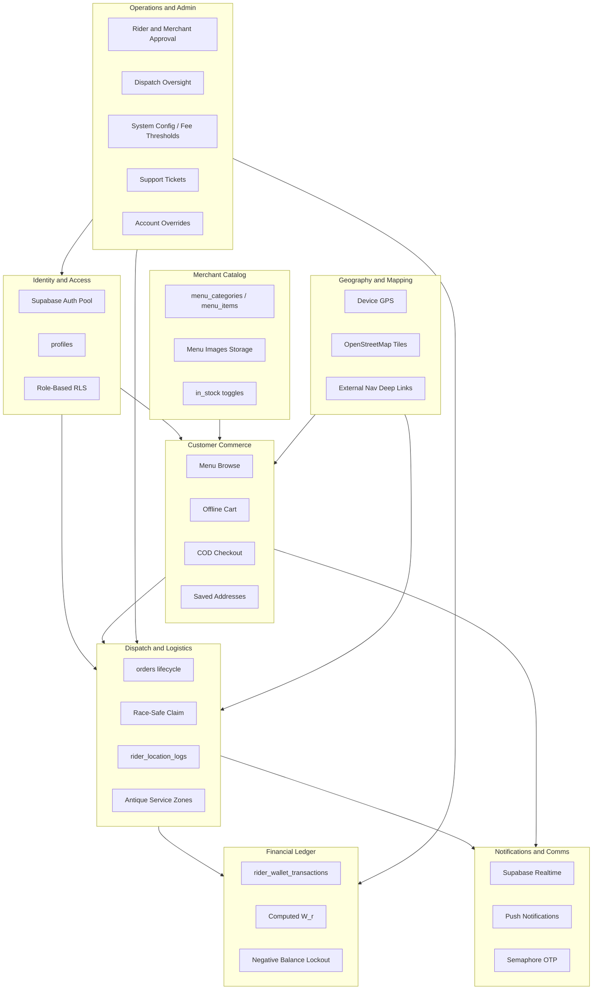

# Information Domains

Grouped bounded contexts extracted from [ARCHITECTURE.md](../../ARCHITECTURE.md).

---

## Domain Map

---

## 1. Identity and Access

**Owner:** Supabase Auth (identity) + `cartman-server` (write-path authorization) + RLS (read-path defense-in-depth). See [ARCHITECTURE.md §6](../../ARCHITECTURE.md#6-authentication--authorization).

| Concept | Storage | Consumers |
|---------|---------|-----------|
| User identity | `auth.users` (email + password, no email verification) | Customer + Rider apps |
| Role assignment | `profiles.role` — only `customer`/`rider` are self-serve; `merchant`/`admin` set directly by ops | `cartman-server` `RolesGuard`, client route guards |
| Phone verification | `profiles.phone_verified` | COD checkout gate — not a signup gate |
| Rider eligibility | `riders.is_active` only | Rider app, order feed. **No `verification_status` column exists** — the approval workflow was never implemented. `riders.is_verified` (Admin V2, §6 below) is a separate, lighter flag set via admin approval of a `verifications` row — it does **not** gate the feed |
| Merchant eligibility | N/A — `merchants` has no `auth.users` FK | No merchant login exists |

**Roles implemented:** `customer`, `rider` (self-serve). `merchant`, `admin` exist as `profiles.role` values but have no signup path.

**Rule:** Single auth pool. Write-path authorization is server-side (`JwtAuthGuard` + `RolesGuard`); read-path is RLS — defense-in-depth, not the primary boundary.

---

## 2. Customer Commerce

**Owner:** Customer mobile app writes through `cartman-server`; menu/merchant browse reads direct from Supabase.  
**Backlog refs:** C-1.x through C-7.x

| Capability | Domain Data | Write Path | Local Cache |
|------------|-------------|------------|-------------|
| Food / grocery ordering | `orders`, `order_items`, `menu_items` | `POST /orders/{food,grocery}` | Cart in Hive |
| Errand / Pabili | `orders.custom_description` (JSONB) | `POST /orders/errand` | — |
| Courier booking (`pickup_delivery`) | `orders.pickup_coords`, `dropoff_coords` | `POST /orders/courier`, fee computed server-side | — |
| Saved addresses | `saved_addresses` | `cartman-server` address endpoints (mobile UI not yet wired to them) | — |
| Order notes | `merchant_notes`, `rider_notes` | Via order placement | — |
| Order history | `orders` (last 20 by customer) | `GET /orders/history` | — |
| Contact on order | Verified phone from `profiles.phone` | — | — |

**Payment domain (Phase 1):** COD only (`payment_method = cod`).

---

## 3. Merchant Catalog

**Owner:** No merchant web panel exists (not built, [ARCHITECTURE.md §10.3](../../ARCHITECTURE.md#103-merchant-web-panel)). Menu/merchant data is read directly from Supabase by the mobile apps; catalog rows are seeded by ops, not self-managed.

| Capability | Domain Data | Notes |
|------------|-------------|-------|
| Menu categories | `menu_categories` | Per merchant, seeded by ops |
| Menu items | `menu_items` | Price, stock, image URL |
| Item images | Supabase Storage | Linked from `menu_items.image_url` |
| Stock control | `menu_items.in_stock` | Hides from customer browse when false |
| Order fulfillment | `orders` status transitions | `pending` → `preparing` → `ready_for_pickup`, done by ops via Swagger (`PATCH /orders/:id/accept\|ready`), not a merchant UI |

`merchants` has no `status`/approval column in the implemented schema and no FK to `auth.users` — every merchant record is visible/active by construction; there is no pending/suspended state today.

---

## 4. Dispatch and Logistics

**Owner:** `cartman-server` (writer for feed/claim/status/telemetry) + Rider mobile app + Admin dashboard (planned oversight, `admin-endpoints` in progress)  
**Backlog refs:** R-1.x through R-6.x

| Capability | Domain Data | Transport |
|------------|-------------|-----------|
| Weighted priority feed | `GET /orders/feed` — `ready_for_pickup`, unassigned, ranked (0.40 age + 0.30 proximity + 0.20 payout + 0.10 type, env-tunable) | `cartman-server`; advisory only |
| Feed change-signal | `orders` table change | Supabase Realtime → debounced refetch of the ranked feed |
| Order claim | `orders.assigned_rider_id`, `status` | `PATCH /orders/:id/claim` — conditional `updateMany` in the server, first-writer-wins; gated by on-duty, queue-depth cap **2**, wallet-lock |
| Status progression | `orders.status` | Rider button → `PATCH /orders/:id/status` (server legal-transition guard) → Realtime broadcast |
| Rider on-duty | `riders.is_active` | `PATCH /riders/me/duty`; toggles feed + telemetry |
| Rider telemetry | Batched `POST /riders/me/telemetry` | No `rider_location_logs`-style customer/admin live-map consumer yet |
| Declined orders (UI) | Local Hive | Not persisted server-side |
| Admin cancel / reassign | `orders.status`, `assigned_rider_id` | `PATCH /admin/orders/:id/{cancel,reassign}` (`admin-endpoints`, in progress) — cancel any pre-`delivered`; reassign pre-pickup only, mirrors claim guards |
| Service area | **Not implemented** — no zone config exists; feed has no geographic filter beyond the 10 km proximity term | — |

**Order types in dispatch** (6-value `order_type` enum — see [schema.md](./schema.md)):

| Type | Merchant step | Rider pickup | Born status |
|------|---------------|---------------|-------------|
| `food`, `grocery` | Required (ops via Swagger) | Merchant location | `pending` |
| `errand` | Skipped / ops-handled | Store per `custom_description` | `ready_for_pickup` |
| `pickup_delivery` (courier) | Skipped | Customer pickup coords | `ready_for_pickup` |
| `ride` (Pasakay) | Skipped | Passenger pickup coords | `ready_for_pickup` |
| `multi_stop` | — | — | **Not implemented** — no server endpoint |

---

## 5. Financial Ledger

**Owner:** `cartman-server` — both writers live inside it, no DB trigger, no standalone ledger app. Rider app is read-only.

| Concept | Rule |
|---------|------|
| Ledger table | `rider_wallet_transactions` — append-only |
| Balance | Computed aggregate `W_r` (`rider_net_cash` / `LedgerService.getNetCash`), never client-mutable |
| COD collection | `debit_cod_order` — written by the server's delivered-transition handler, transactionally + idempotently |
| Rider earnings | `credit_delivery_reward` — same delivered-transition writer |
| Cash remittance | `credit_remittance` via `POST /ledger/transactions` (`@Roles('admin')`) |
| Commission | `debit_commission` exists in the enum but **nothing writes it** — not implemented |
| Lockout | `rider_net_cash <= -2000` → `GET /orders/feed` and claim both `403` server-side; client-side check is display-only |

**Forbidden writers:** Customer app, Rider app, Admin dashboard (UI-only — no writes wired yet).

---

## 6. Operations and Admin

**Owner:** `Cartman-PH-Dashboard` (Next.js 16, **UI-only prototype** — no fetch layer, no auth) + `cartman-server`'s AdminModule (branch `admin-endpoints` for the original 8 routes; branch `admin-v2` for the 13 Admin Dashboard V2 routes below).

| Capability | Affects | Status |
|------------|---------|--------|
| Platform stats | — | `GET /admin/stats` — in progress |
| Order list / detail | `orders` | `GET /admin/orders[/:id]` — in progress |
| Order cancel | `orders.status` — any pre-`delivered` | `PATCH /admin/orders/:id/cancel` — in progress |
| Order reassign | `orders.assigned_rider_id`, `status` — pre-pickup only, mirrors claim guards | `PATCH /admin/orders/:id/reassign` — in progress |
| Fleet oversight | Rider list + `net_cash` + last telemetry | `GET /admin/riders` — in progress |
| Merchant list | `merchants` | `GET /admin/merchants` — in progress |
| Ledger read | `rider_wallet_transactions` | `GET /admin/ledger/transactions` — in progress |
| Remittance posting | `rider_wallet_transactions` | `POST /ledger/transactions` — **already implemented**, predates the AdminModule |
| Incidents | `incidents` table | **Implemented** (Admin V2) — `GET/POST /admin/incidents`, `PATCH /admin/incidents/:id`; dashboard Incidents page still mock-only, not wired |
| System / business config | `global_config` (singleton) | **Implemented, store-and-serve only** (Admin V2) — `GET/POST /admin/config` covers pricing (base rate/radius, surcharge per km), rider (strike limit, auto-assign), merchant (pro-exposure multiplier, ads) params. **Not wired** into live delivery-fee/commission calc; wallet lockout threshold (−₱2,000) remains hardcoded, not in this table |
| Support tickets | `tickets` table | **Implemented** (Admin V2) — `GET /admin/tickets`, `PATCH /admin/tickets/:id/status`. No dashboard page consumes it yet (the 7-page prototype predates this domain) |
| Account overrides | `profiles.suspended`, Supabase auth user | **Implemented** (Admin V2) — `GET /admin/users`, `POST /admin/users/:id/{bypass-auth,reset-2fa,toggle-status}`. `reset-2fa` returns a Supabase recovery `action_link`; email delivery is held pending Brevo, so an admin relays it manually. No dashboard page consumes any of this yet |
| Rider/merchant document review | `verifications` table, `riders.is_verified` | **Implemented, partial** (Admin V2) — `GET /admin/verifications`, `POST /admin/verifications/:id/{approve,reject}`. Approve sets `riders.is_verified=true` for rider submitters, but that flag does **not** gate the order feed (`is_active` still the only gate), and a "Merchant Business Permit" verification has no link back to a `merchants` row (which still has no status column). No mobile upload UI, no dashboard page |
| Commission config (per-merchant rate) | — | **Still not implemented** — `global_config`'s merchant block covers pro-exposure/ads only, not a commission rate; dashboard's "commission edit" UI still has nothing to write to |
| Rider approval (feed-gating) | — | **Still not implemented** — no `verification_status` column exists; `is_active` remains the only feed-eligibility gate (`riders.is_verified` above is a separate, non-gating flag) |
| Zone management | — | **Not implemented** — no schema, no config surface |
| Dashboard auth | — | **Not implemented** — no login screen, no session; blocks wiring every endpoint above, old and new alike |

All 21 AdminModule endpoints (8 original + 13 Admin Dashboard V2) are `@Roles('admin')`; list endpoints paginate `{items, total, limit, offset}`. See [ARCHITECTURE.md §10.4](../../ARCHITECTURE.md#104-admin-dashboard) for the page-by-page dependency table.

---

## 7. Notifications and Communications

| Channel | Use Case | Trigger | Status |
|---------|----------|---------|--------|
| Supabase Realtime | In-app live updates (order-watch, feed change-signal) | Postgres WAL on `orders` | Implemented |
| FCM | Lock-screen alerts | `cartman-server` webhook receiver → FCM fan-out | **Stub — logging only, no device delivery**; `firebase_messaging` not in the mobile apps |
| Semaphore SMS | Phone verification (COD gate, not registration) | `cartman-server` `POST /auth/send-otp` | Implemented; deprecated `otp-send`/`otp-verify` Edge Functions still exist as dormant files |
| Native dialer | Rider → customer call | `tel:` link from order contact | Implemented |

---

## 8. Geography and Mapping

| Surface | In-App Maps | Navigation |
|---------|-------------|------------|
| Customer app | OSM tiles, draggable pin | — |
| Rider app | OSM (tracking context) | Deep link to Google/Apple/Waze |
| Admin dashboard | Fleet page is UI-only mock — no live map wired to real telemetry yet | — |

**Phase 1 constraint:** No Mapbox/Google in-app tile APIs (₱0 baseline).

---

## Application-to-Domain Matrix

| Application | Primary Domains |
|-------------|-----------------|
| Customer mobile | Identity, Commerce, Geo, Notifications |
| Rider mobile | Identity, Dispatch, Finance (read), Geo, Notifications |
| `cartman-server` | Identity (write-path auth), Commerce (writer), Catalog (fulfillment writes), Dispatch (writer), Finance (writer), Notifications (OTP/FCM) |
| Merchant web | **Not built** — target domains would be Catalog, Dispatch (merchant slice) |
| Admin web (`Cartman-PH-Dashboard`) | Identity (planned), Ops, Dispatch (planned, `admin-endpoints`), Finance (planned) — **UI-only today, not wired to any domain's write path** |

---

## Cross-Domain Events

| Event | Source Domain | Target Domains |
|-------|---------------|----------------|
| Order placed | Commerce (via `cartman-server`) | Catalog, Dispatch, Notifications |
| Order ready | Catalog (ops via Swagger, §3) | Dispatch, Notifications |
| Order claimed | Dispatch (`cartman-server` claim endpoint) | Commerce, Catalog, Notifications |
| Order delivered | Dispatch | Finance (ledger write), Notifications |
| Remittance logged | Finance (`POST /ledger/transactions`) | Dispatch (lockout lift) |
| Merchant activated | — | **Not applicable** — merchants have no activation workflow (no auth linkage) |

See [flows.md](./flows.md) for sequence diagrams.
