# System Flows

Process and interaction flows extracted from [ARCHITECTURE.md](../../ARCHITECTURE.md).

---

## Flow Index

| Flow | Type | Actors |
|------|------|--------|
| [Customer registration](#customer-registration-otp) | Onboarding | Customer, Auth, Edge, Semaphore |
| [Rider registration](#rider-registration-approval) | Onboarding | Rider, Admin |
| [Merchant registration](#merchant-registration-approval) | Onboarding | Merchant, Admin, Storage |
| [Food order lifecycle](#food-order-lifecycle) | Core | Customer, Merchant, Rider |
| [Errand order](#errand-pabili-order) | Core | Customer, Rider, Ops |
| [Courier order](#courier-order) | Core | Customer, Rider |
| [Rider order claim](#rider-order-claim-race-condition) | Dispatch | Multiple riders |
| [Rider delivery progression](#rider-delivery-status-progression) | Dispatch | Rider |
| [Merchant order queue](#merchant-order-queue) | Fulfillment | Merchant |
| [Wallet and lockout](#wallet-and-lockout) | Finance | Rider, Admin |
| [Realtime subscriptions](#realtime-subscription-flows) | Events | All clients |
| [Push notification](#push-notification-flow) | Events | FCM |

---

## Customer Registration (OTP)

**Refs:** C-1.1, C-1.2

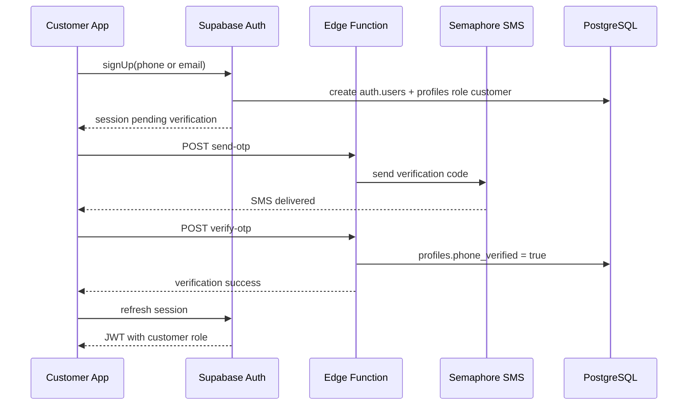

**Gates:**
- Checkout blocked until `phone_verified = true`
- Session stored in encrypted device storage

---

## Rider Registration (Approval)

**Refs:** R-4.2 (post-approval on-duty)

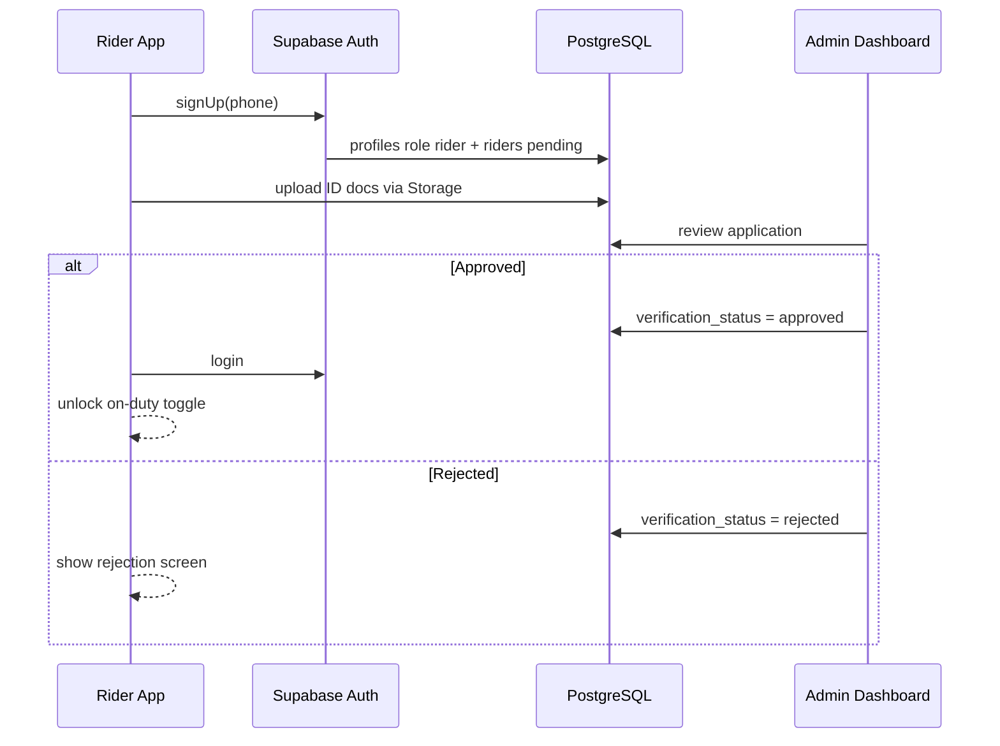

**Feed gate:** `verification_status = approved` AND `is_active = true`

---

## Merchant Registration (Approval)

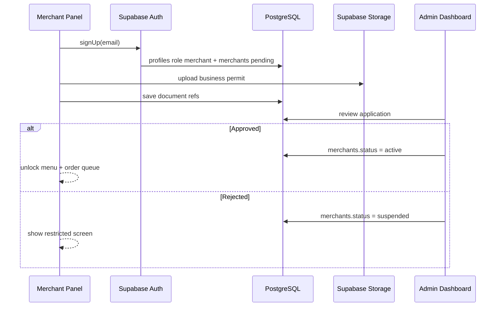

---

## Food Order Lifecycle

End-to-end from placement to delivery.

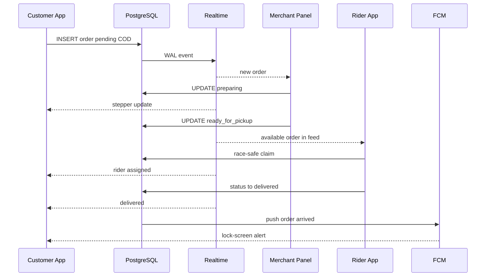

### Order status state machine

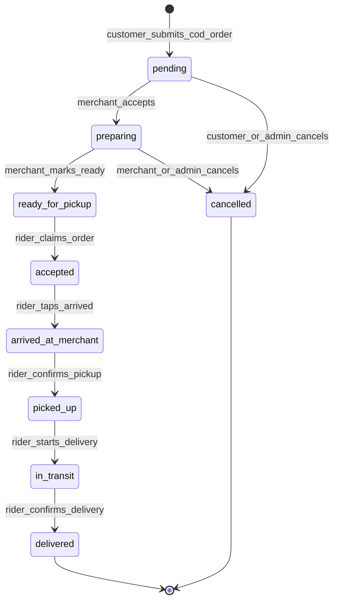

---

## Errand (Pabili) Order

**Refs:** C-5.2

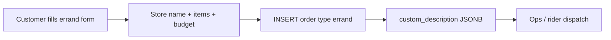

| Field in `custom_description` | Example |
|------------------------------|---------|
| Store name | "Antique Public Market" |
| Item list | "2kg rice, cooking oil" |
| Estimated budget | 500 PHP |

No `merchant_id` or `order_items`. Rider claims from feed when status reaches `ready_for_pickup` (may be set by admin/ops for non-merchant flow).

---

## Courier Order

**Refs:** C-5.3

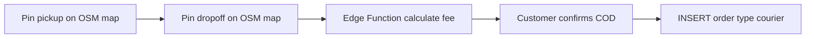

Stores `pickup_coords` and `dropoff_coords`. Fee calculated server-side for consistency.

---

## Rider Order Claim (Race Condition)

**Refs:** R-1.1, R-1.2, R-4.1  
**Target latency:** under 50ms

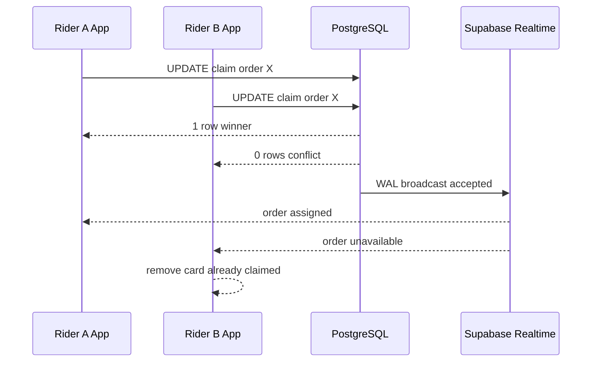

**Decline flow:** Card removed locally (Hive/AsyncStorage); no server write.

---

## Rider Delivery Status Progression

**Refs:** R-5.1

Single contextual button advances status in order:

```
accepted → arrived_at_merchant → picked_up → in_transit → delivered
```

Each tap: `UPDATE orders SET status = :next` → Realtime broadcast to customer, merchant, admin.

**Navigation (R-4.3):** Deep link to Google Maps / Apple Maps / Waze with target coords.

---

## Merchant Order Queue

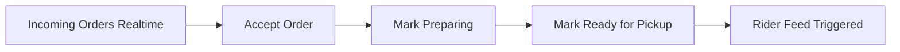

| Step | Status change | Side effect |
|------|---------------|-------------|
| Accept | `pending` → `preparing` | Customer stepper updates |
| Ready | `preparing` → `ready_for_pickup` | Rider feed subscription fires |

---

## Wallet and Lockout

**Refs:** R-3.1, R-3.2

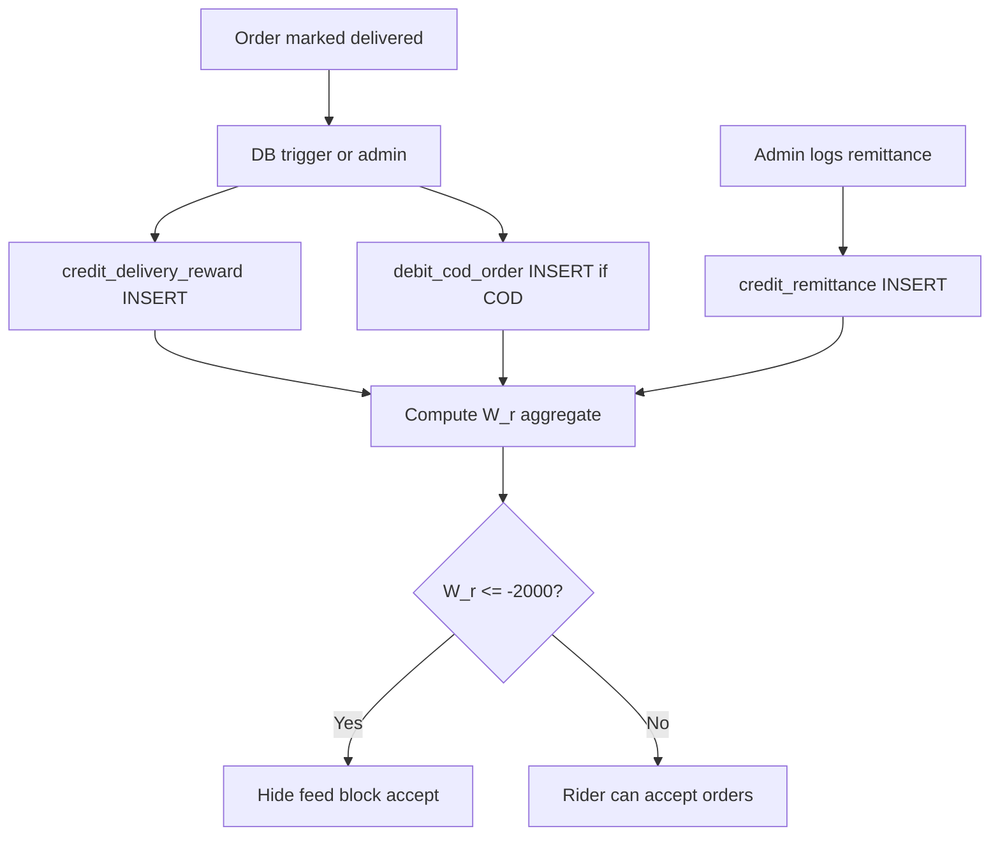

| Transaction | Writer | When |
|-------------|--------|------|
| `credit_delivery_reward` | DB trigger / admin | On delivery |
| `debit_cod_order` | Admin ledger | COD collected |
| `credit_remittance` | Admin ledger | Rider remits cash |

Rider app: **SELECT only** on `rider_wallet_transactions`.

---

## Realtime Subscription Flows

### Event catalog

| Event | Producer | Consumers |
|-------|----------|-----------|
| Order status change | Merchant, Rider, Admin | Customer, Rider, Merchant, Admin |
| `ready_for_pickup` | Merchant | On-duty riders |
| GPS telemetry | Rider app | Customer tracking, Admin map |
| Wallet txn | Admin ledger | Rider earnings view |
| Push | Edge / trigger | FCM to device |

### Customer — track single order (C-4.1)

```javascript
supabase
  .channel('order:' + orderId)
  .on('postgres_changes', {
    event: 'UPDATE',
    schema: 'public',
    table: 'orders',
    filter: 'id=eq.' + orderId
  }, handleStatusChange)
  .subscribe()
```

### Rider — available orders feed (R-1.1)

```javascript
supabase
  .channel('available-orders')
  .on('postgres_changes', {
    event: 'UPDATE',
    schema: 'public',
    table: 'orders',
    filter: 'status=eq.ready_for_pickup'
  }, appendToFeed)
  .subscribe()
```

---

## Push Notification Flow

**Refs:** C-4.2

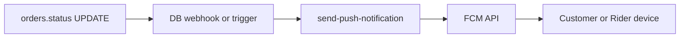

Triggers on key transitions (e.g. rider assigned, delivered). Works when app is backgrounded or killed.

---

## Background GPS Flow (Rider)

**Refs:** R-2.1, R-4.2

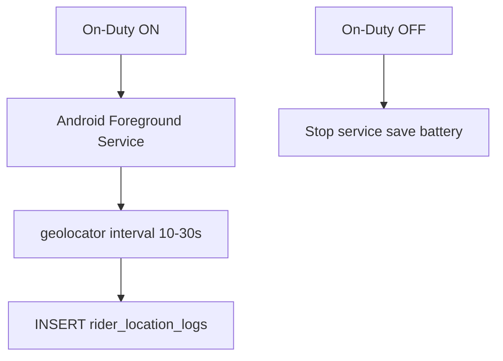

Customer sees assigned rider position via Realtime/poll on logs. Admin dispatch map uses same data.

---

## App Access Control Flow

Post-login role check on every client:

| App | Reject when |
|-----|-------------|
| Customer | `role != customer` |
| Rider | `role != rider` OR `verification_status != approved` |
| Merchant | `role != merchant` OR `status != active` |
| Admin / Ledger | `role != admin` |

Enforced client-side (route guards) and server-side (RLS).
