# System Flows

Process and interaction flows extracted from [ARCHITECTURE.md](../../ARCHITECTURE.md). **Writes route through `cartman-server`** unless noted otherwise.

---

## Flow Index

| Flow | Type | Actors |
|------|------|--------|
| [Customer registration](#customer-registration-email--password) | Onboarding | Customer, Supabase Auth, `cartman-server`, Semaphore |
| [Rider registration](#rider-registration-no-approval-gate) | Onboarding | Rider, Supabase Auth |
| [Merchant registration](#merchant-registration-not-implemented) | Onboarding | **Not implemented** |
| [Food order lifecycle](#food-order-lifecycle) | Core | Customer, `cartman-server`, Ops (Swagger), Rider |
| [COD ID validation](#cod-id-validation-not-implemented) | Core | **Not implemented** |
| [Errand order](#errand-pabili-order) | Core | Customer, `cartman-server`, Rider |
| [Courier order](#courier-order-pickup_delivery) | Core | Customer, `cartman-server`, Rider |
| [Rider order claim](#rider-order-claim-race-condition) | Dispatch | Multiple riders, `cartman-server` |
| [Rider delivery progression](#rider-delivery-status-progression) | Dispatch | Rider, `cartman-server` |
| [Merchant order queue (ops interim)](#merchant-order-queue-ops-interim) | Fulfillment | Ops, `cartman-server` (Swagger) |
| [Admin cancel and reassign](#admin-cancel-and-reassign) | Dispatch | Admin, `cartman-server` (`admin-endpoints`, in progress) |
| [Wallet and lockout](#wallet-and-lockout) | Finance | Rider, `cartman-server`, Admin |
| [Support ticket and override](#support-ticket-and-override-not-implemented) | Admin | **Not implemented** |
| [Realtime subscriptions](#realtime-subscription-flows) | Events | All clients |
| [Push notification](#push-notification-flow) | Events | FCM — stub |

---

## Customer Registration (Email + Password)

**Refs:** C-1.1, C-1.2

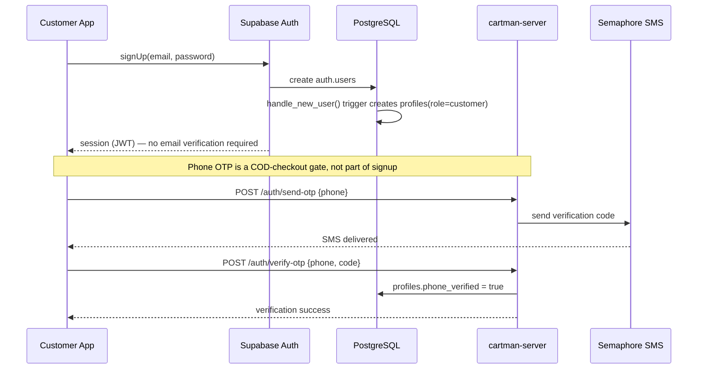

**Gates:**
- COD checkout blocked until `phone_verified = true` — signup/login/browsing are not blocked.
- `OTP_DEV_MODE=true` returns the code inline instead of sending SMS.
- Session tokens stored via the Supabase client SDK's secure storage.

---

## Rider Registration (No Approval Gate)

**Refs:** R-4.2

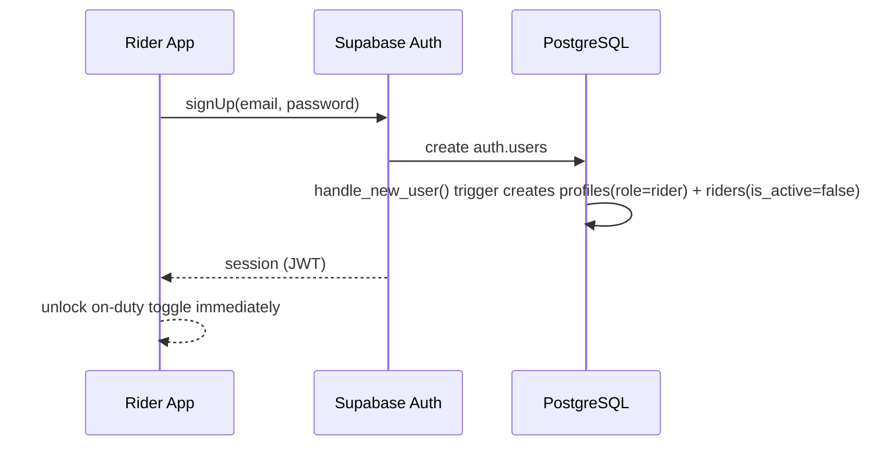

**Feed gate:** `is_active = true` only. **No approval workflow exists** — the `verification_status: pending/approved/rejected` design (with admin document review) was never implemented; there is no `verification_status` column.

---

## Merchant Registration (Not Implemented)

There is no merchant app, no merchant login, and `merchants` has no FK to `auth.users`. The application/document-upload/admin-review flow originally designed here does not exist in code. Merchant rows (name, menu, delivery fee) are inserted directly by ops — seed data today is *Kusina ni Aling Nena* with 3 menu items. See [ARCHITECTURE.md §10.3](../../ARCHITECTURE.md#103-merchant-web-panel).

---

## Food Order Lifecycle

End-to-end from placement to delivery. Writes go through `cartman-server`; realtime broadcast is unchanged (Supabase WAL).

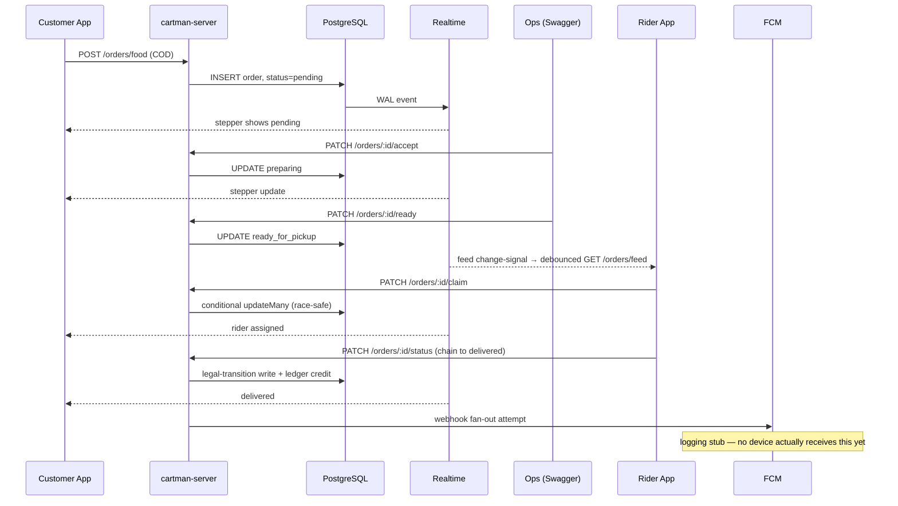

### Order status state machine

Implemented `order_status` enum uses **`canceled`** (one L), not `cancelled`. Includes admin cancel (any pre-`delivered` status) and admin reassign (pre-pickup only) — see [ARCHITECTURE.md §8](../../ARCHITECTURE.md#8-order-lifecycle) for the full diagram with every admin-cancel edge.

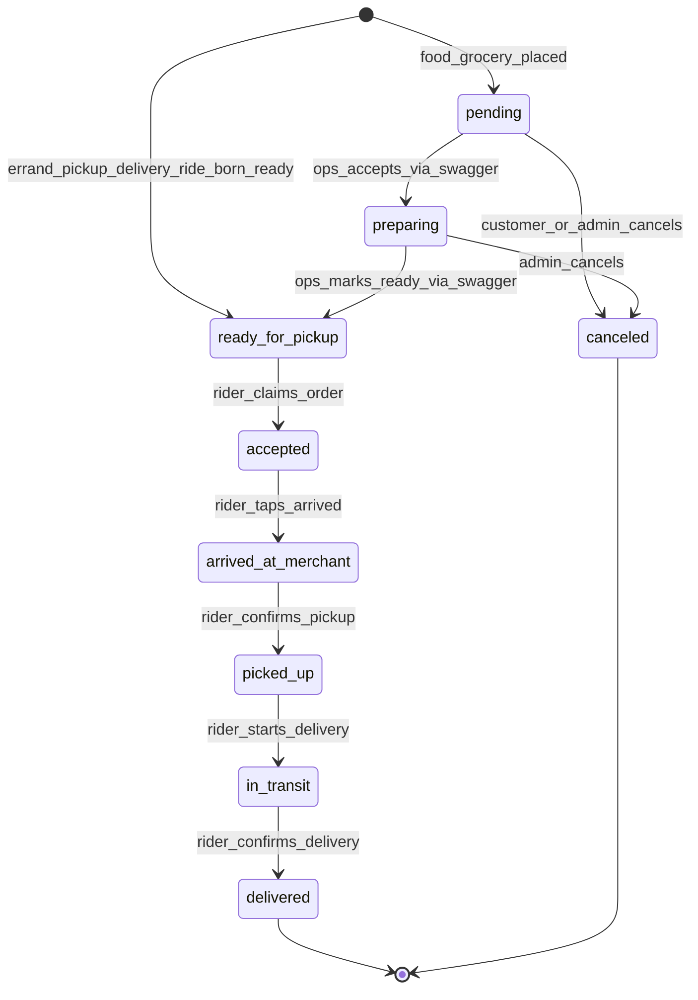

---

## COD ID Validation (Not Implemented)

The original design gated COD checkout on `profiles.id_document_url`/`id_verified`. **Neither column exists** in the implemented `profiles` table — there is no ID-upload popup, no document review, no COD-fraud gate beyond phone OTP verification (`phone_verified`). Treat this flow as unbuilt, not as a hidden/disabled feature.

---

## Errand (Pabili) Order

**Refs:** C-5.2

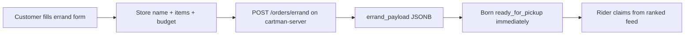

| Field in `errand_payload` (implemented column name — original design called it `custom_description`) | Example |
|------------------------------|---------|
| Store name | "Antique Public Market" |
| Item list | "2kg rice, cooking oil" |
| Estimated budget | 500 PHP |

No `merchant_id` or `order_items`. Born `ready_for_pickup` directly — no ops accept/ready step, unlike food/grocery.

---

## Courier Order (`pickup_delivery`)

**Refs:** C-5.3

The implemented `order_type` enum value is `pickup_delivery`, not `courier`.

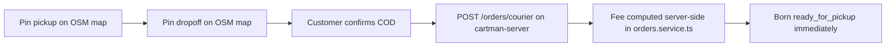

Stores `pickup_lat`/`pickup_lng`/`dropoff_lat`/`dropoff_lng` (not `point` columns). Fee is calculated server-side at placement — a `fare-calc` Edge Function file exists in `cartman-mobile/supabase/functions` but is unused; the client's local `fare.dart` is a display-only preview, not authoritative.

---

## Rider Order Claim (Race Condition)

**Refs:** R-1.1, R-1.2, R-4.1  
**Target latency:** under 50ms

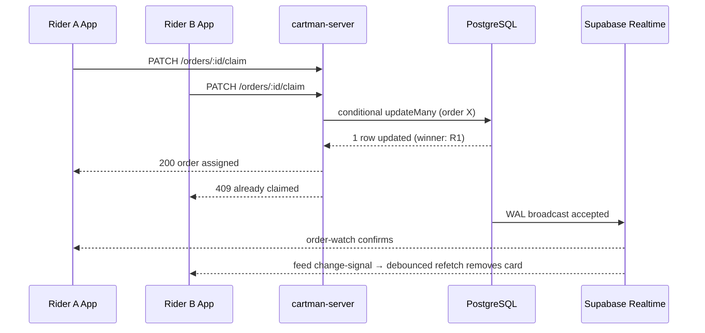

Gated server-side before the update runs: rider on-duty (`riders.is_active`), queue-depth cap **2** concurrent non-terminal orders, wallet not locked (`rider_net_cash > -₱2,000`).

**Decline flow:** Card removed locally (Hive); no server write.

---

## Rider Delivery Status Progression

**Refs:** R-5.1

Single contextual button advances status in order:

```
accepted → arrived_at_merchant → picked_up → in_transit → delivered
```

Each tap: `PATCH /orders/:id/status` on `cartman-server` (validates the legal-transition chain server-side, strict, no skipping) → Realtime broadcast to customer.

**Navigation (R-4.3):** Deep link to Google Maps / Apple Maps / Waze with target coords.

---

## Merchant Order Queue (Ops Interim)

No merchant panel exists — this is ops, by hand, via Swagger, standing in for it.

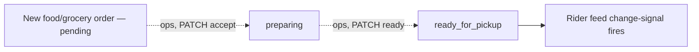

| Step | Endpoint | Status change |
|------|----------|----------------|
| Accept | `PATCH /orders/:id/accept` (ops, Swagger) | `pending` → `preparing` |
| Ready | `PATCH /orders/:id/ready` (ops, Swagger) | `preparing` → `ready_for_pickup` |

`errand`/`pickup_delivery`/`ride` skip this entirely — born `ready_for_pickup`.

---

## Admin Cancel and Reassign

**Status:** branch `admin-endpoints`, in progress — not yet merged.

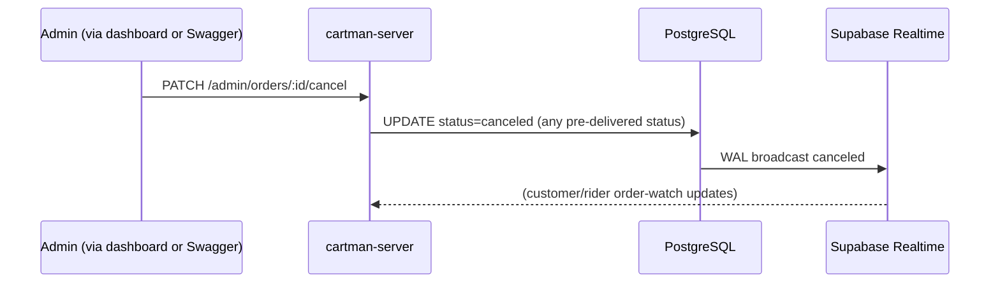

```mermaid
sequenceDiagram
  participant Admin as Admin (via dashboard or Swagger)
  participant Server as cartman-server
  participant DB as PostgreSQL
  participant RT as Supabase Realtime

  Admin->>Server: PATCH /admin/orders/:id/reassign {new_rider_id}
  Note over Server: Pre-pickup only (status = accepted); mirrors claim guards\n(on-duty, queue-depth cap 2, wallet not locked) for the new rider
  Server->>DB: UPDATE assigned_rider_id, status=accepted
  DB->>RT: WAL broadcast
  RT-->>Server: old rider's order-watch drops it; new rider's picks it up
```

Both are `@Roles('admin')`. Cancel accepts any status before `delivered`; reassign is pre-pickup only (before `arrived_at_merchant`).

---

## Wallet and Lockout

**Refs:** R-3.1, R-3.2

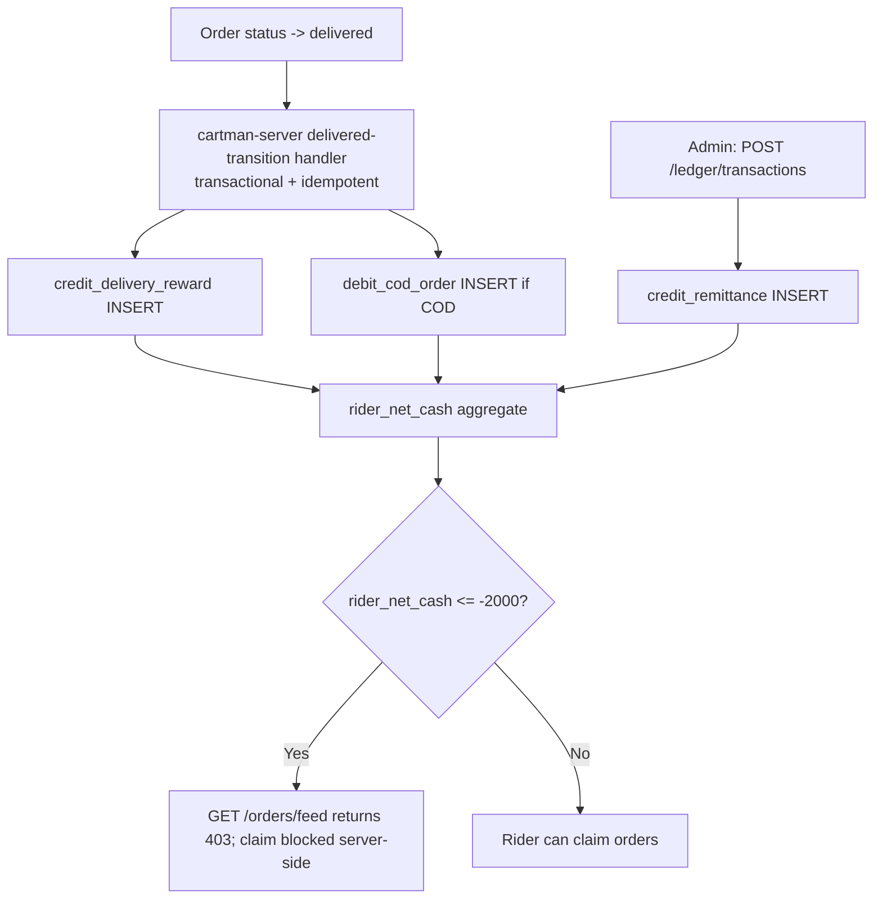

| Transaction | Writer | When | Status |
|-------------|--------|------|--------|
| `credit_delivery_reward` | `cartman-server` (delivered-transition handler) | On delivery | Implemented |
| `debit_cod_order` | Same handler | COD collected | Implemented |
| `credit_remittance` | `cartman-server` (`POST /ledger/transactions`, `@Roles('admin')`) | Rider remits cash | Implemented |
| `debit_commission` | — | Would apply commission | **Never written — not implemented** |

Rider app: **SELECT only**, via `GET /ledger/me/*` — never a direct table read/write.

---

## Support Ticket and Override (Not Implemented)

No `support_tickets` table exists in the implemented schema. The account-override flow described here (password reset / auth bypass gated by a ticket + user confirmation) is design-only — there is no ticket submission, no admin review queue, and no override execution path in code today.

---

## Realtime Subscription Flows

### Event catalog

| Event | Producer | Consumers | Status |
|-------|----------|-----------|--------|
| Order status change | `cartman-server` (write) | Customer/Rider order-watch channels | Implemented |
| Feed change-signal | `cartman-server` (write) | On-duty riders — triggers debounced `GET /orders/feed` refetch, not a raw row push | Implemented |
| GPS telemetry | Rider app, batched `POST /riders/me/telemetry` | Server-side storage only | No customer-tracking/admin-map consumer wired yet |
| Wallet txn | `cartman-server` (write) | Rider app, via `GET /ledger/me/*` reads (not a realtime push) | Implemented |
| Push | `cartman-server` webhook receiver | FCM to device | **Stub — logging only** |

### Customer — track single order (C-4.1, unchanged from original design)

```javascript
supabase
  .channel('order:' + orderId)
  .on('postgres_changes', {
    event: 'UPDATE',
    schema: 'public',
    table: 'orders',
    filter: 'id=eq.' + orderId
  }, handleStatusChange)
  .subscribe()
```

### Rider — feed change-signal, not a direct feed push (R-1.1)

```javascript
supabase
  .channel('available-orders')
  .on('postgres_changes', {
    event: '*',
    schema: 'public',
    table: 'orders',
    filter: 'status=eq.ready_for_pickup'
  }, () => debouncedRefetchRankedFeed()) // GET /orders/feed on cartman-server
  .subscribe()
```

The event handler doesn't append the changed row directly to the feed (as the original design's `appendToFeed` implied) — it triggers a refetch of the server's ranked feed, which re-scores and re-sorts.

---

## Push Notification Flow

**Refs:** C-4.2 — **Not functional today.**

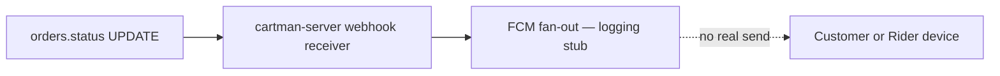

`firebase_messaging` is not in the mobile apps; no Firebase project is wired up. Device-token plumbing (`device_tokens` table, `POST` endpoints) exists, but nothing consumes it for real delivery.

---

## Background GPS Flow (Rider)

**Refs:** R-2.1, R-4.2

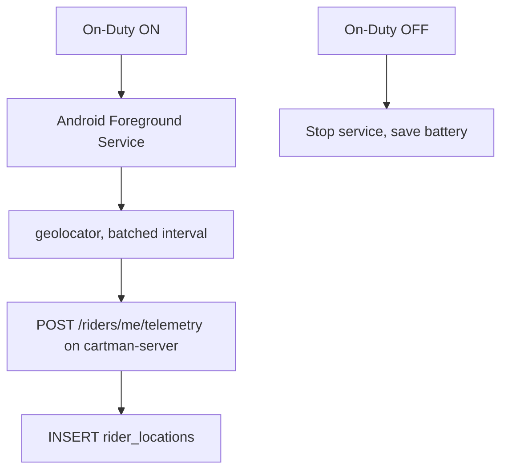

Telemetry is batched through the server (not a raw per-tick client insert to Supabase). No customer-tracking or admin-dispatch-map consumer of this data is wired up yet — it's write-only today.

---

## App Access Control Flow

Post-login role check on every client:

| App | Reject when |
|-----|-------------|
| Customer | `role != customer` |
| Rider | `role != rider` (no `verification_status` check — doesn't exist) |
| Merchant panel | N/A — no merchant app exists |
| Admin dashboard | No login exists yet; planned check is `role == admin` once dashboard auth ships |

Write-path enforcement is server-side (`JwtAuthGuard` + `RolesGuard` on `cartman-server`); the RLS-based enforcement in the original design applies only to the direct-read surfaces (§ schema.md).
