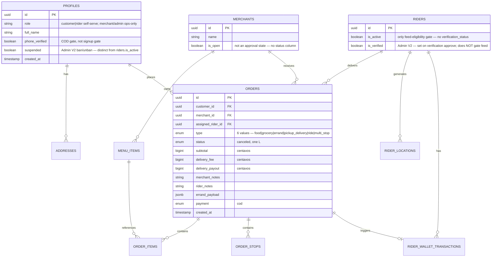

# Database Schema

Database design reference extracted from [ARCHITECTURE.md](../../ARCHITECTURE.md).  
**Engine:** PostgreSQL 15+ via Supabase. **Two schema sources must stay in sync** (no shared migration tooling, see [ARCHITECTURE.md §4](../../ARCHITECTURE.md#4-repository-layout)): `cartman-mobile/supabase/migrations/*.sql` (tables, RLS, functions, realtime — source of truth) and `cartman-server/prisma/schema.prisma` (Prisma model consumed by the API).

**Writes vs reads:** tables written by mobile clients go through `cartman-server` (§13 below); RLS on the tables below governs the **direct reads** the apps still make to Supabase (menu/merchant browse, own-row reads, realtime).

---

## Entity Relationship Overview



No `menu_categories` table in the implemented schema — `menu_items.category` is a plain text field, not a joined entity. Auth tables (`auth.users`) link 1:1 to `profiles.id`. This diagram is simplified for relationships; see Table Reference below for full, accurate columns.

---

## Table Reference

Implemented table names/shapes below (from `cartman-mobile/supabase/migrations/20260630000100_schema.sql`), annotated where the original design (right column caveats) didn't match.

### `profiles`

Extension of `auth.users`. Central role and identity record. **Written by `cartman-server`** (OTP verify) and by the `handle_new_user()` trigger on signup; read directly by clients under RLS.

| Column | Type | Notes |
|--------|------|-------|
| `id` | `uuid` PK | FK → `auth.users.id` |
| `role` | `text` | Default `'customer'`; only `'customer'` \| `'rider'` are reachable via self-serve signup. `'merchant'`/`'admin'` are valid values but set only by ops |
| `full_name` | `text` | Display name |
| `phone` | `text` unique | |
| `phone_verified` | `boolean` | COD checkout gate — set via `cartman-server`'s `POST /auth/verify-otp`, **not** a signup requirement |
| `avatar_url` | `text` nullable | Avatar upload UI is disabled client-side (no `image_picker` wired) even though this column and server storage plumbing exist |
| `membership_tier`, `cart_points`, `wallet_centavos` | `text`, `bigint`, `bigint` | Customer loyalty fields — not part of the original design, present in the implemented schema |
| `suspended` | `boolean` default `false` | **Admin Dashboard V2.** Ban/unban flag, flipped by `POST /admin/users/:id/toggle-status` and cleared by `POST /admin/users/:id/bypass-auth`. Distinct from `riders.is_active` (duty on/off) — this is an account-level lock, not a rider-only concept |
| `created_at` | `timestamptz` | Default `now()` |

**No `id_document_url`/`id_verified` columns exist** — the COD-ID-validation design in [flows.md](./flows.md) is not implemented against this table.

---

### `riders`

Rider-specific extension. One row per rider profile, created by `handle_new_user()` when `role = 'rider'`.

| Column | Type | Notes |
|--------|------|-------|
| `id` | `uuid` PK | FK → `profiles.id` |
| `is_active` | `boolean` | On-duty toggle; **the only** feed-eligibility gate — written via `cartman-server`'s `PATCH /riders/me/duty` |
| `is_verified` | `boolean` default `false` | **Admin Dashboard V2.** Set `true` by `POST /admin/verifications/:id/approve` when the approved `verifications` row's `user_id` is this rider. **Does not gate the feed** — `is_active` above is still the only gate this column doesn't touch |
| `vehicle`, `plate_no` | `text` | |
| `rating`, `acceptance_rate`, `total_trips`, `broadcast_count`, `avg_duration_secs` | numeric/int | Performance stats |

**No `verification_status` column** — the `pending`/`approved`/`rejected`/`suspended` approval workflow from the original design was never implemented. `is_verified` (above) is a narrower, differently-scoped Admin V2 addition (a simple boolean flag from a generic document-review queue), not a replacement for it.

**Computed (not stored):** wallet balance `W_r`, via the `rider_net_cash(rider_id)` SQL function / `LedgerService.getNetCash` in `cartman-server`.

---

### `merchants`

Merchant catalog record — **not an authenticated actor.**

| Column | Type | Notes |
|--------|------|-------|
| `id` | `uuid` PK | No FK to `auth.users`/`profiles` — merchants don't log in |
| `name`, `category` | `text` | |
| `rating` | `numeric` | |
| `delivery_fee`, `min_order` | `bigint` (centavos) | |
| `eta_minutes` | `int` | |
| `is_open` | `boolean` | Business-hours/stock flag — not an approval state |
| `image_url`, `promo_text` | `text` nullable | |
| `created_at` | `timestamptz` | |

**No `status`/`documents`/`location` columns** — the pending/active/suspended approval workflow and document-upload flow in the original design don't exist. Merchant rows are inserted by ops (seed data today).

---

### `menu_items`

Flat per-merchant menu table (no separate `menu_categories` table in the implemented schema — category is a text field on the item, not a joined entity).

| Column | Type | Notes |
|--------|------|-------|
| `id` | `uuid` PK | |
| `merchant_id` | `uuid` FK | → `merchants.id` |
| `name`, `category` | `text` | |
| `price` | `bigint` (centavos) | |
| `in_stock` | `boolean` | Hidden from browse when false |
| `image_url` | `text` nullable | |

---

### `orders`

Central transactional entity. **Written exclusively by `cartman-server`** — placement, claim, status, cancel, admin cancel/reassign. Read directly by clients (own rows / feed pool) under RLS.

| Column | Type | Notes |
|--------|------|-------|
| `id` | `uuid` PK | |
| `ref_no` | `text` unique | `CMN-######`, filled by a `before insert` trigger from `order_ref_seq` — not client-supplied |
| `customer_id` | `uuid` FK | → `profiles.id` |
| `assigned_rider_id` | `uuid` FK nullable | → `profiles.id`; null until claimed |
| `type` | `order_type` enum | `food`, `grocery`, `errand`, `pickup_delivery`, `ride`, `multi_stop` (6 values — see enum below; column name is `type`, not `order_type`) |
| `status` | `order_status` enum | See enum below |
| `merchant_id` | `uuid` FK nullable | → `merchants.id`; required for `food`/`grocery` |
| `merchant_name` | `text` nullable | Denormalized snapshot |
| `payment` | `payment_method` enum | Phase 1: `cod` only |
| `pickup_lat`/`pickup_lng`/`pickup_text`, `dropoff_lat`/`dropoff_lng`/`dropoff_text` | `double precision`, `text` | Geocoded endpoints — used by `errand`/`pickup_delivery`/`ride`, not `point` types as originally designed |
| `subtotal`, `delivery_fee`, `discount`, `total`, `delivery_payout` | `bigint` (centavos) | Money — **BigInt centavos everywhere, not `decimal`** |
| `errand_payload` | `jsonb` nullable | Pabili: store, items, budget (the original design's `custom_description`) |
| `notes`, `merchant_notes`, `rider_notes` | `text` nullable | |
| `recipient_name`, `recipient_phone` | `text` nullable | |
| `created_at`, `updated_at` | `timestamptz` | No `accepted_at` column — claim time isn't separately tracked; **no `delivered_at` column either** — avg-delivery-time reporting approximates from `updated_at` (deferred gap) |

Indexes worth knowing: `orders_feed_idx` on `(status) WHERE assigned_rider_id IS NULL` — the hot path for the ranked feed query.

---

### `order_stops`

**Not in the original design.** Backing table for a "Multi-Stop Builder" UI, matching the `multi_stop` order type — but **no server endpoint reads or writes it**; it's schema-only, unused.

| Column | Type | Notes |
|--------|------|-------|
| `id` | `uuid` PK | |
| `order_id` | `uuid` FK | → `orders.id` |
| `seq` | `int` | Stop order |
| `kind` | `text` | `'pickup'` \| `'buy'` \| `'deliver'` |
| `label`, `lat`, `lng`, `payload` | `text`, `double precision`, `jsonb` | |

---

### `device_tokens`

**Not in the original design.** FCM push targets — exists as schema, but push fan-out is a logging stub (§ Deferred/Absent below), so nothing currently sends to these tokens.

| Column | Type | Notes |
|--------|------|-------|
| `id` | `uuid` PK | |
| `user_id` | `uuid` FK | → `profiles.id` |
| `token` | `text` | |
| `platform` | `text` | `'android'` \| `'ios'` |
| `updated_at` | `timestamptz` | |

---

### `otp_codes`

**Not in the original design** (original had no OTP persistence table — verification state lived only on `profiles.phone_verified`).

| Column | Type | Notes |
|--------|------|-------|
| `id` | `uuid` PK | |
| `phone` | `text` nullable | |
| `email` | `text` nullable | Email-channel column exists but is **dormant** — only the `sms` channel is wired end-to-end today |
| `channel` | `text` | `'sms'` (active) \| `'email'` (dormant — planned Resend integration, not live) |
| `code_hash` | `text` | SHA-256 of the 6-digit code |
| `user_id` | `uuid` FK nullable | → `profiles.id` |
| `expires_at` | `timestamptz` | |
| `consumed` | `boolean` | |

---

### `order_items`

Structured line items for `food`/`grocery` orders.

| Column | Type | Notes |
|--------|------|-------|
| `id` | `uuid` PK | |
| `order_id` | `uuid` FK | → `orders.id`, cascade delete |
| `menu_item_id` | `uuid` FK nullable | |
| `name` | `text` | Denormalized snapshot |
| `qty` | `int` | (original design: `quantity`) |
| `unit_price` | `bigint` (centavos) | (original design: `line_total`/`decimal`) |
| `modifiers` | `jsonb` | Variations, add-ons |

---

### `addresses`

(Original design called this `saved_addresses` — implemented table is `addresses`.)

| Column | Type | Notes |
|--------|------|-------|
| `id` | `uuid` PK | |
| `profile_id` | `uuid` FK | → `profiles.id` |
| `label`, `lat`, `lng`, `text` fields | — | Address CRUD endpoints exist on `cartman-server`, but the customer app's saved-addresses screen buttons are **not yet wired** to them |

---

### `rider_locations`

Append-only telemetry. (Original design called this `rider_location_logs`.)

| Column | Type | Notes |
|--------|------|-------|
| `id` | `bigserial` PK | |
| `rider_id` | `uuid` FK | → `riders.id` |
| `lat`, `lng` | `double precision` | Not a `point` type |
| `order_id` | `uuid` FK nullable | |
| `recorded_at` | `timestamptz` | Written via batched `POST /riders/me/telemetry`, not a raw per-tick client insert |

---

### `rider_wallet_transactions`

Append-only financial ledger. **Written only by `cartman-server`** — the delivered-transition handler (transactional + idempotent) and the admin `POST /ledger/transactions` endpoint. No DB trigger.

| Column | Type | Notes |
|--------|------|-------|
| `id` | `bigserial` PK | |
| `rider_id` | `uuid` FK | → `riders.id` |
| `order_id` | `uuid` FK nullable | Linked order when applicable |
| `type` | `wallet_txn_type` enum | 4 values — see below (column name is `type`, not `txn_type`) |
| `amount` | `bigint` (centavos) | Always positive; sign is derived from `type` in `rider_net_cash()`, not stored |
| `created_at` | `timestamptz` | Immutable |

No `description` column — audit label isn't a stored field.

---

### Admin Dashboard V2 tables (`incidents`, `verifications`, `tickets`, `global_config`)

Four new tables, all **admin/server-only**: RLS is enabled on each with **no policies** — same posture as other server-write-only tables (§ Row-Level Security Summary below). Mobile apps never read these directly; only `cartman-server` (via `DATABASE_URL`/`DIRECT_URL`, not the service-role key) reads/writes them. Source: `cartman-server/prisma/schema.prisma`, mirrored in `cartman-mobile/supabase/migrations/20260709000100_admin_v2.sql`. All four have no BigInt/Decimal money columns except `global_config`, so Nest serializes their rows as-is (Date → ISO) apart from that one exception.

#### `incidents`

Operational issue / system alert log. Written/read by `AdminIncidentsService` (`GET/POST /admin/incidents`, `PATCH /admin/incidents/:id`).

| Column | Type | Notes |
|--------|------|-------|
| `id` | `uuid` PK | `gen_random_uuid()` |
| `type`, `severity` | `text` | Free-form, set by the caller — no enum/check constraint |
| `status` | `text` default `'Open'` | `Open` \| `Investigating` \| `Resolved` — enforced application-side (`@IsIn`), not a DB enum |
| `related_order`, `assignee` | `text` nullable | Free-form; `related_order` is **not** an FK to `orders.id` |
| `reported_at` | `timestamptz` default `now()` | |

#### `verifications`

COD ID / Merchant Business Permit review queue. Written/read by `AdminVerificationsService` (`GET /admin/verifications`, `POST /admin/verifications/:id/{approve,reject}`).

| Column | Type | Notes |
|--------|------|-------|
| `id` | `uuid` PK | |
| `user_id` | `uuid`, not an FK-enforced column in Prisma | Conceptually → `profiles.id`; approve flips `riders.is_verified` when this id matches a rider |
| `document_type`, `document_url` | `text` | Free-form — no distinction in schema between a rider COD-ID submission and a merchant business-permit submission beyond this string |
| `status` | `text` default `'Pending'` | `Pending` \| `Approved` \| `Rejected` |
| `submitted_at` | `timestamptz` default `now()` | |

No mobile-app upload UI writes this table yet; rows are created by ops/Swagger today. Approving a `Merchant Business Permit` verification does **not** touch any `merchants` row — `merchants` still has no status column (see `merchants` above).

#### `tickets`

Multi-channel support requests (customer/rider/merchant). Written/read by `AdminTicketsService` (`GET /admin/tickets`, `PATCH /admin/tickets/:id/status`).

| Column | Type | Notes |
|--------|------|-------|
| `id` | `uuid` PK | |
| `user_id` | `uuid`, not an FK-enforced column in Prisma | Conceptually → `profiles.id` |
| `category` | `text` | `General` \| `Dispute` \| `Technical` \| `Billing` — free-form, not a DB enum |
| `subject` | `text` | |
| `priority` | `text` default `'Low'` | `Low` \| `Medium` \| `High` — free-form |
| `status` | `text` default `'Open'` | `Open` \| `In Progress` \| `Closed` |
| `created_at` | `timestamptz` default `now()` | |

No client-facing submission path exists yet (no ticket-creation endpoint) — rows are seeded/created by ops today; only the admin list/status-update surface is implemented.

#### `global_config`

Singleton row (`id` fixed at `1`) for dynamic business parameters. Written/read by `AdminConfigService` (`GET/POST /admin/config`). **Created on first `GET`** if the row doesn't exist yet (`db push` doesn't seed it).

| Column | Type | Notes |
|--------|------|-------|
| `id` | `int` PK, default `1` | Singleton — `upsert`d, never a second row |
| `base_rate` | `Decimal` default `39.0` | **Pesos, not centavos** — breaks from the BigInt-centavos convention ([ARCHITECTURE.md §11](../../ARCHITECTURE.md#11-financial-ledger--wallet-model)) used everywhere else in the schema |
| `base_radius` | `Decimal` default `2.0` | Kilometers |
| `surcharge_per_km` | `Decimal` default `15.0` | Pesos per km |
| `strike_limit` | `int` default `3` | Rider strike threshold |
| `auto_assign` | `boolean` default `true` | |
| `pro_exposure_multiplier` | `Decimal` default `2.0` | Merchant visibility weighting |
| `allow_ads` | `boolean` default `true` | |
| `updated_at` | `timestamptz` default `now()`, `@updatedAt` | |

**STORE-AND-SERVE ONLY.** None of these values are read by `orders.service.ts` or any live pricing/commission/dispatch code path — the runtime constants there are unchanged. A `POST /admin/config` call persists a value the dashboard can display, but has **no effect on a real order** until a separate wiring change lands. The wallet lockout threshold (−₱2,000, `WALLET_LOCK_FLOOR`) is **not** in this table — it remains a hardcoded constant.

---

## Enumerations

### `profiles.role`

| Value | App access | Registration path |
|-------|------------|--------------------|
| `customer` | Customer mobile | Self-serve email+password |
| `rider` | Rider mobile | Self-serve email+password |
| `merchant` | N/A — no merchant app | Not reachable via signup; set by ops only, and `merchants` has no linkage to this role anyway |
| `admin` | Admin dashboard (planned), Swagger ops | Not reachable via signup; set by ops directly |

### `orders.type` (Prisma/DB enum `order_type`)

6 values, not the original design's 3:

| Value | `merchant_id` | `order_items` | Born status |
|-------|---------------|---------------|-------------|
| `food` | Required | Required | `pending` |
| `grocery` | Required | Required | `pending` |
| `errand` | Null | Empty (`errand_payload` instead) | `ready_for_pickup` |
| `pickup_delivery` | Null | Empty | `ready_for_pickup` |
| `ride` | Null | Empty | `ready_for_pickup` |
| `multi_stop` | — | — | **No server endpoint — enum value exists, unusable** |

### `orders.status` (`order_status` enum)

```
pending → preparing → ready_for_pickup → accepted → arrived_at_merchant
  → picked_up → in_transit → delivered
```

Terminal: **`canceled`** (one L — matches the Prisma enum), reachable from any pre-`delivered` status via admin cancel, or from `pending`/`ready_for_pickup` (while unassigned) via customer cancel. See [ARCHITECTURE.md §8](../../ARCHITECTURE.md#8-order-lifecycle) for the full transition diagram including admin reassign.

### `riders.verification_status` — **does not exist**

The `pending`/`approved`/`rejected`/`suspended` approval workflow from the original design was never implemented. `riders.is_active` is the only feed-eligibility gate. Admin Dashboard V2 added `riders.is_verified` (a simple boolean, see `riders` above) — a narrower mechanism that does not gate the feed and is not this column.

### `merchants.status` — **does not exist**

The `pending`/`active`/`suspended` approval workflow from the original design was never implemented. `merchants.is_open` is a business-hours/stock flag, not an approval state.

### `rider_wallet_transactions.type` (`wallet_txn_type` enum)

4 values — one unused:

| Type | Effect on W_r | Written by |
|------|---------------|------------|
| `credit_delivery_reward` | Rider earnings credit | Server delivered-transition handler |
| `debit_cod_order` | Rider liability increases (collected COD) | Same handler |
| `credit_remittance` | Rider remitted cash to platform | Admin `POST /ledger/transactions` |
| `debit_commission` | Would apply commission `C_m` | **Never written — commission is not implemented** |

---

## Balance Formula

```
W_r = Σ(R_a) - Σ(V_o(COD) + (V_o × C_m) - F_d)
```

| Symbol | Source | Status |
|--------|--------|--------|
| `W_r` | Computed; lockout when `<= -2000` PHP, enforced server-side (feed `403` + claim guard) | Implemented |
| `R_a` | `credit_remittance` rows | Implemented |
| `V_o(COD)` | `debit_cod_order` rows | Implemented |
| `C_m` | Commission rate | **Not implemented** — no config surface, `debit_commission` never written |
| `F_d` | `credit_delivery_reward` rows | Implemented |

---

## Critical Constraints

### Race-safe order claim

Implemented as a Prisma `updateMany` **inside `cartman-server`** (`orders.service.ts`), not a client-run SQL statement or `security definer` RPC:

```typescript
await prisma.orders.updateMany({
  where: { id: orderId, assigned_rider_id: null, status: 'ready_for_pickup' },
  data: { assigned_rider_id: riderId, status: 'accepted' },
});
```

Preceded by three server-side gate checks: rider on-duty, queue-depth cap **2**, wallet not locked. See [ARCHITECTURE.md §8](../../ARCHITECTURE.md#8-order-lifecycle).

### Foreign keys

- `orders.customer_id` → `profiles.id` (required)
- `orders.merchant_id` → `merchants.id` (nullable)
- `orders.assigned_rider_id` → `profiles.id` (nullable)
- `order_items.order_id` → `orders.id` **on delete cascade**
- `order_stops.order_id` → `orders.id` **on delete cascade** (table unused — no writer)
- `riders.id` → `profiles.id` **on delete cascade**
- `rider_wallet_transactions.rider_id` → `riders.id` **on delete cascade**

---

## Row-Level Security Summary

Governs **direct reads** only (menu/merchant browse, own-row reads, realtime) — write authorization for these tables is enforced by `cartman-server`'s `JwtAuthGuard`/`RolesGuard`, not by the policies below (§13 of ARCHITECTURE.md). 18 policies total across the tables here.

| Table | Customer | Rider | Merchant | Admin |
|-------|----------|-------|----------|-------|
| `orders` | Own SELECT | Pool (`ready_for_pickup`, unassigned) + assigned SELECT | — (no merchant auth) | Full |
| `order_items` | Via order | Via order | — | Full |
| `menu_items` | Active SELECT | — | — | Full |
| `rider_wallet_transactions` | — | Own SELECT | — | Full |
| `rider_locations` | Assigned rider SELECT | Own INSERT/SELECT | — | Full |
| `addresses` | Own CRUD | — | — | Full |
| `merchants` | SELECT (no active/inactive distinction — no status column) | — | — | Full |
| `riders` | — | Own SELECT; UPDATE `is_active` | — | Full |
| `incidents`, `verifications`, `tickets`, `global_config` | — | — | — | RLS enabled, **no policies for any role** — `cartman-server` reads/writes via its own DB connection, not RLS-mediated (Admin Dashboard V2) |

**Hard rules:**
- Rider app: never INSERT/UPDATE wallet table — server-only writer.
- Service role key: server-side jobs only, not in APKs. `cartman-server` uses `DATABASE_URL`/`DIRECT_URL`, not the service role key.
- OTP rate limit: 10 requests/min via `cartman-server`'s `ThrottlerGuard` (not a per-phone Edge Function throttle).

---

## Storage Buckets (Supabase Storage)

| Bucket / path | Content | Access |
|---------------|---------|--------|
| Menu images | `menu_items` photos | Public read |
| Avatar / docs | Uploaded via `cartman-server`'s multipart storage endpoint, not direct client-to-Storage writes | Server-mediated |

Merchant document buckets from the original design don't apply — there's no merchant document-upload flow (§ merchants above).

---

## Deferred / Absent (explicit gaps — not implemented anywhere in the stack)

These appear in earlier design iterations of this doc but have **no backing table, column, or endpoint** today:

| Item | Original design location | Gap |
|------|---------------------------|-----|
| `orders.delivered_at` | N/A | No column — avg-delivery-time reporting approximates from `orders.updated_at` |
| Order status history | N/A | No `order_status_history`-style table — the "timeline" is just current `status` + `created_at`/`updated_at`, not a full audit trail of every transition |
| `merchants.status` / commission rate | Above (`merchants`) | No approval state, no per-merchant commission field. `global_config.merchantConfig` (Admin V2) covers pro-exposure/ads only, not a status or a commission rate |
| `riders.verification_status` | Above (`riders`) | No approval state; `riders.is_verified` (Admin V2) is a separate, non-gating flag — see note above |
| `global_config` live wiring | Admin Dashboard V2 | **Table + endpoints implemented** (`GET/POST /admin/config`), and it stores pricing/rider/merchant parameters — but nothing in `orders.service.ts` or any commission calculation reads from it. Changes persist with no runtime effect. Wallet lockout threshold also not represented in this table |
| Dashboard auth | § ARCHITECTURE.md §10.4 | No login screen, no session on `Cartman-PH-Dashboard` — blocks wiring any `/admin/*` endpoint, original or Admin V2, into the actual pages |

`incidents`, `verifications`, and `tickets` domains **are no longer in this list** — all three shipped as real tables + endpoints in Admin Dashboard V2 (see Table Reference above). What remains deferred for them is dashboard-page wiring, not schema/backend.

---

## Server-Hosted Equivalents (formerly Edge Function Touchpoints)

| Function | Original design | Implemented reality |
|----------|------------------|----------------------|
| `send-otp` / `verify-otp` | Edge Function, touches `profiles.phone_verified` | **Deprecated** — `cartman-server`'s `POST /auth/send-otp\|verify-otp` now owns this; `otp_codes` table backs it |
| `calculate-delivery-fee` | Edge Function, read-only | Computed server-side in `orders.service.ts` at placement; writes `orders.delivery_fee`/`delivery_payout` directly, no separate read-only call |
| `send-push-notification` | Edge Function, reads `orders`, sends FCM | `cartman-server`'s webhook receiver → FCM fan-out, but fan-out is a **logging stub** |

See [flows.md](./flows.md) for write sequences.
