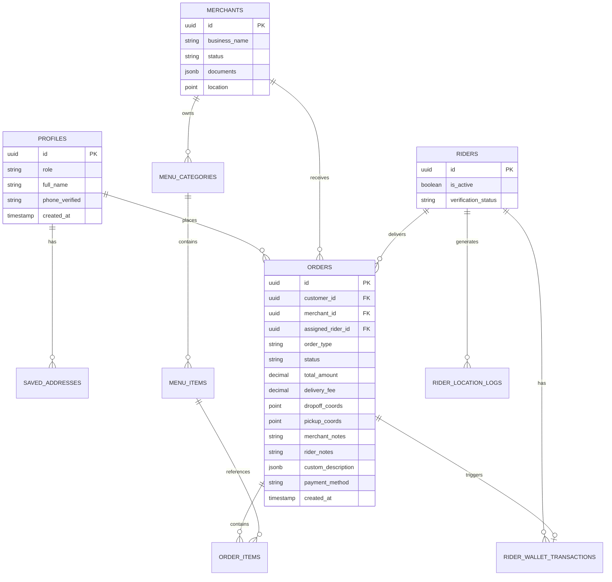

# Database Schema

Database design reference extracted from [ARCHITECTURE.md](../../ARCHITECTURE.md).  
**Engine:** PostgreSQL 15+ via Supabase.

---

## Entity Relationship Overview



Auth tables (`auth.users`) link 1:1 to `profiles.id`.

---

## Table Reference

### `profiles`

Extension of `auth.users`. Central role and identity record.

| Column | Type | Notes |
|--------|------|-------|
| `id` | `uuid` PK | FK → `auth.users.id` |
| `role` | `enum` / `text` | `customer`, `rider`, `merchant`, `admin` |
| `full_name` | `text` | Display name |
| `phone_verified` | `boolean` | Required before COD checkout |
| `created_at` | `timestamptz` | Default `now()` |

---

### `riders`

Rider-specific extension. One row per rider profile.

| Column | Type | Notes |
|--------|------|-------|
| `id` | `uuid` PK | FK → `profiles.id` |
| `is_active` | `boolean` | On-duty toggle; gates order feed |
| `verification_status` | `text` | `pending`, `approved`, `rejected`, `suspended` |

**Computed (not stored):** wallet balance `W_r` from `rider_wallet_transactions`.

---

### `merchants`

Merchant business record.

| Column | Type | Notes |
|--------|------|-------|
| `id` | `uuid` PK | FK → `profiles.id` |
| `business_name` | `text` | |
| `status` | `text` | `pending`, `active`, `suspended` |
| `documents` | `jsonb` | Storage refs for permits, etc. |
| `location` | `point` / `geography` | Shop coordinates |

---

### `menu_categories`

| Column | Type | Notes |
|--------|------|-------|
| `id` | `uuid` PK | |
| `merchant_id` | `uuid` FK | → `merchants.id` |
| `name` | `text` | |
| `sort_order` | `int` | Optional display order |

---

### `menu_items`

| Column | Type | Notes |
|--------|------|-------|
| `id` | `uuid` PK | |
| `category_id` | `uuid` FK | → `menu_categories.id` |
| `name` | `text` | |
| `price` | `decimal` | |
| `in_stock` | `boolean` | Hidden from browse when false |
| `image_url` | `text` | Supabase Storage path |

---

### `orders`

Central transactional entity.

| Column | Type | Notes |
|--------|------|-------|
| `id` | `uuid` PK | |
| `customer_id` | `uuid` FK | → `profiles.id` |
| `merchant_id` | `uuid` FK nullable | Required for `food`; null for errand/courier |
| `assigned_rider_id` | `uuid` FK nullable | Set on claim |
| `order_type` | `text` | `food`, `errand`, `courier` |
| `status` | `text` | See status enum below |
| `total_amount` | `decimal` | |
| `delivery_fee` | `decimal` | |
| `dropoff_coords` | `point` | Customer destination |
| `pickup_coords` | `point` nullable | Courier origin only |
| `merchant_notes` | `text` | Customer → merchant |
| `rider_notes` | `text` | Customer → rider |
| `custom_description` | `jsonb` nullable | Errand: store, items, budget |
| `payment_method` | `text` | Phase 1: `cod` only |
| `accepted_at` | `timestamptz` nullable | Set on rider claim |
| `created_at` | `timestamptz` | |

---

### `order_items`

Line items for food orders.

| Column | Type | Notes |
|--------|------|-------|
| `id` | `uuid` PK | |
| `order_id` | `uuid` FK | → `orders.id` |
| `menu_item_id` | `uuid` FK nullable | Null for non-food lines |
| `quantity` | `int` | |
| `modifiers` | `jsonb` | Variations, add-ons |
| `line_total` | `decimal` | |

---

### `saved_addresses`

| Column | Type | Notes |
|--------|------|-------|
| `id` | `uuid` PK | |
| `profile_id` | `uuid` FK | → `profiles.id` |
| `label` | `text` | `home`, `work`, `other` |
| `text_address` | `text` | Barangay, landmarks, house no. |
| `coords` | `point` | Map pin |

---

### `rider_location_logs`

Append-only telemetry for active riders.

| Column | Type | Notes |
|--------|------|-------|
| `id` | `uuid` PK | |
| `rider_id` | `uuid` FK | → `riders.id` |
| `coords` | `point` | |
| `recorded_at` | `timestamptz` | Interval: ~10–30s in transit |

---

### `rider_wallet_transactions`

Append-only financial ledger. **Admin and DB triggers only for INSERT.**

| Column | Type | Notes |
|--------|------|-------|
| `id` | `uuid` PK | |
| `rider_id` | `uuid` FK | → `riders.id` |
| `order_id` | `uuid` FK nullable | Linked order when applicable |
| `txn_type` | `text` | See transaction types below |
| `amount` | `decimal` | Signed per type convention |
| `description` | `text` | Audit label |
| `created_at` | `timestamptz` | Immutable |

---

## Enumerations

### `profiles.role`

| Value | App access |
|-------|------------|
| `customer` | Customer mobile |
| `rider` | Rider mobile |
| `merchant` | Merchant panel |
| `admin` | Admin + Ledger |

### `orders.order_type`

| Value | `merchant_id` | `order_items` |
|-------|---------------|---------------|
| `food` | Required | Required |
| `errand` | Null | Empty |
| `courier` | Null | Empty |

### `orders.status`

```
pending → preparing → ready_for_pickup → accepted → arrived_at_merchant
  → picked_up → in_transit → delivered
```

Terminal: `cancelled` (from `pending` or `preparing`).

### `riders.verification_status`

`pending` | `approved` | `rejected` | `suspended`

### `merchants.status`

`pending` | `active` | `suspended`

### `rider_wallet_transactions.txn_type`

| Type | Effect on W_r |
|------|---------------|
| `debit_cod_order` | Rider liability increases (collected COD) |
| `credit_delivery_reward` | Rider earnings credit |
| `credit_remittance` | Rider remitted cash to platform |

---

## Balance Formula

```
W_r = Σ(R_a) - Σ(V_o(COD) + (V_o × C_m) - F_d)
```

| Symbol | Source |
|--------|--------|
| `W_r` | Computed; lockout when `<= -2000` PHP |
| `R_a` | `credit_remittance` rows |
| `V_o(COD)` | `debit_cod_order` rows |
| `C_m` | Commission rate (admin config) |
| `F_d` | `credit_delivery_reward` rows |

---

## Critical Constraints

### Race-safe order claim

```sql
UPDATE orders
SET
  assigned_rider_id = :rider_id,
  status = 'accepted',
  accepted_at = now()
WHERE
  id = :order_id
  AND assigned_rider_id IS NULL
  AND status = 'ready_for_pickup'
RETURNING *;
```

### Foreign keys

- `orders.customer_id` → `profiles.id` (required)
- `orders.merchant_id` → `merchants.id` (nullable)
- `order_items.order_id` → `orders.id` (cascade on delete policy TBD)
- Orphan prevention enforced at insert time (C-3.2)

---

## Row-Level Security Summary

| Table | Customer | Rider | Merchant | Admin |
|-------|----------|-------|----------|-------|
| `orders` | Own SELECT | Pool + assigned SELECT; assigned UPDATE | Own SELECT/UPDATE status | Full |
| `order_items` | Via order | Via order | Via merchant order | Full |
| `menu_items` | Active SELECT | — | Own CRUD | Full |
| `rider_wallet_transactions` | — | Own SELECT | — | Full |
| `rider_location_logs` | Assigned rider SELECT | Own INSERT/SELECT | — | Full |
| `saved_addresses` | Own CRUD | — | — | Full |
| `merchants` | Active SELECT | — | Own SELECT | Full |
| `riders` | — | Own SELECT; UPDATE `is_active` | — | Full |

**Hard rules:**
- Rider app: never INSERT/UPDATE wallet table
- Service role key: Edge Functions only, not in APKs
- OTP rate limit: ~3 requests / 15 min per phone

---

## Storage Buckets (Supabase Storage)

| Bucket / path | Content | Access |
|---------------|---------|--------|
| Merchant documents | Business permits | Merchant owner + admin |
| Menu images | `menu_items` photos | Public read; merchant write |

---

## Edge Function Touchpoints

| Function | Tables affected |
|----------|-----------------|
| `send-otp` / `verify-otp` | `profiles.phone_verified` |
| `calculate-delivery-fee` | Read-only; returns fee to client |
| `send-push-notification` | Reads `orders`; sends FCM |

See [flows.md](./flows.md) for write sequences.
