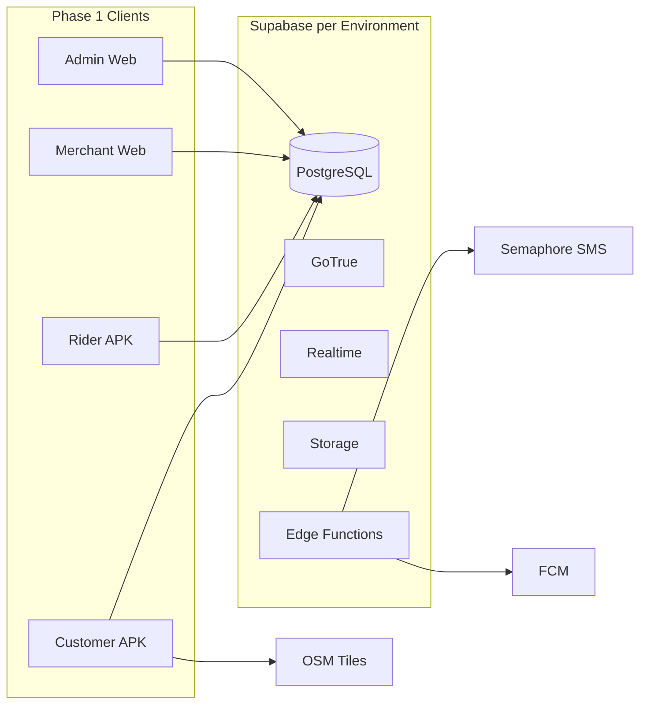

# Platform Strategy

Strategic decisions, constraints, and roadmap extracted from [ARCHITECTURE.md](../../ARCHITECTURE.md).

---

## Vision and Scope

**Product:** Provincial delivery platform for Antique Province — food, errands (Pabili), and courier.

**Phase 1 boundary:**

| In scope | Out of scope |
|----------|--------------|
| COD payments | Digital wallets (GCash, cards) |
| Android mobile apps | iOS release |
| OSM in-app maps | Mapbox / Google in-app tiles |
| 5 client surfaces + Supabase | Multi-province |
| Antique Province zones | In-app turn-by-turn |

---

## Architectural Principles

1. **Single source of truth** — PostgreSQL via Supabase holds all transactional state.
2. **Realtime over polling** — Order status via Supabase Realtime (Postgres WAL).
3. **Zero-cost maps baseline** — OSM tiles; riders use external map apps for navigation.
4. **Append-only financial ledger** — Rider balances derived; mobile never writes wallet rows.
5. **Offline resilience** — Customer cart in local storage for low-connectivity barangays.

---

## Repository Strategy

**Decision:** Monorepo (`cartman-ph/`)

```
cartman-ph/
├── apps/          # customer-mobile, rider-mobile, merchant-web, admin-web, ledger-web
├── packages/      # shared-types, supabase-client, geo-utils
├── supabase/      # migrations, functions, seed
└── docs/
```

| Rationale | Detail |
|-----------|--------|
| Shared enums | Order status, wallet txn types sync across 5 surfaces |
| RLS co-location | Migrations reviewed before any app deploy |
| Type safety | Shared DTOs in `packages/shared-types` |
| CI | One pipeline runs migration checks + app builds |

**Ledger placement (recommended):** Admin module in Phase 1; split to `ledger-web` if team grows.

---

## Technology Strategy

### Stack decision matrix

| Layer | Phase 1 | Rationale |
|-------|---------|-----------|
| Mobile | Flutter **or** RN (TBD) | Both PDFs compatible; cross-platform for Phase 2 iOS |
| Backend | Supabase full stack | Managed, budget-fit for provincial ops |
| In-app maps | OSM | No API key cost |
| Rider nav | Deep links | Google/Apple/Waze |
| Push | FCM | Background/killed app alerts |
| SMS | Semaphore + Edge Functions | PH-local OTP |
| Web panels | React + Vite (recommended) | Lightweight SPAs |
| Local cache | Hive / AsyncStorage | Offline cart, declined orders |

### Mobile framework decision guide

| Choose Flutter if… | Choose React Native if… |
|--------------------|-------------------------|
| UI consistency on low-end Android is priority | Team is strong in TypeScript/React |
| No existing JS codebase | Web + mobile code sharing matters |
| — | `packages/` utilities shared with web |

### Android-first strategy

Phase 1 ships **Android only**.

| Factor | Why Android |
|--------|-------------|
| Device economics | Dominant in provincial PH; lower cost for riders |
| Distribution | APK sideload viable for Antique pilot |
| Rider pool | iPhones rare among target workforce |
| Ops cost | No Apple Dev Program / TestFlight / review cycle |
| Background GPS | Foreground-service pattern well-established on Android |

Codebase stays cross-platform-ready for Phase 2 iOS.

---

## Deployment Strategy



### Environments

| Env | Purpose | Supabase project |
|-----|---------|------------------|
| `dev` | Local dev, seeds | Separate |
| `staging` | QA, Antique test cohort | Separate |
| `prod` | Live operations | Separate |

### Android distribution

| Phase | Channel |
|-------|---------|
| Pilot | Direct APK to known riders/customers |
| Scale | Google Play Store |

### Edge Functions

| Function | Purpose |
|----------|---------|
| `send-otp` | Semaphore SMS on registration |
| `verify-otp` | Validate code, set `phone_verified` |
| `calculate-delivery-fee` | Server-side courier fee (tamper-proof) |
| `send-push-notification` | FCM on status change |

---

## Security Strategy

| Control | Implementation |
|---------|----------------|
| Authorization | Single auth pool + `profiles.role` + RLS |
| Wallet integrity | Admin-only INSERT on ledger; rider SELECT only |
| OTP abuse | Rate limit ~3 / 15 min per phone in Edge Function |
| PII | Customer phone visible to assigned rider during active order only |
| Secrets | Service role key in Edge Functions only, never in APK |
| Merchant docs | Storage RLS: owner + admin |

See [schema.md](./schema.md) for full RLS table.

---

## Non-Functional Requirements

| Requirement | Target | Source |
|-------------|--------|--------|
| Rider claim query | < 50ms | R-1.2 |
| Status propagation | Near-instant (Realtime WAL) | C-4.1 |
| Offline cart | Survives app kill | C-3.1 |
| GPS interval | 10–30s in transit; off when off-duty | R-2.1, R-4.2 |
| Push when killed | FCM background delivery | C-4.2 |
| Order history | Initial limit 20 | C-7.2 |
| Map tiles | No enterprise API keys | C-2.2 |
| Lockout check | On app open + post-delivery | R-3.2 |

**Rider GPS pattern:** Android foreground service with persistent notification while on-duty.

---

## Phase Roadmap

### Phase 1 (current)

- Antique Province
- Android Customer + Rider
- Merchant Panel, Admin Dashboard, Financial Ledger
- COD, OSM, food + errand + courier
- Supabase Realtime + FCM

### Phase 2 (future)

- iOS apps
- Digital payments (GCash, Maya)
- In-app turn-by-turn
- Multi-province expansion
- Auto-dispatch, surge pricing
- Loyalty / promotions

---

## Open Decisions

| Decision | Options | Recommendation | Blocks |
|----------|---------|----------------|--------|
| Mobile framework | Flutter vs RN | Team skill-based | App scaffolding |
| Web framework | Vite vs Next.js | Vite for SPAs | Web scaffolding |
| Ledger UI | Separate app vs admin module | Admin module Phase 1 | Repo layout |
| Courier fee | Client vs Edge Function | **Edge Function** | Courier feature |
| Geofencing | Polygons vs radius | Define in admin zone epic | Rider feed filter |
| Distribution | Sideload vs Play Store | Sideload pilot → Play Store | Launch plan |

---

## Antique Province Context

| Assumption | Detail |
|------------|--------|
| Geography | Municipalities/barangays configured in Admin |
| Maps | OSM adequate for San Jose de Buenavista and surrounds |
| SMS | Semaphore +63 numbers |
| Payments | COD dominant in provincial market |

---

## Document Map

| Need | Read |
|------|------|
| What each domain owns | [domains.md](./domains.md) |
| Tables, columns, RLS | [schema.md](./schema.md) |
| Sequences and state machines | [flows.md](./flows.md) |
| Why and when | This file |
| Full canonical spec | [ARCHITECTURE.md](../../ARCHITECTURE.md) |
