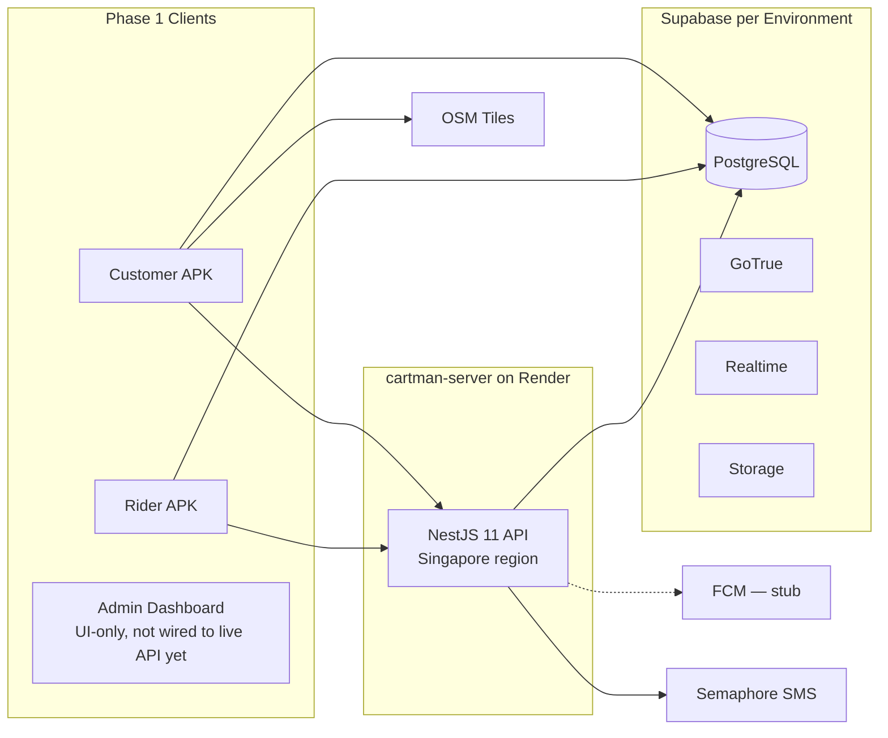

# Platform Strategy

Strategic decisions, constraints, and roadmap extracted from [ARCHITECTURE.md](../../ARCHITECTURE.md).

---

## Vision and Scope

**Product:** Provincial delivery platform for Antique Province — food, errands (Pabili), and courier.

**Phase 1 boundary:**

| In scope | Out of scope |
|----------|--------------|
| COD payments | Digital wallets (GCash, cards) |
| Android native apps | iOS native release (web app interim solution) |
| iOS web app (temporary access) | Mapbox / Google in-app tiles |
| OSM in-app maps | Multi-province |
| 5 client surfaces + Supabase | In-app turn-by-turn |
| Antique Province zones | Cartman Pro subscription features |
| Threshold-based adaptive delivery fees | |
| Support ticket + admin override system | |

---

## Architectural Principles

1. **Single source of truth** — PostgreSQL via Supabase holds all transactional state.
2. **Realtime over polling** — Order status via Supabase Realtime (Postgres WAL).
3. **Zero-cost maps baseline** — OSM tiles; riders use external map apps for navigation.
4. **Append-only financial ledger** — Rider balances derived; mobile never writes wallet rows.
5. **Offline resilience** — Customer cart in local storage for low-connectivity barangays.

---

## Repository Strategy

**Planned:** Monorepo (`cartman-ph/`). **Implemented: polyrepo instead** — see [ARCHITECTURE.md §4](../../ARCHITECTURE.md#4-repository-layout) for the actual layout and how drift is mitigated without shared tooling.

```
cartmanph-master-dir/            # actual layout — workspace root, not a git repo
├── cartman-server/               # NestJS 11 + Prisma 7
├── cartman-mobile/                # Flutter melos: apps/customer, apps/rider, packages/core, supabase/
├── Cartman-PH-Dashboard/         # Next.js 16 admin dashboard — UI-only prototype
└── cartmanph-docs/                # this repo
```

| Original rationale | Implemented reality |
|-----------|--------|
| Shared enums across 5 surfaces via one repo | No shared package — `cartman-server/prisma/schema.prisma` and `cartman-mobile/supabase/migrations` are kept in sync manually |
| RLS co-location, reviewed before any app deploy | RLS still lives in `cartman-mobile/supabase/migrations`; `cartman-server` deploys independently via `render.yaml` |
| Shared DTOs in `packages/shared-types` | Does not exist — each repo defines its own DTOs/models |
| One CI pipeline for migration checks + app builds | No cross-repo CI — each repo gates independently (`npm test`/`melos run analyze`) |

**Ledger placement:** implemented as server-side writers inside `cartman-server` (delivered-transition handler + `POST /ledger/transactions`) — not a standalone `ledger-web`, and not yet wired into the admin dashboard's Finance page either.

---

## Technology Strategy

### Stack decision matrix

| Layer | Phase 1 | Rationale |
|-------|---------|-----------|
| Mobile | **Flutter** (confirmed) | Cross-platform; team confirmed on Jul 1, 2026 |
| Backend | **Implemented:** NestJS 11 + Prisma 7 on **Render** (Singapore region) — `cartman-server` is the authoritative writer for orders/dispatch/ledger/OTP; Supabase remains Auth/DB/Realtime/Storage | Render superseded the earlier Railway evaluation (see Open Decisions) |
| In-app maps | OSM | No API key cost; Google Maps API avoided (geocoding costs) |
| Rider nav | Deep links | Google/Apple/Waze |
| Push | FCM — **fan-out is a logging stub**, no real device delivery yet | Needs a Firebase project + `firebase-admin` fan-out work |
| SMS | Semaphore, called server-side by `cartman-server` | PH-local OTP; deprecated `otp-send`/`otp-verify` Edge Functions replaced by `POST /auth/send-otp\|verify-otp` |
| Web panels | **Implemented:** Next.js 16 + Tailwind v4 — admin dashboard shipped **UI-only** (no fetch layer, no auth); merchant panel not started | See [ARCHITECTURE.md §10.3–10.4](../../ARCHITECTURE.md#103-merchant-web-panel) |
| Local cache | Hive | Offline cart, declined orders |
| Image caching | Flutter `cached_network_image` | Reduces load on client and server |

### Android-first strategy

Phase 1 ships **Android** as primary native target. **iOS** has a web app interim solution.

| Factor | Why Android |
|--------|-------------|
| Device economics | Dominant in provincial PH; lower cost for riders |
| Distribution | APK sideload viable for Antique pilot |
| Rider pool | iPhones rare among target workforce |
| Ops cost | No Apple Dev Program / TestFlight / review cycle |
| Background GPS | Foreground-service pattern well-established on Android |

Codebase stays cross-platform-ready (Flutter) for Phase 2 iOS.

**iOS interim solution (Phase 1):** A web app version serves iOS users while the native iOS app is being finalized. Location detection may be limited in web context but core ordering remains functional.

---

## Delivery Fee Strategy

The design below (global admin-configurable threshold system) is **not implemented**. Fee is computed server-side in `cartman-server`'s `orders.service.ts` at order placement — tamper-proof in the sense that the client can't set its own fee, but there is no `system_config` table and no admin UI to tune thresholds without a code deploy.

| Parameter | Design | Implemented reality |
|-----------|--------|----------------------|
| Baseline | Flag-down rate for first 2 km radius | Hardcoded in server logic, not admin-configurable |
| Structure | Distance thresholds configurable as global variables | Same — hardcoded |
| Management | Admin dashboard global config, adjustable on the fly | **No config surface exists** |
| Calculation | Adaptive pricing; avoids static/hardcoded fee tables | Computed server-side (not client-side, not an Edge Function) |
| Geocoding | Cost-effective routing preferred | Lat/lng columns, no geocoding service integration confirmed |

---

## Support Ticket and Override System

**Not implemented.** No `support_tickets` table exists in the schema, and there is no admin override flow (password reset / auth bypass gated by a ticket) in code. The design below remains a Phase 2+ candidate.

| Capability | Design (not built) |
|------------|--------|
| Support tickets | Users submit tickets for account assistance |
| Admin override | Password reset or auth bypass executable by admin after ticket + user confirmation |
| Scope | Remote password resets, authentication bypasses |
| Guard | Requires support ticket and user confirmation before admin acts |

---

## Deployment Strategy



No Merchant Web / Ledger Web nodes — neither exists (§10.3, §10.5 of ARCHITECTURE.md). Admin Dashboard exists but doesn't call `NestAPI` yet.

### Environments

| Env | Purpose | Supabase project |
|-----|---------|------------------|
| `dev` | Local dev, seeds | Separate |
| `staging` | QA, Antique test cohort | Separate |
| `prod` | Live operations | Separate |

### Android distribution

| Phase | Channel |
|-------|---------|
| Pilot | Direct APK to known riders/customers |
| Initial Play Store | Franz Eliezer Samilo's Google Play Console account (faster deployment) |
| Scale | Transfer to official Cartman PH Play Console account |

**Organization account:** Team is investigating Google/Apple organization account registration to bypass 14-day testing requirements for app stores.

**TestFlight (iOS):** Alternative to production iOS release; allows controlled beta testing while native iOS app is finalized.

### Backend API (NestJS) — implemented modules

| Module | Purpose | Status |
|----------|---------|--------|
| `AuthModule` | `send-otp`/`verify-otp` → Semaphore; validates code; not tied to signup | Implemented |
| `OrdersModule` | Placement, race-safe claim (conditional `updateMany`), legal-transition status guard, server-side fee calc, customer cancel, admin cancel/reassign (in progress) | Implemented (admin cancel/reassign in progress, branch `admin-endpoints`) |
| `FeedModule`/feed service | Weighted priority feed (`GET /orders/feed`) | Implemented |
| `RidersModule` | On-duty toggle, batched telemetry, history | Implemented |
| `LedgerModule` | Append-only wallet transactions — delivered-transition writer + `POST /ledger/transactions` (admin) | Implemented |
| `AdminModule` | Stats, orders (list/detail/cancel/reassign), riders, merchants, ledger reads | **In progress** — branch `admin-endpoints` |
| `WebhooksModule` | Inbound webhook receiver → FCM fan-out | Implemented, but FCM fan-out is a **logging stub** |

There is no `MerchantsModule` for panel-style menu/stock CRUD — menu browse is a direct Supabase read, and merchant catalog rows are seeded by ops (§ domains.md).

---

## Security Strategy

| Control | Implementation | Status |
|---------|----------------|--------|
| Authorization | `JwtAuthGuard` + `RolesGuard` on `cartman-server` for writes; RLS for direct reads (defense-in-depth) | Implemented |
| Wallet integrity | Writers are the server's delivered-transition handler + `POST /ledger/transactions` (`@Roles('admin')`) — not a raw DB insert from a ledger UI; rider app reads via `GET /ledger/me/*` only | Implemented |
| OTP abuse | `ThrottlerGuard` at 10 req/min on OTP routes | Implemented (replaces the earlier per-phone Edge Function throttle) |
| PII | Customer phone visible to assigned rider during active order only | Implemented |
| Secrets | Service role key not used by `cartman-server` (it authenticates via `DATABASE_URL`/`DIRECT_URL`); never shipped in APKs | Implemented |
| Merchant docs | N/A — no merchant document upload exists | Not applicable (§10.3) |
| API protection | `helmet`, env-driven CORS, `UserOrIpThrottlerGuard` (200/min per user, webhook exempt), global `ValidationPipe({whitelist:true})`, exception filter, env validation at boot | Implemented |
| Server | Single Singapore server (Render); no CDN required for current PH volume | Implemented |
| Phone verification | Phone OTP gates COD checkout, not account creation | Implemented, but not a signup requirement (see Open Decisions history) |
| COD fraud prevention | Valid-ID popup at checkout | **Not implemented** — no `id_document_url`/`id_verified` columns exist |
| Email OTP | `otp_codes.channel = 'email'` column exists | **Dormant** — only the `sms` channel is wired end-to-end |

See [schema.md](./schema.md) for full RLS table.

---

## Non-Functional Requirements

| Requirement | Target | Source |
|-------------|--------|--------|
| Rider claim query | < 50ms | R-1.2 |
| Status propagation | Near-instant (Realtime WAL) | C-4.1 |
| Offline cart | Survives app kill | C-3.1 |
| GPS interval | 10–30s in transit; off when off-duty | R-2.1, R-4.2 |
| Push when killed | FCM background delivery | C-4.2 |
| Order history | Initial limit 20 | C-7.2 |
| Map tiles | No enterprise API keys | C-2.2 |
| Lockout check | On app open + post-delivery | R-3.2 |

**Rider GPS pattern:** Android foreground service with persistent notification while on-duty.

---

## Phase Roadmap

### Phase 1 — implementation status

- Antique Province
- Android Customer + Rider (native Flutter apps) — **implemented**
- iOS Customer access via web app (interim) — not implemented
- Merchant Panel — **not built**, interim ops-via-Swagger ([ARCHITECTURE.md §10.3](../../ARCHITECTURE.md#103-merchant-web-panel))
- Admin Dashboard — **UI-only prototype**, wiring in progress (`admin-endpoints`)
- Financial Ledger — **implemented** as server-side writers + admin endpoint, no standalone ledger app
- COD, OSM, food + grocery + errand + pickup_delivery (courier) + ride — **implemented**; `multi_stop` in the enum but no server endpoint
- Weighted priority dispatch feed — **implemented**, shipped Phase 1 (see delta vs the full proposal in [rider-dispatch-weighting.md](../proposals/rider-dispatch-weighting.md))
- Supabase Realtime — **implemented**; FCM — **stub, no real device delivery**
- Render backend hosting (Singapore) — **implemented**
- Threshold-based adaptive delivery fee (admin configurable) — **not implemented**; fee is computed server-side but not admin-tunable via a config table
- Phone number verification for customers — **implemented** as a COD-checkout gate (not a SIM/signup requirement)
- Mandatory valid ID for COD checkout — **not implemented** (no `id_document_url`/`id_verified` columns)
- Rider custom drop-off points — implemented via `pickup_delivery`/`ride` coords
- Support ticket + admin override system — **not implemented** (no `support_tickets` table)
- Operational monitoring dashboard — UI-only prototype, not wired

### Phase 2 (future)

- iOS native apps
- Digital payments (GCash, Maya)
- In-app turn-by-turn
- Multi-province expansion
- Staggered-wave dispatch, per-rider reliability scoring — the delta beyond the shipped Phase 1 ranked feed; see [rider-dispatch-weighting.md](../proposals/rider-dispatch-weighting.md)
- Loyalty / promotions
- Cartman Pro merchant subscription tier

---

## Open Decisions

| Decision | Options | Status | Blocks |
|----------|---------|--------|--------|
| Mobile framework | Flutter vs RN | **RESOLVED: Flutter** (confirmed Jul 1, 2026) | — |
| Hosting provider | Render vs Railway | **RESOLVED: Render** — `render.yaml` is live in `cartman-server`; the Jul 1 Railway decision noted below was superseded before launch | — |
| Web framework | Vite vs Next.js | **RESOLVED: Next.js 16** — Admin Dashboard built on it | — |
| Ledger UI | Separate app vs admin module | **RESOLVED: server-side writers + admin endpoint** — no standalone ledger app, no admin-module ledger UI wired yet either | Repo layout |
| Courier fee | Client vs Edge Function | **Resolved differently than planned: server-side in `cartman-server`**, not an Edge Function | Courier feature |
| Geofencing | Polygons vs radius | Open — no zone config surface built at all | Rider feed filter |
| Distribution | Sideload vs Play Store | Sideload pilot → Franz's Play Console → Cartman PH account | Launch plan |
| Organization account | Google/Apple org registration | Under investigation (Benjamen) | App store 14-day bypass |
| PDF order printing | Support vs skip | Under investigation for larger merchants | Merchant panel (itself not built) |
| 2FA implementation | Email OTP vs authenticator | Planned: Email OTP via Resend (confirmed Jul 2, 2026 as a decision) — **not implemented**: `otp_codes.channel = 'email'` exists in schema but is dormant; only `sms` is wired | Email OTP rollout |
| Dashboard auth strategy | Session cookie, Supabase Auth client, service-role proxy | Open — no login screen exists | Wiring dashboard to `/admin/*` |
| Commissions model | Flat rate, per-merchant, or defer | Open — riders keep 100% of delivery fee today; `debit_commission` enum value unused | Merchants page "commission edit" |
| `delivered_at` column | Add real column vs keep approximating | Open — avg-delivery-time is an `updated_at` approximation | Delivery-time reporting |
| Incidents domain | Design schema vs defer | Open — no schema at all | Incidents page wiring |
| FCM completion | Firebase project + fan-out vs stay stubbed | Open | Real push notifications |

---

## Antique Province Context

| Assumption | Detail |
|------------|--------|
| Geography | Municipalities/barangays configured in Admin |
| Maps | OSM adequate for San Jose de Buenavista and surrounds |
| SMS | Semaphore +63 numbers |
| Payments | COD dominant in provincial market |

---

## Document Map

| Need | Read |
|------|------|
| What each domain owns | [domains.md](./domains.md) |
| Tables, columns, RLS | [schema.md](./schema.md) |
| Sequences and state machines | [flows.md](./flows.md) |
| Why and when | This file |
| Full canonical spec | [ARCHITECTURE.md](../../ARCHITECTURE.md) |
