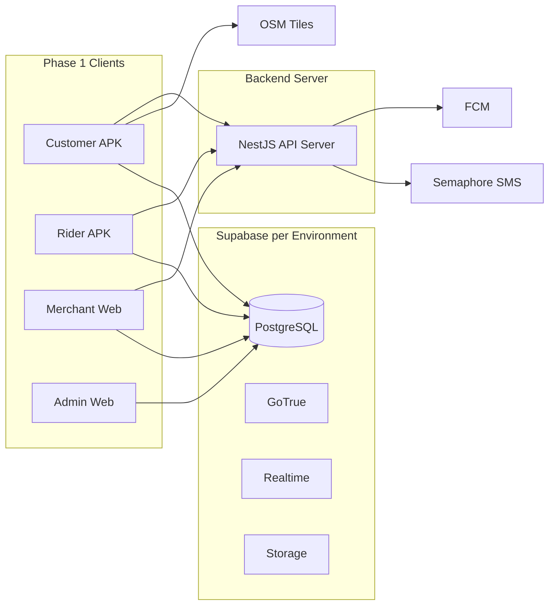

# Platform Strategy

Strategic decisions, constraints, and roadmap extracted from [ARCHITECTURE.md](../../ARCHITECTURE.md).

---

## Vision and Scope

**Product:** Provincial delivery platform for Antique Province — food, errands (Pabili), and courier.

**Phase 1 boundary:**

| In scope | Out of scope |
|----------|--------------|
| COD payments | Digital wallets (GCash, cards) |
| Android native apps | iOS native release (web app interim solution) |
| iOS web app (temporary access) | Mapbox / Google in-app tiles |
| OSM in-app maps | Multi-province |
| 5 client surfaces + Supabase | In-app turn-by-turn |
| Antique Province zones | Cartman Pro subscription features |
| Threshold-based adaptive delivery fees | |
| Support ticket + admin override system | |

---

## Architectural Principles

1. **Single source of truth** — PostgreSQL via Supabase holds all transactional state.
2. **Realtime over polling** — Order status via Supabase Realtime (Postgres WAL).
3. **Zero-cost maps baseline** — OSM tiles; riders use external map apps for navigation.
4. **Append-only financial ledger** — Rider balances derived; mobile never writes wallet rows.
5. **Offline resilience** — Customer cart in local storage for low-connectivity barangays.

---

## Repository Strategy

**Decision:** Monorepo (`cartman-ph/`)

```
cartman-ph/
├── apps/          # cartman-server, customer-mobile, rider-mobile, merchant-web, admin-web, ledger-web
├── packages/      # shared-types, geo-utils
├── supabase/      # migrations, functions, seed
└── docs/
```

| Rationale | Detail |
|-----------|--------|
| Shared enums | Order status, wallet txn types sync across 5 surfaces |
| RLS co-location | Migrations reviewed before any app deploy |
| Type safety | Shared DTOs in `packages/shared-types` |
| CI | One pipeline runs migration checks + app builds |

**Ledger placement (recommended):** Admin module in Phase 1; split to `ledger-web` if team grows.

---

## Technology Strategy

### Stack decision matrix

| Layer | Phase 1 | Rationale |
|-------|---------|-----------|
| Mobile | **Flutter** (confirmed) | Cross-platform; team confirmed on Jul 1, 2026 |
| Backend | NestJS API + Supabase, hosted on **Railway** | Pay-as-you-go; supports DB hosting; single Singapore server |
| In-app maps | OSM | No API key cost; Google Maps API avoided (geocoding costs) |
| Rider nav | Deep links | Google/Apple/Waze |
| Push | FCM | Background/killed app alerts |
| SMS | Semaphore + Edge Functions | PH-local OTP |
| Web panels | React + Vite (recommended) | Lightweight SPAs |
| Local cache | Hive | Offline cart, declined orders |
| Image caching | Flutter `cached_network_image` | Reduces load on client and server |

### Android-first strategy

Phase 1 ships **Android** as primary native target. **iOS** has a web app interim solution.

| Factor | Why Android |
|--------|-------------|
| Device economics | Dominant in provincial PH; lower cost for riders |
| Distribution | APK sideload viable for Antique pilot |
| Rider pool | iPhones rare among target workforce |
| Ops cost | No Apple Dev Program / TestFlight / review cycle |
| Background GPS | Foreground-service pattern well-established on Android |

Codebase stays cross-platform-ready (Flutter) for Phase 2 iOS.

**iOS interim solution (Phase 1):** A web app version serves iOS users while the native iOS app is being finalized. Location detection may be limited in web context but core ordering remains functional.

---

## Delivery Fee Strategy

The delivery fee model uses a **global threshold-based system** managed through the admin dashboard.

| Parameter | Detail |
|-----------|--------|
| Baseline | Flag-down rate for first 2 km radius |
| Structure | Distance thresholds configurable as global variables |
| Management | Admin dashboard global config — adjustable on the fly |
| Calculation | Adaptive pricing; avoids static/hardcoded fee tables |
| Geocoding | Cost-effective routing preferred; Google Maps geocoding API avoided |

The admin can modify thresholds without a code deploy. Courier fee calculation runs server-side via Edge Function for tamper-proofing.

---

## Support Ticket and Override System

To handle account issues without direct DB access for end users:

| Capability | Detail |
|------------|--------|
| Support tickets | Users submit tickets for account assistance |
| Admin override | Password reset or auth bypass executable by admin after ticket + user confirmation |
| Scope | Remote password resets, authentication bypasses |
| Guard | Requires support ticket and user confirmation before admin acts |

---

## Deployment Strategy



### Environments

| Env | Purpose | Supabase project |
|-----|---------|------------------|
| `dev` | Local dev, seeds | Separate |
| `staging` | QA, Antique test cohort | Separate |
| `prod` | Live operations | Separate |

### Android distribution

| Phase | Channel |
|-------|---------|
| Pilot | Direct APK to known riders/customers |
| Initial Play Store | Franz Eliezer Samilo's Google Play Console account (faster deployment) |
| Scale | Transfer to official Cartman PH Play Console account |

**Organization account:** Team is investigating Google/Apple organization account registration to bypass 14-day testing requirements for app stores.

**TestFlight (iOS):** Alternative to production iOS release; allows controlled beta testing while native iOS app is finalized.

### Backend API (NestJS)

| Module | Purpose |
|----------|---------|
| `AuthModule` | Semaphore SMS on registration, validate code |
| `OrdersModule` | Race-safe order claim, server-side courier fee, FCM push on status change |
| `MerchantsModule` | Menu and stock management |
| `LedgerModule` | Append-only wallet transactions |

---

## Security Strategy

| Control | Implementation |
|---------|----------------|
| Authorization | Single auth pool + `profiles.role` + RLS |
| Wallet integrity | Admin-only INSERT on ledger; rider SELECT only |
| OTP abuse | Rate limit ~3 / 15 min per phone in Edge Function |
| PII | Customer phone visible to assigned rider during active order only |
| Secrets | Service role key in Edge Functions only, never in APK |
| Merchant docs | Storage RLS: owner + admin |
| API protection | Standard API keys + rate limiting on all endpoints |
| Server | Single Singapore server; no CDN required for current PH volume |
| Phone verification | SIM registration-based phone number mandatory for customer accounts |
| COD fraud prevention | Valid ID required to finalize COD transaction (popup at checkout, skippable at registration) |
| Email OTP | Email service free tier ~3,000/month for 2FA and password reset OTPs |

See [schema.md](./schema.md) for full RLS table.

---

## Non-Functional Requirements

| Requirement | Target | Source |
|-------------|--------|--------|
| Rider claim query | < 50ms | R-1.2 |
| Status propagation | Near-instant (Realtime WAL) | C-4.1 |
| Offline cart | Survives app kill | C-3.1 |
| GPS interval | 10–30s in transit; off when off-duty | R-2.1, R-4.2 |
| Push when killed | FCM background delivery | C-4.2 |
| Order history | Initial limit 20 | C-7.2 |
| Map tiles | No enterprise API keys | C-2.2 |
| Lockout check | On app open + post-delivery | R-3.2 |

**Rider GPS pattern:** Android foreground service with persistent notification while on-duty.

---

## Phase Roadmap

### Phase 1 (current)

- Antique Province
- Android Customer + Rider (native Flutter apps)
- iOS Customer access via web app (interim)
- Merchant Panel, Admin Dashboard, Financial Ledger
- COD, OSM, food + errand + courier
- Supabase Realtime + FCM
- Railway backend hosting (Singapore)
- Threshold-based adaptive delivery fee (admin configurable)
- Phone number + SIM verification for customers
- Mandatory valid ID for COD checkout
- Rider custom drop-off points
- Support ticket + admin override system
- Operational monitoring dashboard

### Phase 2 (future)

- iOS native apps
- Digital payments (GCash, Maya)
- In-app turn-by-turn
- Multi-province expansion
- Auto-dispatch, surge pricing — see [rider-dispatch-weighting.md](../proposals/rider-dispatch-weighting.md) proposal
- Loyalty / promotions
- Cartman Pro merchant subscription tier

---

## Open Decisions

| Decision | Options | Status | Blocks |
|----------|---------|--------|--------|
| Mobile framework | Flutter vs RN | **RESOLVED: Flutter** (confirmed Jul 1, 2026) | — |
| Hosting provider | Render vs Railway | **RESOLVED: Railway** (confirmed Jul 1, 2026) | — |
| Web framework | Vite vs Next.js | Vite for SPAs (recommended) | Web scaffolding |
| Ledger UI | Separate app vs admin module | Admin module Phase 1 | Repo layout |
| Courier fee | Client vs Edge Function | **Edge Function** (recommended) | Courier feature |
| Geofencing | Polygons vs radius | Define in admin zone epic | Rider feed filter |
| Distribution | Sideload vs Play Store | Sideload pilot → Franz's Play Console → Cartman PH account | Launch plan |
| Organization account | Google/Apple org registration | Under investigation (Benjamen) | App store 14-day bypass |
| PDF order printing | Support vs skip | Under investigation for larger merchants | Merchant panel |
| 2FA implementation | Email OTP vs authenticator | **RESOLVED: Email OTP via Resend** (confirmed Jul 2, 2026) — raw HTTP call to Resend's API, no SDK, matching the existing Semaphore SMS pattern | — |

---

## Antique Province Context

| Assumption | Detail |
|------------|--------|
| Geography | Municipalities/barangays configured in Admin |
| Maps | OSM adequate for San Jose de Buenavista and surrounds |
| SMS | Semaphore +63 numbers |
| Payments | COD dominant in provincial market |

---

## Document Map

| Need | Read |
|------|------|
| What each domain owns | [domains.md](./domains.md) |
| Tables, columns, RLS | [schema.md](./schema.md) |
| Sequences and state machines | [flows.md](./flows.md) |
| Why and when | This file |
| Full canonical spec | [ARCHITECTURE.md](../../ARCHITECTURE.md) |
