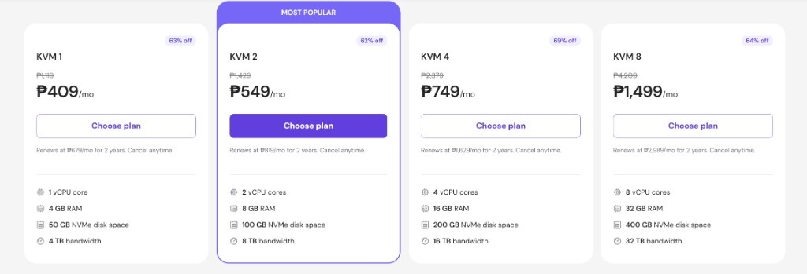
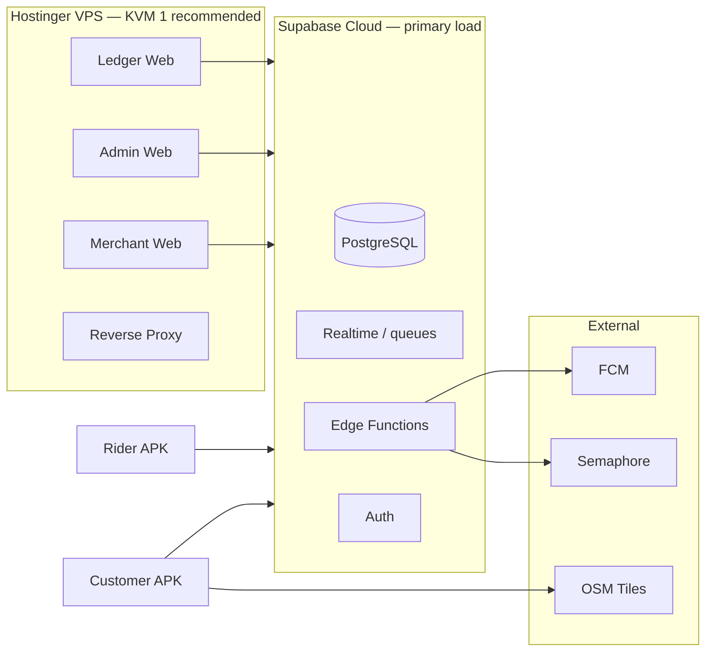

# Cartman PH — Hostinger VPS Sizing & Cost Report

Infrastructure sizing for **300–1,000 daily active users** on the Cartman PH platform (Antique Province, Phase 1).

**Sources:** [ARCHITECTURE.md](../../ARCHITECTURE.md), [docs/breakdown/](../../breakdown/)

---

## Executive summary

The documented architecture is **Supabase-centric**. PostgreSQL, auth, realtime dispatch (“queueing”), edge functions, and rider GPS writes run on **Supabase Cloud** — not on a Hostinger VPS.

A Hostinger VPS is mainly for:

- Merchant web panel
- Admin dashboard
- Financial ledger (or admin module)
- Reverse proxy (Caddy / nginx)
- Optional: Redis + background workers (not in Phase 1 spec)

| Deployment approach | Recommended VPS | Budget at renewal (2-yr term) |
|---------------------|-----------------|-------------------------------|
| **As-designed** — Supabase backend + VPS for web only | **KVM 1** | **₱679/mo** |
| Supabase + Redis / async workers | **KVM 2** | **₱819/mo** |
| Self-hosted Supabase on VPS (not recommended) | **KVM 4** at 1,000 DAU | **₱1,629/mo** |

**KVM 4 and KVM 8 are not required** for 300–1,000 DAU if Supabase stays managed and the VPS only serves web panels.

---

## Hostinger KVM plans — reference pricing

Screenshot captured from Hostinger’s VPS pricing page (Philippine Pesos):

### Budget using non-discounted prices

> **Do not budget from introductory promo rates** (₱409–₱1,499/mo). Those are short-term discounts (62–69% off). For financial planning, use **renewal rates** and **list prices** below.

| Plan | Promo price (ignore for budget) | **Renewal price (2-yr term)** | **List / non-discounted price** | Specs |
|------|---------------------------------|-------------------------------|---------------------------------|-------|
| **KVM 1** | ~~₱409/mo~~ (63% off) | **₱679/mo** | **₱1,119/mo** | 1 vCPU · 4 GB RAM · 50 GB NVMe · 4 TB bandwidth |
| **KVM 2** | ~~₱549/mo~~ (62% off) | **₱819/mo** | **₱1,429/mo** | 2 vCPU · 8 GB RAM · 100 GB NVMe · 8 TB bandwidth |
| **KVM 4** | ~~₱749/mo~~ (69% off) | **₱1,629/mo** | **₱2,379/mo** | 4 vCPU · 16 GB RAM · 200 GB NVMe · 16 TB bandwidth |
| **KVM 8** | ~~₱1,499/mo~~ (64% off) | **₱2,989/mo** | **₱4,209/mo** | 8 vCPU · 32 GB RAM · 400 GB NVMe · 32 TB bandwidth |

**Renewal price** = what Hostinger charges after the introductory period on a 2-year commitment.

**List / non-discounted price** = full monthly rate before any promotion (strikethrough price on the pricing page).

### Annual cost at renewal (recommended path)

| Plan | Monthly (renewal) | **Annual at renewal** | Annual at list price |
|------|-------------------|----------------------|----------------------|
| KVM 1 (recommended) | ₱679 | **₱8,148** | ₱13,428 |
| KVM 2 (with workers) | ₱819 | **₱9,828** | ₱17,148 |
| KVM 4 (self-host Supabase) | ₱1,629 | **₱19,548** | ₱28,548 |

---

## What “queueing” means in this architecture

Phase 1 does **not** specify Redis, RabbitMQ, or BullMQ. Queueing is implemented via **PostgreSQL + Supabase Realtime**:

| Queue / flow | Implementation | Needs VPS? |
|--------------|----------------|------------|
| Merchant order queue | Realtime subscription on `orders` | No |
| Rider dispatch feed | Realtime filter `status = ready_for_pickup` | No |
| Order status propagation | Postgres WAL → Realtime channels | No |
| Push notifications | Edge Function → FCM | No |
| OTP / SMS | Edge Function → Semaphore | No |
| Optional async jobs | Redis + worker (future / not in spec) | Yes — KVM 2+ |

See [flows.md](../breakdown/flows.md#merchant-order-queue) and [ARCHITECTURE.md §10](../../ARCHITECTURE.md#102-rider-mobile-app).

---

## Load model — 300 to 1,000 DAU

Assumptions:

- ~25% of customers place one order per day
- 15–25 riders on duty at peak (Antique Province)
- GPS telemetry every 10–30s in transit ([R-2.1](../../ARCHITECTURE.md))
- ~40% of daily orders concentrated in lunch/dinner rush

| Tier | Orders / day | Peak concurrent sessions | Realtime WebSocket connections | GPS inserts / min (peak) |
|------|--------------|--------------------------|--------------------------------|--------------------------|
| **300 DAU** | ~60 | ~45 | ~35 | ~18 |
| **600 DAU** | ~150 | ~90 | ~70 | ~36 |
| **1,000 DAU** | ~250 | ~150 | ~120 | ~60 |

This load lands on **Supabase** (Postgres writes, Realtime fanout, Edge Functions), not on Hostinger vCPU/RAM — when following the documented architecture.

---

## Recommendation matrix

| Scenario | KVM 1 | KVM 2 | KVM 4 | KVM 8 | **Pick** | **Budget (renewal/mo)** |
|----------|-------|-------|-------|-------|----------|-------------------------|
| **A — As-designed** (Supabase + web VPS) | Sufficient | Comfortable (+ staging) | Overkill | Unnecessary | **KVM 1** | **₱679** |
| **B — Supabase + Redis job queue** | Tight | Recommended | Comfortable | Overkill | **KVM 2** | **₱819** |
| **C — Self-hosted Supabase on VPS** | Insufficient | Minimum viable | Recommended at 1k DAU | Growth headroom | **KVM 4** | **₱1,629** |

### Scenario A — KVM 1 RAM budget (web panels only)

| Component | Est. RAM |
|-----------|----------|
| OS + reverse proxy | ~512 MB |
| Static SPAs (merchant, admin, ledger) | ~128 MB |
| Monitoring (optional) | ~256 MB |
| **Headroom on 4 GB plan** | ~3.1 GB free |

### Scenario B — KVM 2 RAM budget (Redis + workers)

| Component | Est. RAM |
|-----------|----------|
| OS + reverse proxy | ~512 MB |
| Redis | ~256 MB |
| 2× Node workers | ~1 GB |
| Staging copy | ~512 MB |
| **Headroom on 8 GB plan** | ~5.7 GB free |

---

## Total stack cost (PHP / month)

VPS is only part of the bill. Queueing, database, and management APIs run on Supabase.

### Recommended path — budget at non-promo rates

| Item | Promo / intro (do not use) | **Renewal / realistic budget** |
|------|----------------------------|--------------------------------|
| Hostinger KVM 1 | ~~₱409/mo~~ | **₱679/mo** |
| Hostinger KVM 2 (if workers) | ~~₱549/mo~~ | **₱819/mo** |
| Supabase Pro (~$25 USD) | — | **~₱1,400/mo** |
| Semaphore SMS (OTP volume) | — | **₱56–560/mo** (see [sms-gateway-cost-breakdown.md](./sms-gateway-cost-breakdown.md) for sourced per-message pricing) |
| FCM | — | **₱0** |

### Example monthly totals (renewal pricing)

| Stack | Low estimate | High estimate |
|-------|--------------|---------------|
| KVM 1 + Supabase Pro + SMS | **₱2,279/mo** | **₱2,879/mo** |
| KVM 2 + Supabase Pro + SMS | **₱2,419/mo** | **₱3,019/mo** |

### Example annual totals (renewal pricing, mid-range SMS)

| Stack | Calculation | **Annual** |
|-------|-------------|------------|
| KVM 1 + Supabase Pro + ~₱500 SMS | (679 + 1400 + 500) × 12 | **~₱31,548/yr** |
| KVM 2 + Supabase Pro + ~₱500 SMS | (819 + 1400 + 500) × 12 | **~₱32,628/yr** |

> If you priced VPS at **list rates** instead of renewal, KVM 1 alone would be **₱1,119/mo (₱13,428/yr)** — 65% higher than the 2-year renewal rate. Always clarify which rate applies when comparing quotes.

---

## Supabase tier (backend — not Hostinger)

| DAU | Guidance |
|-----|----------|
| **300** | Free tier may work for pilot; **Pro** is safer for Realtime connection limits and production support |
| **600–1,000** | **Pro required** — monitor Realtime connections (~120 at peak) and `rider_location_logs` table growth |

Performance targets from the spec:

- Rider order claim **&lt; 50 ms** ([R-1.2](../../ARCHITECTURE.md)) — depends on Supabase Postgres, not VPS
- Status propagation **near-instant** via Realtime ([C-4.1](../../ARCHITECTURE.md))

---

## Where load actually lands

At **1,000 DAU**, the heaviest components are:

1. **PostgreSQL** — order writes, status updates, append-only `rider_location_logs`
2. **Supabase Realtime** — merchant queue, rider feed, customer tracking stepper
3. **Edge Functions** — FCM push, OTP, delivery fee calculation

None of these run on the Hostinger VPS in the as-designed architecture.

---

## Risks and mitigations

| Risk | Mitigation |
|------|------------|
| Budgeting from ₱409–₱1,499 promo prices | Use **₱679 (KVM 1)** or **₱819 (KVM 2)** renewal rates; list prices up to **₱4,209/mo** if not on a term |
| Running Postgres + Realtime on KVM 1 | Violates architecture; insufficient for GPS write volume + WAL fanout |
| Confusing merchant “order queue” with a job broker | Queues are Realtime UI subscriptions — no Redis in Phase 1 |
| Bandwidth overage on VPS | Web panel traffic stays far below 4 TB; OSM tiles load on mobile clients |
| Undersizing Supabase | VPS choice does not replace Supabase Pro at 600–1,000 DAU |

---

## Bottom line

1. **Supabase Pro** handles backend, realtime queueing, GPS persistence, and management APIs.
2. **Hostinger KVM 1 at ₱679/mo renewal** (not ₱409 promo) is sufficient for web panels at 300–1,000 DAU.
3. **KVM 2 at ₱819/mo renewal** only if you add Redis workers, co-locate staging, or want operational headroom.
4. **KVM 4+ (₱1,629–₱2,989/mo renewal)** is for self-hosted Supabase or scale beyond Antique Phase 1 — not required for the documented 300–1,000 DAU target.

When presenting costs to stakeholders, lead with **renewal and list prices**. Introductory discounts are marketing rates, not sustainable operating budget.

---

## Related documents

| Document | Purpose |
|----------|---------|
| [ARCHITECTURE.md](../../ARCHITECTURE.md) | Canonical system design |
| [strategy.md](../breakdown/strategy.md) | Deployment strategy, stack decisions |
| [flows.md](../breakdown/flows.md) | Order, dispatch, and queue flows |
| [schema.md](../breakdown/schema.md) | Database tables and Realtime-related schema |
| [render-vs-railway.md](./render-vs-railway.md) | `cartman-server` hosting cost comparison |
| [sms-gateway-cost-breakdown.md](./sms-gateway-cost-breakdown.md) | Semaphore vs alternatives, sourced per-message pricing |
| [total-app-cost-breakdown.md](./total-app-cost-breakdown.md) | Full consolidated cost of the entire Cartman PH stack |
