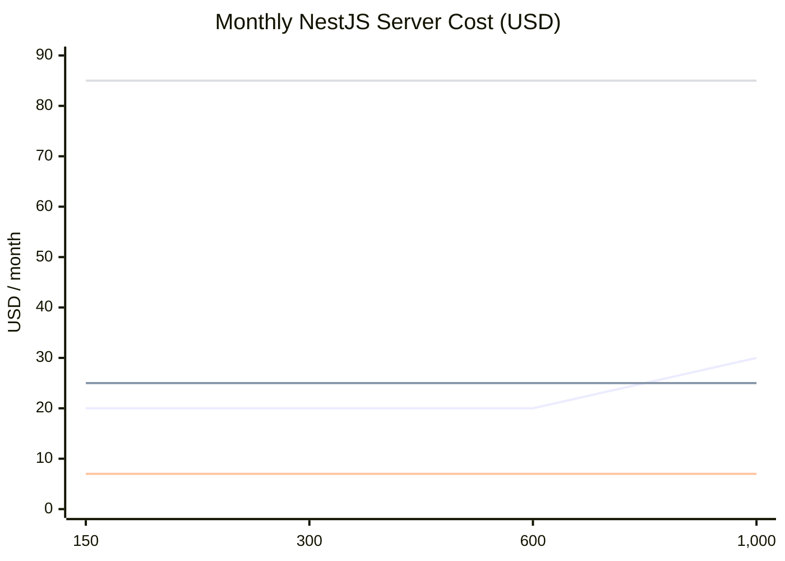

# Render Pro vs Railway — NestJS Backend Cost Comparison

**Scope:** NestJS API server (cartman-server) hosting only.  
**Primary target:** 150–300 daily active users (Antique Province Phase 1 launch).  
**Extended reference:** Up to 1,000 DAU (growth planning).  
**Context:** Supabase Cloud handles PostgreSQL, Auth, Realtime, Storage, and Edge Functions — the NestJS server handles REST API logic, FCM dispatch, Semaphore OTP relay, and courier fee calculation.  
**Action item owner:** Louie Dale Cervera (assigned 2026-07-01 meeting)  
**Exchange rate used:** ~₱57 / USD (verify current rate before budgeting)

---

## Platform Pricing at a Glance

### Railway — Usage-Based with Included Credit

Railway Pro charges by actual resource consumption per second. The monthly plan fee doubles as a prepaid compute credit — if usage stays under the included credit, you pay only the plan fee.

| Plan | Monthly base | Included credit | CPU rate | RAM rate | Egress rate |
|------|-------------|-----------------|----------|----------|-------------|
| Hobby | $5 | $5 of usage | $20/vCPU/mo | $10/GB/mo | $0.05/GB |
| **Pro** | **$20/seat** | **$20 of usage** | **$20/vCPU/mo** | **$10/GB/mo** | **$0.05/GB** |

**How it works:** If containers consume $15 in resources, you pay $20 (credit absorbs it). If they consume $35, you pay $35 ($20 credit covers the first $20, $15 billed as overage).

**Volume storage:** $0.15/GB/month  
**Bandwidth included:** 25 GB/month  
**Sleep behavior:** None — containers run continuously while deployed.  
**Scale-to-zero:** Available optionally; not recommended for production APIs.

**Pro plan features:**
- No service maximum
- 25 GB bandwidth included
- Full-stack previews
- Horizontal autoscaling
- Isolated environments
- Private links
- Workspace audit logs
- AWS OIDC Integration (Beta)
- Chat support
- Up to 42 replicas, 1 TB RAM pool, 1,000 vCPU pool
- 1 TB volume storage, unlimited image size

---

### Render — Fixed Instance Tiers

Flat monthly rate per web service instance. Billing is prorated per second (relevant only if a service is created or destroyed mid-month — for a running production service it is effectively flat monthly). Always-on for all paid tiers.

| Instance | Monthly (USD) | Monthly (PHP) | RAM | vCPU | Bandwidth included |
|----------|--------------|---------------|-----|------|-------------------|
| Free | $0 | ₱0 | 512 MB | 0.1 vCPU | 100 GB | Sleeps after 15 min idle (~30s cold start) |
| **Starter** | **$7** | **~₱399** | 512 MB | 0.5 vCPU | 100 GB |
| **Standard** | **$25** | **~₱1,425** | 2 GB | 1 vCPU | 100 GB |
| **Pro** | **$85** | **~₱4,845** | 4 GB | 2 vCPU | 100 GB |
| Pro Plus | $175 | ~₱9,975 | 8 GB | 4 vCPU | 100 GB |
| Pro Max | $225 | ~₱12,825 | — | — | 100 GB |
| Pro Ultra | $450 | ~₱25,650 | — | — | 100 GB |

> Pro Max and Pro Ultra are not applicable to Phase 1. Listed for completeness.

**Bandwidth overage:** $0.15/GB beyond 100 GB/month  
**Persistent disk:** $0.25/GB/month  
**Team workspace (optional):** $19/user/month for advanced team access and permissions  
**Sleep behavior:** Free tier only. Starter and above are always-on.

---

## Cartman PH NestJS Server — Resource Profile

The `cartman-server` (NestJS) is a **lightweight, I/O-bound API relay**. Supabase absorbs all heavy operations (Postgres writes, Realtime fanout, GPS inserts, Edge Functions). NestJS handles:

| Module | Load type |
|--------|-----------|
| AuthModule — OTP relay to Semaphore | Burst on sign-ups; low sustained |
| OrdersModule — race-safe claim, FCM push triggers | Moderate peaks at lunch/dinner rush |
| MerchantsModule — menu/stock read API | Low sustained |
| LedgerModule — wallet transaction API | Very low; admin-only writes |

### Estimated resource consumption

| DAU | Peak concurrent requests | Est. RAM | Est. CPU |
|-----|--------------------------|----------|----------|
| **150** | ~5–8 | ~200–350 MB | ~0.1–0.2 vCPU |
| **300** | ~10–18 | ~300–512 MB | ~0.2–0.35 vCPU |
| 600 | ~25–40 | ~400–768 MB | ~0.3–0.5 vCPU |
| 1,000 | ~45–65 | ~512 MB–1 GB | ~0.4–0.6 vCPU |

NestJS process baseline (idle): ~120–200 MB RAM. At 150–300 DAU, 512 MB RAM with 0.5 vCPU is comfortable with headroom.

---

## Monthly Cost Estimates — NestJS Server Only

### Railway Pro ($20/month, includes $20 compute credit)

| Scenario | Est. provisioned | Compute cost | Credit covers | Overage | **Total/month (USD)** | **Total (PHP)** |
|----------|-----------------|-------------|--------------|---------|----------------------|-----------------|
| **150 DAU** | 0.25 vCPU · 256 MB | $5 + $2.56 = **$7.56** | Full | $0 | **$20** | **~₱1,140** |
| **300 DAU** | 0.5 vCPU · 512 MB | $10 + $5 = **$15** | Full | $0 | **$20** | **~₱1,140** |
| 600 DAU | 0.5 vCPU · 1 GB | $10 + $10 = **$20** | Full | $0 | **$20** | **~₱1,140** |
| 1,000 DAU | 1 vCPU · 1 GB | $20 + $10 = **$30** | $20 covered | $10 | **$30** | **~₱1,710** |

Egress: API JSON responses at 150–300 DAU stay well within the 25 GB/month included bandwidth — **₱0 extra**.

### Render (flat monthly — no compute on top)

| Instance | DAU suitability | **Total/month (USD)** | **Total (PHP)** | Notes |
|----------|----------------|----------------------|-----------------|-------|
| Starter ($7) | **150–300 DAU** | **$7** | **~₱399** | 512 MB RAM; fits at this DAU with no async workers — best for staging |
| Standard ($25) | **150–1,000 DAU** | **$25** | **~₱1,425** | 2 GB RAM; comfortable across full Phase 1 range |
| Pro ($85) | 1,000+ DAU | **$85** | **~₱4,845** | 4 GB / 2 vCPU; over-provisioned for Phase 1 |

Bandwidth: 100 GB/month included on all paid tiers. API traffic at 150–300 DAU will not approach this limit.

---

## Side-by-Side Comparison

| Dimension | Render Starter | Render Standard | Render Pro | **Railway Pro** |
|-----------|---------------|-----------------|------------|-----------------|
| **Monthly cost (USD)** | $7 fixed | $25 fixed | $85 fixed | $20 base + usage |
| **Est. cost at 150 DAU** | **$7** | **$25** | **$85** | **$20** |
| **Est. cost at 300 DAU** | **$7** | **$25** | **$85** | **$20** |
| **Est. cost at 1,000 DAU** | Risky (RAM limit) | **$25** | **$85** | **$30** |
| **Monthly cost PHP (300 DAU)** | ~₱399 | ~₱1,425 | ~₱4,845 | ~₱1,140 |
| **RAM** | 512 MB (hard cap) | 2 GB (hard cap) | 4 GB (hard cap) | Configurable; scales to need |
| **vCPU** | 0.5 (hard cap) | 1 (hard cap) | 2 (hard cap) | Configurable; billed per second |
| **Bandwidth included** | 100 GB | 100 GB | 100 GB | 25 GB |
| **Bandwidth overage rate** | $0.15/GB | $0.15/GB | $0.15/GB | $0.05/GB |
| **Billing model** | Flat — pay for max | Flat — pay for max | Flat — pay for max | Credit absorbs low usage; overage beyond |
| **Overpay at idle** | Yes | Yes | Yes | No — credit covers light usage |
| **Horizontal autoscaling** | No | No | Yes | **Yes** |
| **Sleep / cold start** | No (paid) | No | No | No |
| **Singapore region** | Available | Available | Available | **Available** |
| **Chat support** | No | No | No | **Yes** |
| **Workspace audit logs** | No | No | No | **Yes** |
| **Team access** | $19/user extra | $19/user extra | $19/user extra | **Included per seat** |

---

## Total Monthly Stack Cost (NestJS server + Supabase + SMS)

At **150–300 DAU primary target**, combined with Supabase Pro (~$25/month ≈ ₱1,425) and Semaphore SMS (~₱500/month):

| Hosting choice | Server/month | Supabase Pro | SMS (est.) | **Monthly total** | **Annual total** |
|---------------|-------------|-------------|-----------|-------------------|-----------------|
| Render Starter (150–300 DAU) | ₱399 | ₱1,425 | ₱500 | **₱2,324** | **~₱27,888** |
| **Railway Pro** (150–600 DAU) | ₱1,140 | ₱1,425 | ₱500 | **₱3,065** | **~₱36,780** |
| Render Standard (150–300 DAU) | ₱1,425 | ₱1,425 | ₱500 | **₱3,350** | **~₱40,200** |
| Railway Pro (1,000 DAU) | ₱1,710 | ₱1,425 | ₱500 | **₱3,635** | **~₱43,620** |
| Render Pro (150–300 DAU) | ₱4,845 | ₱1,425 | ₱500 | **₱6,770** | **~₱81,240** |

**Extended reference — 1,000 DAU:**

| Hosting choice | Server/month | Supabase Pro | SMS (est.) | **Monthly total** |
|---------------|-------------|-------------|-----------|-------------------|
| Render Standard | ₱1,425 | ₱1,425 | ₱500 | **₱3,350** |
| Railway Pro | ₱1,710 | ₱1,425 | ₱500 | **₱3,635** |
| Render Pro | ₱4,845 | ₱1,425 | ₱500 | **₱6,770** |

---

## Key Tradeoffs

### Railway Pro — Advantages

- **Cheaper than Render Standard at 150–600 DAU** — $20/month vs $25/month flat; the $20 credit absorbs compute at this load.
- **Scales with actual traffic** — compute cost only overruns the credit when load justifies it; you never overpay for an idle server at 3am.
- **Horizontal autoscaling** — handles lunch/dinner peak bursts automatically without manual instance resizing.
- **No fixed RAM ceiling** — not hard-capped at 512 MB or 2 GB if a busy day pushes past it.
- **Chat support included** — valuable during initial launch instability.
- **Workspace audit logs** — team deployment visibility out of the box.
- **Team access included in seat fee** — no extra $19/user/month.
- **Cheaper egress** — $0.05/GB vs Render's $0.15/GB at higher DAU.
- **Future Postgres hosting** — if Supabase is ever supplemented, Railway hosts Postgres natively within the same billing.

### Railway Pro — Disadvantages

- **Variable billing** — requires setting a hard spend cap to avoid surprises from a misconfigured or runaway service.
- **Less included bandwidth** — 25 GB/month vs Render's 100 GB (not a real concern at current DAU).
- **Newer platform** — fewer legacy third-party tutorials and community resources than Render.

### Render — Advantages

- **Render Starter ($7) is the cheapest absolute option** for 150–300 DAU if budget is the only constraint.
- **Fully predictable billing** — flat rate; no risk of compute overruns.
- **4× more bandwidth included** — 100 GB vs Railway's 25 GB.
- **Proven, mature platform** — broader documentation and community.

### Render — Disadvantages

- **Render Standard ($25) costs more than Railway Pro ($20) at 150–300 DAU** for the same workload, with no autoscaling.
- **No autoscaling on Starter or Standard** — a lunch rush spike beyond the fixed instance limit queues or errors.
- **Pay for provisioned capacity 24/7** — paying for max RAM/CPU whether at 3 requests/hour or 300.
- **Team access costs extra** — $19/user/month workspace fee for multi-member dashboard.
- **Render Pro ($85/month) is wasteful** for this load — 4 GB RAM / 2 vCPU is 4–8× more than needed at Phase 1 scale.

---

## Cost Curve (150 to 1,000 Users)

| Color | Series | Service | Notes |
|-------|--------|---------|-------|
| 🔵 Blue | 1st defined | Railway Pro — $20 → $30 | Rises at 1,000 users when compute exceeds credit |
| 🟢 Green | 2nd defined | Render Standard — $25 | Flat throughout |
| 🟡 Yellow | 3rd defined | Render Starter — $7 | RAM risk at 600+ users |
| 🔴 Red | 4th defined | Render Pro — $85 | Flat; over-provisioned for Phase 1 |

> Colors reflect Mermaid's default theme series order. They may differ slightly depending on your renderer or theme configuration.

Railway Pro stays flat at $20 through 600 users and only rises to $30 at 1,000. Render Standard is flat at $25 throughout. Railway is cheaper at every point except versus the Render Starter ($7) entry tier.

---

## Recommendation

### At 150–300 DAU (Phase 1 Antique Province launch target)

**Railway Pro at $20/month (~₱1,140) is the best value for the primary launch target.**

It costs ₱285/month less than Render Standard while adding horizontal autoscaling, chat support, and workspace audit logs — features that matter during an active launch period.

| Option | Cost at 300 DAU | Verdict |
|--------|----------------|---------|
| Render Starter ($7) | ~₱399/mo | Lowest cost; use as staging environment — RAM is too tight for production confidence |
| **Railway Pro ($20)** | **~₱1,140/mo** | **Best value — cheaper than Render Standard, includes autoscaling** |
| Render Standard ($25) | ~₱1,425/mo | Safe predictable fallback; no autoscaling |
| Render Pro ($85) | ~₱4,845/mo | Do not use — severely over-provisioned for Phase 1 |

### At 1,000 DAU (growth reference)

Railway Pro at $30/month (~₱1,710) still beats Render Standard ($25/month = ~₱1,425) only slightly in cost at this range, but the autoscaling advantage becomes genuinely operational as peak concurrent requests hit 45–65 during delivery windows. The $285/month premium over Render Standard is justified at this scale.

### Operational guidance for Railway Pro at launch

- **Set a hard spend cap** of $60/month in Railway's billing dashboard to guard against runaway services.
- **Right-size at launch:** start at 0.5 vCPU / 512 MB RAM. Scale up only after 30 days of production data (~2026-07-08 backend launch target).
- **Use Render Starter as staging** — low traffic keeps Railway compute costs minimal there, while production runs on Railway Pro.

| Environment | Host | Est. cost | Reasoning |
|-------------|------|-----------|-----------|
| Production | **Railway Pro** | ~₱1,140/mo | Best value; autoscaling; credit covers Phase 1 load |
| Staging / dev | Render Starter | ~₱399/mo | Predictable, cheap, sufficient for testing |

---

## Related Documents

| Document | Purpose |
|----------|---------|
| [Hostinger KVM comparison](./README.md) | VPS option for web panel hosting |
| [strategy.md](../breakdown/strategy.md) | Confirmed stack decisions (Railway selected 2026-07-01) |
| [ARCHITECTURE.md](../../ARCHITECTURE.md) | Full system design and container map |
| [meeting-notes-2026-07-01.md](../../references/meeting-notes-2026-07-01.md) | Source of this action item |
